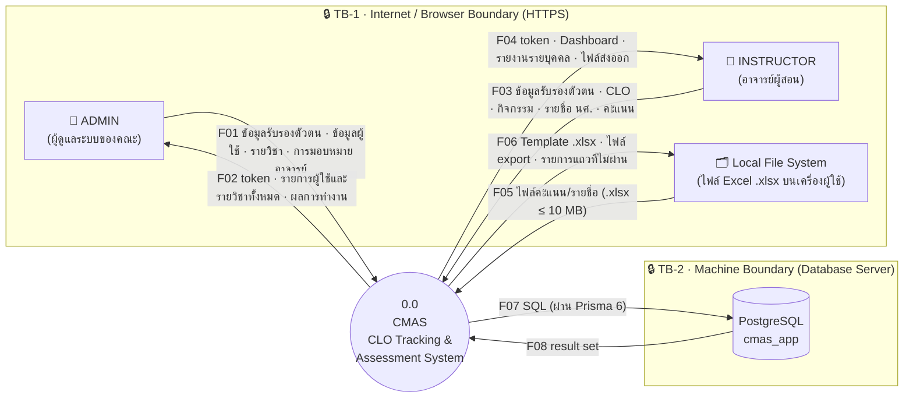
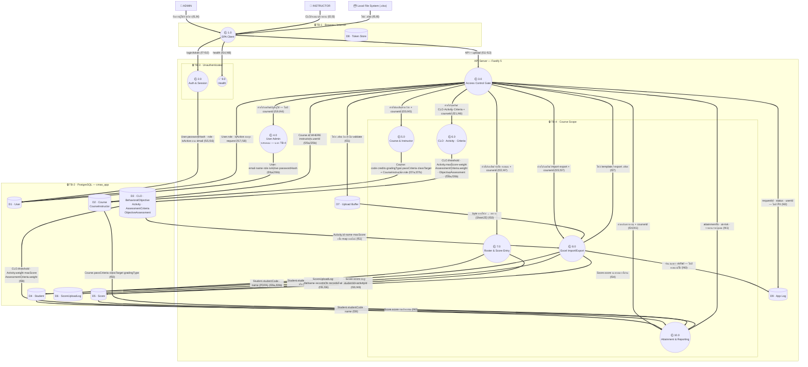
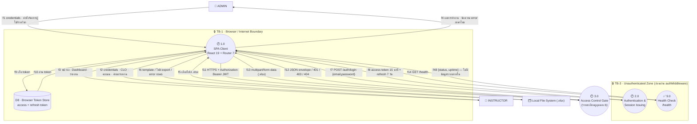
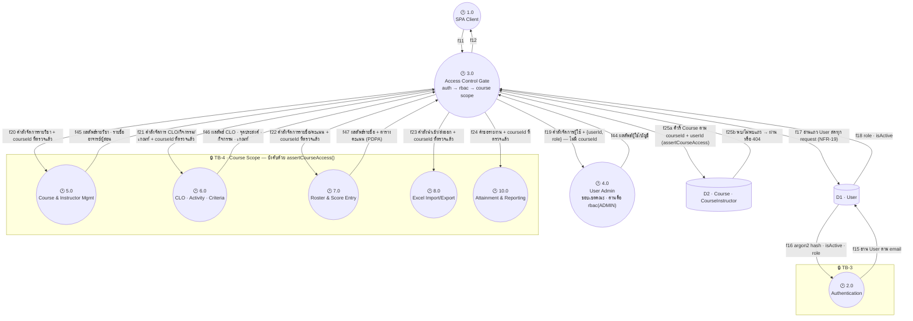
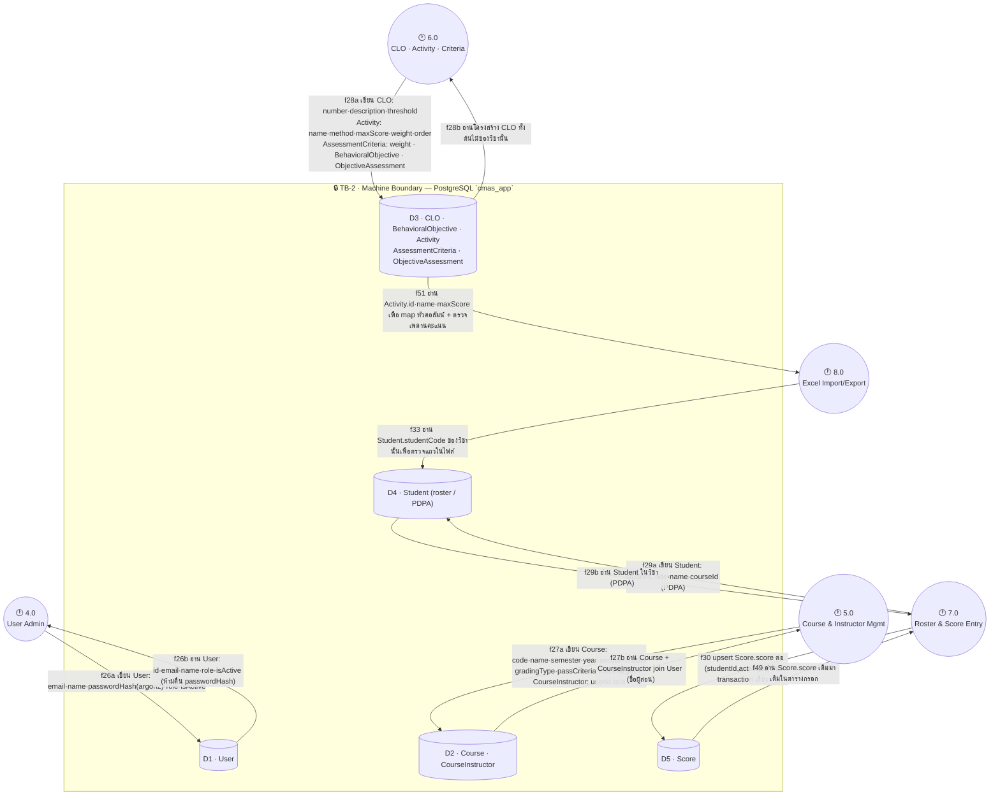
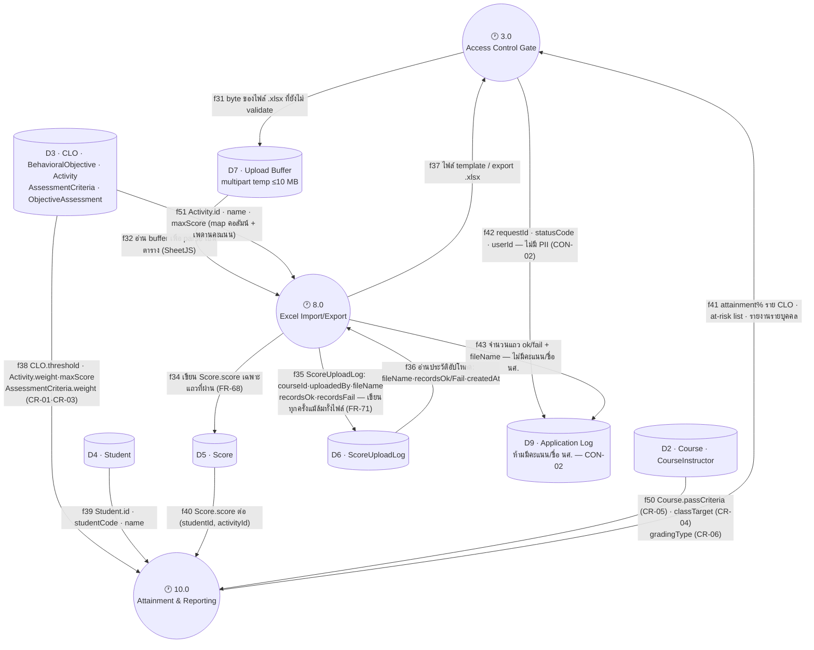
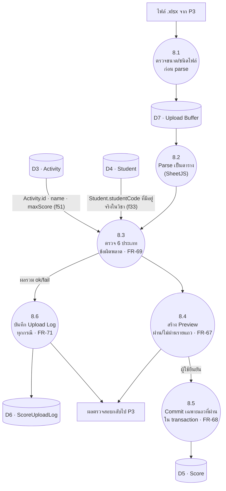
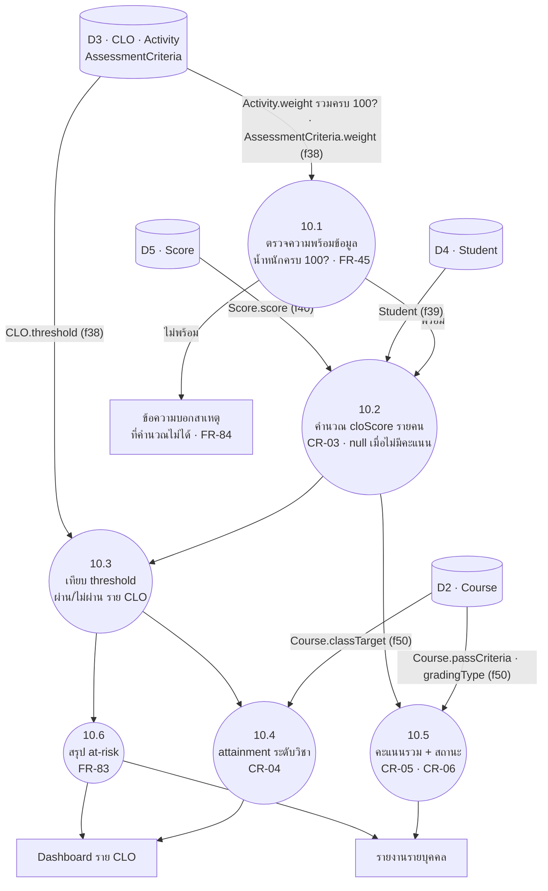

# แผนภาพกระแสข้อมูล (DFD — Data Flow Diagram) ของระบบ CMAS ระบบติดตามและประเมินผลลัพธ์การเรียนรู้ที่คาดหวังระดับรายวิชา (CLO — Course Learning Outcome)

See also: [[srs]] · [[schema]] · [[usecase]] · [[theory]] · [[project-plan]]

> **Version:** 2.5.0 | **Updated:** 2026-08-05
> **Baseline:** [[srs]] v2.0.0 · `database/schema.prisma` (**11 models — single-tenant**) ·
> `app/server/src/middlewares/{auth,rbac}.middleware.ts` · `services/authorization.service.ts`
> **Purpose:** เอกสารนี้เป็นทั้ง **แผนภาพกระแสข้อมูลสำหรับบทที่ 3** และ **input ของ threat modeling**
> (TMT — Microsoft Threat Modeling Tool 2016) — โครงสร้างข้อมูลยึด [[schema]] เสมอ
>
> **v2.0.0:** ตัด SUPER_ADMIN · Institution · Curriculum และ tenant boundary ออกทั้งหมด
> ตามการตัดสินใจ single-tenant (2026-08-04) — ขอบเขตข้อมูลที่เหลือคือ **รายวิชา** ไม่ใช่สถาบัน
>
> **v2.1.0 (audit):** เพิ่ม §0 อักษรย่อ · แก้จำนวน process ใน §3 (8 → 10 พร้อมตารางเทียบ SRS/route) ·
> เติม Data Flow Register ให้ครบทั้ง 43 เส้น (เดิมขาด f1–f6 · f9 · f10 · f14 · f33 · f36 · f37) ·
> เพิ่มตาราง balancing ระหว่าง Level 0 ↔ Level 1 · แก้ชื่อ TB-3 ในไดอะแกรมให้ตรงกับนิยาม §7 ·
> ทำเครื่องหมายสถานะ implement ในไดอะแกรมตามกฎข้อ 1 ของ §1
>
> **v2.2.0 (ตรวจ Level 1 ตามกฎ DFD/threat modeling — ดู §3.4):** ผิดกฎ 7 ข้อจาก 12 แก้แล้วทั้งหมด
> เพิ่มเส้นที่ขาด **f44–f49** (ขาออกของ TB-4 · การตอบของ `/health` · การอ่านคะแนนเดิม) ·
> แยกเส้นสองทางเป็น a/b (**f25 · f26 · f27 · f28 · f29**) · ตั้งชื่อเส้น f21–f24 ที่เดิมเขียนว่า `idem` ·
> แก้คอลัมน์ boundary ของ f32 · f37 · f41 · f43 ที่ตัด TB-4 จริงแต่ไม่ได้บันทึก — รวมเป็น **54 เส้น**
>
> **v2.3.0:** แยกไดอะแกรม §3 จาก 1 รูปเป็น **4 มุมมองย่อย (a)–(d)** — รูปเดียวเดิมมี P1/P3 เป็น hub
> ที่มีเส้นวิ่งเข้าออกพร้อมกัน 15+ เส้นจนอ่านไม่ออกเมื่อ render จริง เนื้อหา/ทิศทางไม่เปลี่ยน มีแต่การจัดวาง
>
> **v2.4.0:** เพิ่ม **§3.0 ภาพรวม** ก่อนมุมมองย่อย (a)–(d) — รูปเดียวเห็นทั้ง 10 process/9 store/4 boundary
> พร้อมป้ายเส้นแบบกลุ่ม (ไม่ใช่ 1:1 กับ f-id) ใช้เพื่อเห็นรูปทรงของระบบก่อนลงรายละเอียด ไม่ใช้ import เข้า TMT
>
> **v2.5.0 (ตรวจกับ `schema.prisma` ทีละตาราง — ดู §5.4):** เดิม data store ถูกตั้งชื่อด้วย *หมวดหมู่*
> (`D3 · CLO/Activity/Criteria`) ซึ่งอ่านไม่ออกว่าเส้นหนึ่ง ๆ แตะ **ตารางไหน** — threat model ที่บอกไม่ได้ว่า
> ข้อมูลอะไรถูกส่ง คือ threat model ที่ประเมิน Tampering ไม่ได้ แก้ทั้งหมด 5 จุด:
> 1. **D3 ขาด `ObjectiveAssessment`** — schema มี 11 model แต่ store mapping เดิมครอบได้ 10 (เพิ่ม §5.4 ตารางกระทบยอด)
> 2. **ตั้งชื่อ store ด้วยชื่อตารางจริง** ทุกที่ (ไดอะแกรม §3.0 · (c) · (d) · §5.3) — เลิกใช้คำรวมอย่าง "Criteria"
>    ที่ชี้ได้ทั้ง `AssessmentCriteria` · `CLO.threshold` · `Course.passCriteria` ซึ่งอยู่คนละตาราง
> 3. **เพิ่ม f50 (D2 → P10)** — เดิม P10 คำนวณ CR-04/05/06 โดยไม่มีเส้นส่ง `classTarget` · `passCriteria` ·
>    `gradingType` เข้ามาเลย ทั้งสามอยู่บน `Course` (= D2) ไม่ใช่ D3 → เป็น **miracle** ตามกฎข้อ 2 ของ §3.4
> 4. **เพิ่ม f51 (D3 → P8)** — P8 ต้อง map หัวคอลัมน์ในไฟล์เป็น `activityId` และตรวจ `score ≤ maxScore`
>    แต่เดิมไม่มีเส้นอ่าน `Activity` เลย → **miracle** ข้อที่สอง
> 5. **ย้าย P4 ออกจาก TB-4** — จัดการผู้ใช้เป็นขอบเขตคณะ ไม่มี `courseId` ในเส้นทางเลย
>    ด่านจริงคือ `rbac("ADMIN")` ไม่ใช่ `assertCourseAccess()` — วาดไว้ใน TB-4 ทำให้ TMT ออก threat ผิดตัว
>
> รวมเป็น **56 เส้น** · ป้ายเส้นทุกเส้นระบุ **ตาราง.คอลัมน์** ที่แตะจริงแล้ว

---

## สารบัญ

0. [อักษรย่อและสัญลักษณ์](#0-อักษรย่อและสัญลักษณ์)
1. [หลักการเขียน DFD ชุดนี้](#1-หลักการเขียน-dfd-ชุดนี้)
2. [Level 0 — Context Diagram](#2-level-0--context-diagram)
3. [Level 1 — System Decomposition](#3-level-1--system-decomposition)
4. [Level 2 — สองกระบวนการที่ซับซ้อนที่สุด](#4-level-2--สองกระบวนการที่ซับซ้อนที่สุด)
5. [Element Register (TMT 2016 stencil mapping)](#5-element-register-tmt-2016-stencil-mapping)
6. [Data Flow Register](#6-data-flow-register)
7. [Trust Boundaries](#7-trust-boundaries)
8. [วิธีสร้างใน Threat Modeling Tool 2016](#8-วิธีสร้างใน-threat-modeling-tool-2016)
9. [STRIDE hot spots ที่ต้องตอบให้ได้](#9-stride-hot-spots-ที่ต้องตอบให้ได้)

---

## 0. อักษรย่อและสัญลักษณ์

อ่านตารางนี้ก่อนดูไดอะแกรม — ทุกตัวย่อในเอกสารนี้ถูกนิยามไว้ที่นี่ที่เดียว

### 0.1 รหัสประจำ element (ใช้อ้างอิงข้าม §2–§9)

| รูปแบบ | ความหมาย | ตัวอย่าง |
|---|---|---|
| `EEn` | **E**xternal **E**ntity — ผู้กระทำนอกระบบ (คน/ระบบอื่น) | EE1 = ADMIN |
| `Pn.n` | **P**rocess — กระบวนการที่แปลงข้อมูล | P8 = Excel Import/Export · 8.1 = process ย่อยของ P8 |
| `Dn` | **D**ata Store — ที่เก็บข้อมูล (ตาราง/ไฟล์/หน่วยความจำ) | D5 = Score |
| `TB-n` | **T**rust **B**oundary — เส้นแบ่งความเชื่อถือ | TB-4 = ขอบเขตรายวิชา |
| `Fnn` (ตัวใหญ่) | Data flow ระดับ **Level 0** | F05 = ไฟล์ .xlsx เข้าระบบ |
| `fnn` (ตัวเล็ก) | Data flow ระดับ **Level 1/2** — เป็นการแตกย่อยของ `Fnn` | f13 = multipart upload |
| `fnna` / `fnnb` | เส้นเดียวกันที่ **แยกทิศ** — `a` = ขาเขียน/ขาถาม · `b` = ขาอ่าน/ขาตอบ (TMT ไม่รับเส้นสองทาง) | f26a เขียน User · f26b อ่าน User |

### 0.2 อักษรย่อทั่วไป

| ตัวย่อ | คำเต็ม | ความหมายในบริบทนี้ |
|---|---|---|
| **CMAS** | Course Learning Outcome Management & Assessment System | ชื่อระบบที่พัฒนา |
| **CLO** | Course Learning Outcome | ผลลัพธ์การเรียนรู้ที่คาดหวังระดับรายวิชา |
| **DFD** | Data Flow Diagram | แผนภาพแสดงการไหลของข้อมูล ไม่ใช่ลำดับเวลา |
| **TMT** | (Microsoft) Threat Modeling Tool 2016 | เครื่องมือสร้าง threat list จากไดอะแกรม |
| **SDL** | Security Development Lifecycle | ชุดแนวปฏิบัติของ Microsoft ที่ TMT ใช้เป็น knowledge base |
| **STRIDE** | Spoofing · Tampering · Repudiation · Information disclosure · Denial of service · Elevation of privilege | 6 หมวดภัยคุกคามที่ TMT ใช้จำแนก |
| **EoP** | Elevation of Privilege | การยกระดับสิทธิ์ — ตัวย่อของ STRIDE ตัวสุดท้าย |
| **DoS** | Denial of Service | การทำให้ระบบใช้งานไม่ได้ |
| **PDPA** | Personal Data Protection Act (พ.ร.บ.คุ้มครองข้อมูลส่วนบุคคล) | เหตุผลที่ D4/D5 ถูกทำเครื่องหมาย Sensitive |
| **PII** | Personally Identifiable Information | ข้อมูลที่ระบุตัวบุคคลได้ — ห้ามลง D9 (CON-02) |
| **FR / NFR** | Functional / Non-Functional Requirement | ข้อกำหนดใน [[srs]] §4 / §6 |
| **CR** | Calculation Rule | กฎการคำนวณใน [[srs]] §3 (CR-01…CR-07) |
| **CON / ASM** | Constraint / Assumption | ข้อจำกัด / ข้อสมมติใน [[srs]] §2.3 |
| **UC** | Use Case | กรณีใช้งานใน [[usecase]] |
| **SPA** | Single Page Application | ไคลเอนต์ React ที่เปลี่ยนหน้าโดยไม่โหลดใหม่ (P1) |
| **JWT** | JSON Web Token | รูปแบบ token ที่ P2 ออกให้ |
| **RBAC** | Role-Based Access Control | การตรวจสิทธิ์ตาม role ใน `rbac.middleware.ts` |
| **CRUD** | Create · Read · Update · Delete | ชุดปฏิบัติการพื้นฐานกับข้อมูล |
| **XSS / CSRF** | Cross-Site Scripting / Cross-Site Request Forgery | ช่องโหว่ฝั่งเบราว์เซอร์ที่กระทบวิธีเก็บ token (D8) |
| **TLS / HTTPS** | Transport Layer Security / HTTP over TLS | การเข้ารหัสระหว่างทาง |
| **SQL** | Structured Query Language | ภาษาคิวรีที่ Prisma สร้างให้ |
| **argon2** | Argon2id password hashing | อัลกอริทึม hash รหัสผ่านใน D1 |
| **SheetJS** | ไลบรารี `xlsx` (SheetJS CE) | ตัว parse/สร้างไฟล์ `.xlsx` ใน P8 |
| **at-risk** | นักศึกษากลุ่มเสี่ยง | ผู้ที่ไม่ผ่าน CLO อย่างน้อย 1 ข้อ (FR-83) |
| **attainment** | ระดับการบรรลุ CLO | สัดส่วนผู้ผ่านเกณฑ์ (CR-04) |
| **roster** | รายชื่อนักศึกษาในวิชา | ข้อมูลใน D4 |
| **upsert** | update-or-insert | เขียนคะแนนโดยไม่ต้องรู้ว่ามีแถวเดิมอยู่หรือไม่ |
| **envelope** | รูปแบบ response มาตรฐาน | ซอง JSON `{success, data, error}` ตาม [[srs]] §5.2 |
| **single-tenant** | ใช้งานองค์กรเดียว | ไม่มีชั้นสถาบัน — ขอบเขตข้อมูลคือรายวิชา (ASM-04) |
| **target-state** | สภาพที่ตั้งใจให้เป็น | ไดอะแกรมนี้อธิบายระบบเมื่อพัฒนาเสร็จ ไม่ใช่ ณ วันนี้ |

### 0.3 สัญลักษณ์ในไดอะแกรม

| สัญลักษณ์ | ความหมาย |
|---|---|
| ✅ | implement แล้วและใช้งานได้จริง ณ 2026-08-05 |
| 🕐 | ยังไม่ implement — route ยัง comment ไว้ใน `routes/index.ts` (กฎข้อ 1 ของ §1) |
| 🔒 | Trust boundary |
| 👤 | External entity ที่เป็นคน |
| 🗂️ | External entity ที่เป็นระบบไฟล์ |
| `(( ))` | Process · `[( )]` Data store · `[ ]` External entity |

---

## 1. หลักการเขียน DFD ชุดนี้

| กฎ | เหตุผล |
|---|---|
| **สิ่งที่ไม่มีในโค้ด ห้ามอยู่ในไดอะแกรม** | DFD ที่วาดจากความตั้งใจ ไม่ใช่จากระบบจริง จะให้ threat list ที่ผิด — route ที่ยัง comment ไว้ใน `routes/index.ts` ถูกทำเครื่องหมาย `(planned)` |
| **นักศึกษาไม่ใช่ external entity** | ตาม [[srs]] §2.2 นักศึกษาเป็น **ข้อมูล** ไม่ใช่ผู้ใช้ระบบใน v1 — แต่เป็น **data subject** ตาม PDPA จึงมีผลกับ Information Disclosure |
| **Middleware chain เป็น process แยก (3.0)** | `authMiddleware → rbac → assertCourseAccess` คือจุดบังคับ trust boundary ทั้งหมด ถ้ายุบรวมกับ process อื่น จะมองไม่เห็น threat ที่เกิดจาก "route ที่ลืมต่อ middleware" |
| **ขอบเขตข้อมูลคือรายวิชา ไม่ใช่สถาบัน** | single-tenant ทำให้เหลือ boundary เดียว (TB-4) และ**บังคับที่ชั้นแอปพลิเคชัน** (`assertCourseAccess`) ไม่ใช่ที่ network layer — ต้องเขียนกำกับไว้ในโมเดล |
| **Excel file = ช่องทางรับ input ที่ไม่น่าเชื่อถือ** | ไฟล์ผู้ใช้อัปโหลดคือ untrusted input ที่ข้าม trust boundary — ต้องเป็น data flow ของตัวเอง ไม่ใช่รายละเอียดใน process |

---

## 2. Level 0 — Context Diagram

ระบบทั้งหมดเป็น **1 process** มองจากภายนอก — ตอบคำถามเดียว: ใครคุยกับระบบ และคุยเรื่องอะไร

> **หมายเหตุ Level 0:** ไม่มี SUPER_ADMIN แล้ว — single-tenant ทำให้ไม่มีชั้นที่อยู่เหนือ ADMIN
> ความต่างของสิทธิ์ที่เหลือคือ **ADMIN เห็นทุกรายวิชา ส่วน INSTRUCTOR เห็นเฉพาะวิชาที่ถูกมอบหมาย**
> ซึ่งเป็นเรื่องของขอบเขตข้อมูล (TB-4) ไม่ใช่ระดับ privilege ที่ต่างกันคนละชั้น

---

## 3. Level 1 — System Decomposition

แตก process 0.0 ออกเป็น **10 process** — 1 ฝั่งไคลเอนต์ (P1) · 1 ด่านตรวจสิทธิ์ (P3) ·
8 กระบวนการฝั่งเซิร์ฟเวอร์ที่ล้อกับ §4 ของ [[srs]]

> **หมายเหตุการอ่าน:** Level 1 เต็มมี 56 เส้น — วาดรวมรูปเดียวแล้วอ่านไม่ออก (P1/P3 กลายเป็น hub)
> จึงแยกเป็น **4 มุมมองย่อย (a)–(d)** ตามโซนความไว้ใจ node ที่ปรากฏซ้ำในหลายรูป (เช่น P3, P7, P8)
> คือ **process เดียวกัน** ไม่ใช่คนละตัว — มุมมองที่รวมทุกเส้นเข้าด้วยกันคือ §6 Data Flow Register
>
> การตรวจกฎ black hole/miracle (ข้อ 1–2 ของ §3.4) ต้องดูที่ **ผลรวมของทั้ง 4 มุมมอง** ไม่ใช่ทีละรูป —
> node บางตัว (เช่น P3edge ในมุมมอง (a)) จงใจตัดขาให้เหลือเฉพาะเส้นที่เกี่ยวกับโซนนั้น ไม่ใช่ node จริงที่ไม่ครบ
> **สำหรับ TMT 2016 ให้วาดรวมเป็นผืนเดียวตาม §8** — การแยก 4 รูปนี้มีไว้เพื่ออ่านในเอกสารเท่านั้น

### 3.0 ภาพรวม (Overview) — ก่อนดูรายละเอียด 4 มุมมอง

รูปนี้แสดง **รูปทรง (shape)** ของระบบ: 10 process · 9 data store · 4 trust boundary
โดยยุบเส้นแต่ละ f-id ให้เหลือเป็น**กลุ่มความสัมพันธ์**ต่อคู่ node — ไม่ใช่ข้อมูลสำหรับ import เข้า TMT
(ให้ใช้มุมมอง (a)–(d) หรือ §6 Data Flow Register แทนเมื่อทำ threat modeling จริง)

> **ป้ายเส้นในรูปนี้เป็นกลุ่ม f-id** ไม่ใช่ 1 เส้น = 1 ป้าย — เช่น `(f26a,f26b)` คือมีเส้นเขียนและเส้นอ่าน
> จริง 2 เส้นแยกกัน (ดูมุมมอง (c)) รูปนี้บอกว่า *มีความสัมพันธ์อะไร และส่งฟิลด์อะไร* ระหว่าง node สองตัว
> แต่ไม่ได้บอกทิศและจำนวนเส้นที่แท้จริง — ต้องดูมุมมอง (a)–(d) หรือ §6 สำหรับรายละเอียด
>
> **ทำไมป้ายเส้นถึงต้องระบุ `ตาราง.คอลัมน์`:** TMT ออก Tampering threat ต่อ *เส้น* ไม่ใช่ต่อ *ตาราง*
> ป้ายว่า "CRUD" บอกไม่ได้ว่าการแก้เส้นนั้นกระทบอะไร แต่ป้ายว่า `Activity.weight` บอกทันทีว่า
> การแก้ค่าระหว่างทางจะ **เขียนผลคำนวณ attainment ของทั้งวิชาใหม่** โดยไม่มีใครเห็น (CR-01)
> — ป้ายที่ระบุฟิลด์คือสิ่งที่ทำให้ §9 STRIDE hot spot เขียนได้จริง

### (a) ผู้ใช้ ↔ ไคลเอนต์ ↔ Auth/Health (f1–f14 · f48)

### (b) ด่านตรวจสิทธิ์ ↔ กระบวนการหลัก — TB-4 (f15–f25b · f44–f47)

> **ทิศเข้า (f20–f25a) = ภัยหลัก EoP/Tampering** — เดินตรวจว่า `courseId` ถูกยึดถูกก่อนวิ่งเข้า
> **ทิศออก (f45–f47) = ภัยหลัก Information Disclosure** — เดินตรวจว่าผลลัพธ์ที่ตอบกลับ scope ตาม `courseId` เดียวกันจริง
>
> **f19/f44 ไม่ตัด TB-4 (แก้ใน v2.5.0):** เส้นทางจัดการผู้ใช้ไม่มี `courseId` อยู่ในนั้นเลย —
> `usersRoutes` ถูกกันด้วย `rbac("ADMIN")` ([rbac.middleware.ts](../../../app/server/src/middlewares/rbac.middleware.ts))
> ไม่ใช่ `assertCourseAccess()` การวาด P4 ไว้ใน TB-4 ทำให้ TMT ออก threat "cross-course" กับเส้นที่
> ไม่มีวันมี course อยู่ในนั้น ขณะที่ threat จริงของ P4 คือ **EoP ระดับ role** (INSTRUCTOR ตั้ง role ตัวเองเป็น ADMIN)
> ซึ่งเป็นคนละตัว — ดู §9 ข้อ 9

### (c) กระบวนการหลัก ↔ ฐานข้อมูล — TB-2 (f26a–f30 · f33 · f49 · f51)

ทุกป้ายเส้นในรูปนี้ระบุ **ตาราง.คอลัมน์** ตาม `database/schema.prisma` — ไม่ใช้คำรวมอย่าง "CRUD"

> **f51 คือเส้นที่ v2.4.0 ขาดไป** — ถ้าไม่มีเส้นนี้ P8 จะไม่มีทางรู้ว่าหัวคอลัมน์ `"สอบกลางภาค"` ในไฟล์
> หมายถึง `Activity.id` ตัวไหน และไม่มีทางตรวจ `score ≤ maxScore` ได้ก่อนเขียน
> (`maxScore` ถูกบังคับซ้ำด้วย trigger ที่ชั้น DB ตาม comment หัวไฟล์ `schema.prisma` — แต่ FR-69
> ต้องรายงานความผิดให้ผู้ใช้เห็นเป็นรายแถว **ก่อน** commit ไม่ใช่ปล่อยให้ transaction ระเบิด)

### (d) สายไฟล์ Excel ↔ รายงาน ↔ Log (f31–f43 · f50 · f51)

> **f50 คือเส้นที่ v2.4.0 ขาดไป** — เกณฑ์ตัดสินทั้งสามตัวอยู่บนตาราง `Course` (= **D2**) ไม่ใช่ D3:
> `passCriteria` (ผ่านรายวิชากี่ %) · `classTarget` (ผู้ผ่านกี่ % จึงถือว่าบรรลุ CLO) · `gradingType`
> (LETTER หรือ PASS_FAIL) เดิม P10 จึงเป็น **miracle** — ผลิตคำว่า "บรรลุ/ไม่บรรลุ" ออกมาโดยไม่มีเส้นใด
> ส่งเกณฑ์เข้ามาเลย
>
> **ผลด้าน threat ที่เพิ่งมองเห็นได้เพราะมี f50:** `passCriteria`/`classTarget` เป็น **course-level**
> (comment OI-03 ใน `schema.prisma`) — ใครแก้ค่านี้ผ่าน f27a คือการ**เปลี่ยนผลประเมินย้อนหลังทั้งวิชา**
> โดยไม่แตะคะแนนสักตัวเดียวและไม่มี log ใด ๆ จับได้ (D6 บันทึกเฉพาะการนำเข้าไฟล์) — ดู §9 ข้อ 10

> **สิ่งที่ยังไม่ถูก implement (ณ 2026-08-05):** ทุก process ที่ทำเครื่องหมาย 🕐 — คือ 1.0–8.0 และ 10.0
> route ยังถูก comment ไว้ใน `app/server/src/routes/index.ts` มีเพียง ✅ 9.0 `/health` ที่ทำงานจริง
> DFD นี้จึงเป็น **target-state model** ใช้ทำ threat modeling **ก่อน** implement ไม่ใช่หลัง
> (ข้อยกเว้น: `services/authorization.service.ts` เขียนเสร็จแล้ว แต่ยังไม่มี route เรียกใช้)

### 3.1 ตารางเทียบ process ↔ ข้อกำหนด ↔ โค้ด

ตารางนี้คือหลักฐานว่าไดอะแกรมมาจากระบบจริง ไม่ใช่จากความตั้งใจ (กฎข้อ 1 ของ §1)

| Process | ที่มาใน [[srs]] | โมดูล route | สถานะ ณ 2026-08-05 |
|---|---|---|---|
| P1 SPA Client | §5.1 User Interface | — (ฝั่ง client) | 🕐 |
| P2 Authentication & Session | §4.1 (FR-01…FR-08) | `auth.route.ts` | 🕐 comment ไว้ |
| P3 Access Control Gate | NFR-07 · NFR-19 · FR-25 | middleware + `authorization.service.ts` | 🕐 มีโค้ด service แล้ว ยังไม่มี route ให้ป้องกัน |
| P4 User Administration | §4.1 (FR-05…FR-08) | `users.route.ts` | 🕐 comment ไว้ · **นอก TB-4** (ไม่มี `:courseId`) |
| P5 Course & Instructor Mgmt | §4.3 (FR-20…FR-29) | `courses.route.ts` | 🕐 comment ไว้ |
| P6 CLO · Activity · Criteria | §4.4 + §4.5 (FR-30…FR-48) | `clos.route.ts` | 🕐 comment ไว้ |
| P7 Roster & Score Entry | §4.6 + §4.7 ส่วนกรอกมือ (FR-50…FR-65) | **ยังไม่มีโมดูลใน `routes/index.ts`** | 🕐 **ช่องว่าง — ดู §3.2** |
| P8 Excel Import/Export | §4.7 ส่วนไฟล์ (FR-66…FR-71) | `excel.route.ts` | 🕐 comment ไว้ |
| P9 Health Check | — (infrastructure) | `health.route.ts` | ✅ **ทำงานจริง** |
| P10 Attainment Calc & Reporting | §4.8 (FR-80…FR-88) | `dashboard.route.ts` | 🕐 comment ไว้ |

### 3.2 ช่องว่างที่พบตอน audit

`routes/index.ts` วางแผนไว้ **6 โมดูล** แต่ DFD มี **8 process ฝั่งเซิร์ฟเวอร์** ส่วนที่ไม่มีเจ้าภาพคือ
**P7 (roster + กรอกคะแนนทีละช่อง)** — ต้องตัดสินใจว่าจะยุบเข้า `courses.route.ts` หรือเปิด
`scores.route.ts` แยก **ก่อนเริ่ม Sprint 5** มิฉะนั้นงาน FR-50…FR-65 จะไม่มีที่ลง

### 3.3 Balancing — Level 0 ↔ Level 1

กฎของ DFD: เส้นทุกเส้นที่เข้า/ออก process ระดับบน ต้องปรากฏครบในระดับที่แตกลงไป
ตารางนี้ทำให้ตรวจได้ว่าไม่มีข้อมูลหายหรืองอกระหว่างระดับ

| Level 0 | ทิศทาง | แตกเป็น Level 1 |
|---|---|---|
| **F01** ADMIN → ระบบ | เข้า | f1 → f7 · f11 |
| **F02** ระบบ → ADMIN | ออก | f8 · f44 · f45 → f12 → f4 |
| **F03** INSTRUCTOR → ระบบ | เข้า | f2 → f7 · f11 · f13 |
| **F04** ระบบ → INSTRUCTOR | ออก | f8 · f41 · f45–f47 → f12 → f3 |
| **F05** ไฟล์ .xlsx → ระบบ | เข้า | f5 → f13 → f31 → f32 |
| **F06** ระบบ → ไฟล์ | ออก | f37 → f12 → f6 |
| **F07** ระบบ → ฐานข้อมูล | เข้า DB | f15 · f17 · f25a · f26a–f29a · f30 · f33 · f34 · f35 |
| **F08** ฐานข้อมูล → ระบบ | ออก DB | f16 · f18 · f25b · f26b–f29b · f36 · f38–f40 · f49 · **f50** · **f51** |

> เส้นที่ **ไม่มี** คู่ใน Level 0 มีสองกลุ่มและถูกต้องทั้งคู่ เพราะเป็นการไหล**ภายใน**ขอบเขตเดียว:
> f9/f10 (client ↔ D8 อยู่ในเบราว์เซอร์) และ f42/f43 (log ภายในเซิร์ฟเวอร์)
> ส่วน f14/f48 (`/health`) ไม่ปรากฏใน Level 0 เพราะไม่ใช่ข้อมูลของผู้ใช้ — เป็น flow ของ infrastructure

### 3.4 ผลตรวจ Level 1 ตามกฎ DFD และกฎของ threat modeling

ตรวจเมื่อ 2026-08-05 · เกณฑ์: กฎโครงสร้าง DFD แบบ Yourdon/DeMarco (ข้อ 1–8) +
กฎเฉพาะของ TMT 2016 ที่มีผลกับการ generate threat (ข้อ 9–12)

| # | กฎ | ผลตรวจ | สิ่งที่ทำ |
|---|---|---|---|
| 1 | **ห้ามมี black hole** — process ที่มีขาเข้าแต่ไม่มีขาออก | ❌ **P9** รับ f14 แล้วไม่ตอบอะไรเลย | เพิ่ม **f48** P9 → P1 |
| 2 | **ห้ามมี miracle** — ข้อมูลขาออกที่ไม่มีที่มา | ❌ **f12** (response ถึงผู้ใช้) ไม่มีเส้นป้อนเข้า P3 จาก P4–P7 เลย ทั้งที่ทั้งสี่ process อ่านฐานข้อมูลจริง | เพิ่ม **f44–f47** P4/P5/P6/P7 → P3 |
| 3 | **ทุก data store ต้องมีทั้งคนอ่านและคนเขียน** | ⚠️ **D5** ถูกเขียนโดย P7/P8 และอ่านโดย P10 แต่ **P7 ไม่เคยอ่าน** — หน้าจอกรอกคะแนนจะแสดงคะแนนเดิมไม่ได้ · **D9** เขียนอย่างเดียว | เพิ่ม **f49** D5 → P7 · D9 รับเป็นข้อยกเว้น (ดูหมายเหตุใต้ตาราง) |
| 4 | **ห้ามต่อ store → store โดยตรง** | ✅ ไม่มี | — |
| 5 | **ห้ามต่อ external entity → external entity** | ✅ ไม่มี | — |
| 6 | **ห้ามต่อ external entity → data store โดยตรง** | ✅ EE3 ผ่าน P1 เสมอ | — |
| 7 | **ทุกเส้นต้องมีชื่อที่บอก "ข้อมูลอะไร"** | ❌ f21–f24 เขียนว่า `idem` ซึ่งไม่ใช่ชื่อข้อมูล — import เข้า TMT แล้วจะกลายเป็นเส้นไม่มีชื่อ 4 เส้น | ตั้งชื่อจริงทั้งสี่เส้น |
| 8 | **Balancing กับระดับบน** | ✅ ครบทั้ง 8 เส้นของ Level 0 | ดู §3.3 |
| 9 | **TMT ไม่มีเส้นสองทาง** — flow มีทิศเดียวเสมอ และ threat ต่างกันตามทิศ | ❌ f26–f29 วาดเป็น `<-->` และ f25 วาดทางเดียวแต่ register เขียน `↔` | แยกเป็น **f25a/b · f26a/b · f27a/b · f28a/b · f29a/b** |
| 10 | **เส้นที่ตัดขอบเขตต้องถูกบันทึกว่าตัดขอบเขต** | ❌ f32 · f37 · f41 · f43 ตัด **TB-4** จริง (D7/D9/P3 อยู่นอกกรอบ TB-4 แต่ P8/P10 อยู่ใน) แต่ register เดิมเขียนว่า `—` | แก้คอลัมน์ boundary ใน §6 |
| 11 | **ขอบเขตต้องมีเส้นตัดทั้งสองทิศ** ไม่ใช่ขาเข้าอย่างเดียว | ❌ เดิม TB-4 มีแต่ขาเข้า (f19–f24) — **ทิศที่ข้อมูลรั่วคือขาออก** แต่ไม่มีเส้นให้ TMT เห็น | f44–f47 ปิดช่องนี้พอดี |
| 12 | **ชนิด stencil ต้องตรงกับสิ่งที่ element เป็นจริง** | ✅ ตรงกับ §5 ทั้ง 22 element | — |

**สรุป: ผิดกฎ 7 ข้อจาก 12** — แก้ในไดอะแกรมและ register แล้วทั้งหมด จำนวนเส้นเพิ่มจาก 43 เป็น **54**
(ใช้วิธีเติมเลขใหม่ f44–f49 และแยกด้วยตัวอักษร a/b แทนการเรียงเลขใหม่ทั้งชุด
เพราะ [[project-plan]] และ [[srs]] อ้างเลขเส้นเดิมอยู่ — การ renumber จะทำให้เอกสารอื่นผิดตามทันที)

### 3.5 ผลตรวจรอบสอง — เทียบกับ `schema.prisma` ทีละตาราง (v2.5.0)

รอบ v2.2.0 ตรวจ **โครงสร้างไดอะแกรม** (black hole / miracle / ทิศ) แต่ตรวจจาก*ไดอะแกรมเอง*
รอบนี้ตรวจอีกแกนหนึ่ง: **ไดอะแกรมตรงกับฐานข้อมูลจริงหรือไม่** — เปิด `database/schema.prisma`
ไล่ทีละ model แล้วถามว่า "ตารางนี้อยู่ใน store ไหน และมีเส้นอ่าน/เขียนครบไหม"
กฎที่ใช้คือ **miracle รุ่นละเอียด**: process ที่ผลิตค่าจากคอลัมน์ที่ไม่มีเส้นส่งเข้ามา = miracle เหมือนกัน

| # | สิ่งที่พบ | ประเภท | สิ่งที่ทำ |
|---|---|---|---|
| 13 | `ObjectiveAssessment` ไม่ปรากฏใน store ใดเลย — D3 ครอบ 4 ตาราง แต่ schema มี 5 ตารางในคลัสเตอร์นี้ ทำให้ 11 model แมปได้จริงแค่ 10 | element หาย | เติมชื่อตารางใน D3 ทุกที่ + เพิ่ม **§5.4 ตารางกระทบยอด 11 model** |
| 14 | ชื่อ store เป็น**หมวดหมู่** ไม่ใช่ชื่อตาราง (`D3 · CLO/Activity/Criteria`) — คำว่า "Criteria" ชี้ได้ทั้ง `AssessmentCriteria` · `CLO.threshold` · `Course.passCriteria` ซึ่งอยู่คนละตารางและคนละ store | ป้ายกำกวม | ตั้งชื่อ store ด้วยชื่อ model จริง · ป้ายเส้นทุกเส้นระบุ `ตาราง.คอลัมน์` |
| 15 | **P10 ไม่มีเส้นรับเกณฑ์ตัดสิน** — CR-04 อ่าน `Course.classTarget` · CR-05 อ่าน `Course.passCriteria` · CR-06 อ่าน `Course.gradingType` ทั้งหมดอยู่บน **D2** แต่ P10 ต่อกับ D3/D4/D5 เท่านั้น | **miracle** | เพิ่ม **f50** D2 → P10 |
| 16 | **P8 ไม่มีเส้นรับ Activity** — import ต้องแปลงหัวคอลัมน์เป็น `activityId` และตรวจ `score ≤ Activity.maxScore` ก่อน commit (FR-69) แต่ไม่มีเส้นอ่าน D3 | **miracle** | เพิ่ม **f51** D3 → P8 |
| 17 | **P4 ถูกวาดไว้ใน TB-4** ทั้งที่เส้นทางจัดการผู้ใช้ไม่มี `courseId` — ด่านคือ `rbac("ADMIN")` ไม่ใช่ `assertCourseAccess()` | boundary ผิดตัว | ย้าย P4 ออกนอก TB-4 · แก้คอลัมน์ boundary ของ f19/f44 เป็น `—` · เพิ่ม STRIDE ข้อ 9 |

**สรุปรอบสอง: พบ 5 ข้อ แก้ครบ** — จำนวนเส้นเพิ่มจาก 54 เป็น **56** (f50 · f51)
ทั้งสองเส้นที่เพิ่มเป็น **miracle ชนิดที่ไดอะแกรมมองไม่เห็น**: ผังเดิม "ถูก" ในแง่ว่าทุก process มีขาเข้าและขาออก
แต่ผิดในแง่ที่ว่า *ขาเข้าที่มีอยู่ไม่พอจะผลิตขาออกนั้นได้จริง* — ตรวจเจอได้ก็ต่อเมื่อเทียบกับ schema เท่านั้น

> **ข้อยกเว้นที่รับไว้อย่างตั้งใจ — D9 เขียนอย่างเดียว:** ตามกฎข้อ 3 store ที่ไม่มีใครอ่านคือ store ที่ตายแล้ว
> แต่ D9 ถูกอ่านผ่าน**เครื่องมือ ops นอกระบบ** (`docker logs` / ไฟล์บนเครื่อง) ไม่ใช่ผ่าน process ใดใน DFD นี้
> การลากเส้นอ่านออกไปหา "ผู้ดูแลเซิร์ฟเวอร์" จะเพิ่ม external entity ที่ไม่มีในขอบเขต [[srs]] v1
> **ผลด้าน threat:** ต้องบันทึกใน TMT ว่า D9 ไม่มี access control ในระดับแอป — ใครเข้าเครื่องได้ก็อ่านได้
> จึงเป็นเหตุผลที่ CON-02 (ห้ามมี PII ใน log) ไม่ใช่แค่เรื่องความสะอาด แต่เป็น control ตัวเดียวที่ป้องกัน D9

> **ข้อสังเกตที่เจอระหว่างตรวจแต่ยังไม่แก้ (อยู่ที่ Level 2):** ใน §4.1 เส้น `8.4 → 8.5` ติดป้ายว่า
> "ผู้ใช้ยืนยัน" ซึ่งเป็น **control flow ไม่ใช่ data flow** — DFD ไม่รับเส้นควบคุม
> ที่ถูกต้องคือให้ผู้ใช้ส่ง "คำสั่ง commit + id ของชุด preview" กลับเข้ามาเป็นข้อมูล
> ต้องแก้ตอนทำงาน 3.2.3 พร้อมกับตัดสินใจว่า preview ถูกเก็บที่ไหนระหว่างรอผู้ใช้ยืนยัน

---

## 4. Level 2 — สองกระบวนการที่ซับซ้อนที่สุด

แตกเฉพาะสองกระบวนการที่มีตรรกะภายในมากพอจะซ่อนข้อผิดพลาดได้ (งาน 3.2.3)

### 4.1 P8 — Excel Import Pipeline

**6 ประเภทข้อผิดพลาดที่ 8.3 ต้องจับ (FR-69) แมปกับข้อบังคับใน `schema.prisma` ตรง ๆ:**

| ข้อผิดพลาด | ตรวจกับ | ข้อบังคับที่รองรับซ้ำในชั้น DB |
|---|---|---|
| รหัสนักศึกษาไม่มีในวิชา | `Student.studentCode` (f33) | `@@unique([studentCode, courseId])` |
| หัวคอลัมน์ไม่ตรงกับกิจกรรมใด | `Activity.name` (f51) | — (ต้องตรวจที่แอปเท่านั้น) |
| คะแนนเกินเพดาน | `Activity.maxScore` (f51) | trigger `score <= Activity.maxScore` |
| คะแนนติดลบ | — | CHECK `score >= 0` |
| คะแนนไม่ใช่ตัวเลข | — | ชนิดคอลัมน์ `Float` |
| รหัสนักศึกษาซ้ำในไฟล์เดียวกัน | ภายในไฟล์ | `@@unique([studentId, activityId])` บน `Score` |

> ทุกแถวในตารางนี้มี **สองด่าน** — แอปตรวจเพื่อ*บอกผู้ใช้เป็นรายแถว* (FR-67/FR-69) ส่วน DB ตรวจเพื่อ
> *กันข้อมูลเสีย* ถ้าตัดด่านแอปออกโดยคิดว่า DB รับไว้อยู่แล้ว ผู้ใช้จะได้ 500 พร้อมข้อความ Prisma ดิบ
> ซึ่งละเมิด CON-02 ด้วย (Prisma error พ่วงค่าในฟิลด์ออกมา — STRIDE #5)

**จุดที่ต้องระวัง:** 8.1 ต้องเกิด**ก่อน** 8.2 เสมอ — ถ้า parse ก่อนตรวจขนาด ไฟล์ที่ตั้งใจให้ระเบิด
(zip bomb / แถวเป็นล้าน) จะกินหน่วยความจำจนล้มทั้งเซิร์ฟเวอร์ ซึ่ง Node.js เธรดเดียวรับไม่ไหว

### 4.2 P10 — Attainment Calculation

**จุดที่ต้องระวัง:** 10.1 ต้องแยก "คำนวณไม่ได้" ออกจาก "คำนวณได้และผลเป็น 0" ให้ชัด
FR-84 ห้ามแสดง 0% เมื่อข้อมูลไม่พอ — ทั้งสองอย่างหน้าตาเหมือนกันบนหน้าจอ แต่ความหมายตรงข้ามกัน
ที่มาของ "ไม่พอ" มีสองแบบและต้องแยกข้อความกัน: **น้ำหนักไม่ครบ 100** (`Activity.weight` — FR-45) กับ
**ไม่มีแถว `Score`** (ยังไม่ประเมิน — FR-62) อย่างหลังทำให้ `cloScore` เป็น `null` ไม่ใช่ 0 ตาม CR-03

**จุดที่ต้องระวังข้อสอง (เห็นได้เพราะมี f50):** เกณฑ์ทั้งสามเข้ามาคนละจุดของ pipeline —
`CLO.threshold` ใช้ที่ 10.3 (ผ่าน CLO รายคน) · `Course.classTarget` ใช้ที่ 10.4 (บรรลุระดับวิชา) ·
`Course.passCriteria` ใช้ที่ 10.5 (ผ่านรายวิชา) **สามค่านี้ตอบคนละคำถาม** การสลับที่กันคือบั๊กที่
หน้าจอยังแสดงตัวเลขสวยงามตามปกติ ไม่มี error ให้จับ — จึงต้องมี unit test ต่อ CR-03/04/05 แยกกัน

---

## 5. Element Register (TMT 2016 stencil mapping)

TMT 2016 สร้าง threat จาก **ชนิดของ element** ไม่ใช่จากชื่อ — เลือก stencil ผิด threat list จะผิดทั้งชุด
ใช้ template **SDL TM Knowledge Base (Core)**

### 5.1 External Interactors

| ID | ชื่อใน TMT | Stencil | Property ที่ต้องตั้ง |
|---|---|---|---|
| EE1 | ADMIN | Generic External Interactor | Authenticate = Yes · Provides = Credentials |
| EE2 | INSTRUCTOR | Generic External Interactor | Authenticate = Yes |
| EE3 | Local File System (.xlsx) | Generic External Interactor | Authenticate = No — **แหล่ง untrusted input** |

### 5.2 Processes

| ID | ชื่อใน TMT | Stencil | Running As | หมายเหตุ |
|---|---|---|---|---|
| P1 | SPA Client (React) | Browser Client | User | โค้ดรันบนเครื่องผู้ใช้ = **ไม่เชื่อถือ** |
| P2 | Authentication & Session | Web Application | Service Account | ทางเข้าเดียวที่ไม่ต้องมี token |
| P3 | Access Control Gate | Web Application | Service Account | `auth → rbac → assertCourseAccess` — จุดบังคับ TB-4 |
| P4 | User Administration | Web Application | Service Account | ADMIN เท่านั้น |
| P5 | Course & Instructor Mgmt | Web Application | Service Account | |
| P6 | CLO · Activity · Criteria | Web Application | Service Account | |
| P7 | Roster & Score Entry | Web Application | Service Account | แตะข้อมูล PDPA |
| P8 | Excel Import/Export | Web Application | Service Account | parse ไฟล์ผู้ใช้ = พื้นที่เสี่ยงสูงสุด |
| P9 | Health Check | Web Application | Service Account | unauthenticated โดยเจตนา |
| P10 | Attainment Calc & Reporting | Web Application | Service Account | อ่านอย่างเดียว |

### 5.3 Data Stores

คอลัมน์ "ตารางที่ครอบ" คือชื่อ model ใน `database/schema.prisma` แบบตรงตัว — ไม่ใช่คำอธิบายหมวดหมู่
เพราะป้ายที่เป็นหมวดหมู่ทำให้อ่านไม่ออกว่าเส้นหนึ่ง ๆ แตะตารางไหน (ข้อ 14 ของ §3.5)

| ID | ชื่อใน TMT | ตารางที่ครอบ (`schema.prisma`) | Stencil | Sensitive | หมายเหตุ |
|---|---|---|---|---|---|
| D1 | User | `User` | SQL Database | **Yes** | `passwordHash` (argon2) + `role` — เป้าหมายอันดับ 1 |
| D2 | Course · CourseInstructor | `Course` · `CourseInstructor` | SQL Database | No | **เป็นตารางที่นิยาม TB-4** (`instructors.some.userId`) และ**ถือเกณฑ์ตัดสิน** `passCriteria`/`classTarget`/`gradingType` |
| D3 | CLO Structure | `CLO` · `BehavioralObjective` · `Activity` · `AssessmentCriteria` · `ObjectiveAssessment` | SQL Database | No | ไม่ใช่ PII แต่เป็น **แหล่งของน้ำหนักคำนวณทั้งหมด** — Tampering ที่นี่เงียบกว่าการแก้คะแนน |
| D4 | Student (roster) | `Student` | SQL Database | **Yes** | `studentCode` + `name` — PDPA · หนึ่งแถว = หนึ่ง **enrolment** ไม่ใช่หนึ่งคน (ASM-01) |
| D5 | Score | `Score` | SQL Database | **Yes** | ผลการเรียน — PDPA · **ไม่มีแถว = ยังไม่ประเมิน** ไม่ใช่ 0 (FR-62) |
| D6 | ScoreUploadLog | `ScoreUploadLog` | SQL Database | No | หลักฐาน audit (FR-71) — ครอบเฉพาะการนำเข้าไฟล์ |
| D7 | Upload Buffer | — (ไฟล์ชั่วคราว multipart) | File System | **Yes** | ไฟล์ผู้ใช้ก่อน validate |
| D8 | Browser Token Store | — (`localStorage` / cookie) | Generic Data Store | **Yes** | อยู่ฝั่ง client — นอกการควบคุมของ server |
| D9 | Application Log | — (stdout / ไฟล์บนเครื่อง) | Generic Data Store | No | **ต้องไม่มี** คะแนน/ชื่อ นศ. (CON-02) |

### 5.4 กระทบยอด — 11 model ต้องอยู่ครบใน store ใด store หนึ่ง

ตารางนี้คือหลักฐานว่า DFD ครอบฐานข้อมูลจริงครบ ไม่มีตารางไหนหลุด (ข้อ 13 ของ §3.5)
ถ้าเพิ่ม model ใหม่ใน `schema.prisma` **ต้องกลับมาเติมแถวที่นี่** มิฉะนั้น threat model จะครอบไม่ถึง

| # | Model | Store | เส้นที่เขียน | เส้นที่อ่าน |
|---|---|---|---|---|
| 1 | `User` | D1 | f26a | f16 · f18 · f26b · f27b (ชื่อผู้สอน) |
| 2 | `Course` | D2 | f27a | f25b · f27b · **f50** |
| 3 | `CourseInstructor` | D2 | f27a | f25b · f27b |
| 4 | `CLO` | D3 | f28a | f28b · f38 |
| 5 | `BehavioralObjective` | D3 | f28a | f28b |
| 6 | `Activity` | D3 | f28a | f28b · f38 · **f51** |
| 7 | `AssessmentCriteria` | D3 | f28a | f28b · f38 |
| 8 | `ObjectiveAssessment` | D3 | f28a | f28b |
| 9 | `Student` | D4 | f29a | f29b · f33 · f39 |
| 10 | `Score` | D5 | f30 · f34 | f40 · f49 |
| 11 | `ScoreUploadLog` | D6 | f35 | f36 |

> **`ObjectiveAssessment` อ่าน/เขียนผ่าน f28 เท่านั้น — และนั่นถูกต้อง** ตาม comment ใน `schema.prisma`
> ตารางนี้เป็น **traceability อย่างเดียว** ("เกณฑ์ข้อนี้เป็นหลักฐานของจุดประสงค์ข้อไหน") และ FR-35
> ระบุว่า**ต้องไม่กระทบค่า cloScore ที่คำนวณได้** จึงต้องไม่มีเส้นวิ่งเข้า P10 — ถ้าวันหนึ่งมีเส้น
> `D3 → P10` ที่ดึงตารางนี้ไปใช้ในสูตร แปลว่า FR-35 ถูกละเมิดโดยไม่มีใครสังเกต

---

## 6. Data Flow Register

ครบทั้ง **56 เส้น** ตามไดอะแกรม §3 — เส้นที่ไม่อยู่ในตารางนี้ถือว่าไม่มีอยู่ในระบบ
คอลัมน์ "ข้าม boundary" คือสิ่งที่ TMT ใช้ตัดสินว่าจะออก threat หรือไม่ ช่องที่เป็น `—` แปลว่าอยู่ในขอบเขตเดียวกัน

> **กฎการเขียนคอลัมน์ "ข้อมูล" (v2.5.0):** เส้นที่ปลายทางเป็น data store ต้องระบุ **`ตาราง.คอลัมน์`**
> ที่แตะจริงตาม `schema.prisma` ไม่ใช่คำรวมอย่าง "CRUD" หรือ "อ่านข้อมูลวิชา" — เพราะ TMT ออก threat
> ต่อ **เส้น** ไม่ใช่ต่อ **ตาราง** ป้ายที่ไม่บอกฟิลด์ทำให้ประเมิน Tampering ไม่ได้ว่ากระทบอะไร

### 6.1 ผู้ใช้ ↔ ไคลเอนต์ (f1–f6)

| ID | จาก → ถึง | ข้อมูล | Protocol | ข้าม boundary |
|---|---|---|---|---|
| f1 | EE1 → P1 | credentials · คำสั่งจัดการผู้ใช้/รายวิชา | UI event | — (ในเบราว์เซอร์) |
| f2 | EE2 → P1 | credentials · CLO · คะแนน · คำขอรายงาน | UI event | — |
| f3 | P1 → EE2 | หน้าจอ · Dashboard · รายงาน | render | — |
| f4 | P1 → EE1 | ผลการทำงาน · ข้อความ error ภาษาไทย | render | — |
| f5 | EE3 → P1 | ผู้ใช้เลือกไฟล์ `.xlsx` | File API | — |
| f6 | P1 → EE3 | template / ไฟล์ export / รายการแถวที่ไม่ผ่าน | download | — |

### 6.2 ไคลเอนต์ ↔ เซิร์ฟเวอร์ (f7–f14)

| ID | จาก → ถึง | ข้อมูล | Protocol | ข้าม boundary |
|---|---|---|---|---|
| f7 | P1 → P2 | email + password (plaintext ใน body) | HTTPS/TLS 1.2+ | TB-1 · TB-3 |
| f8 | P2 → P1 | access token 15 นาที · refresh token 7 วัน | HTTPS | TB-1 · TB-3 |
| f9 | P1 → D8 | เก็บ token ไว้ที่เบราว์เซอร์ | in-browser | — (**ดู STRIDE #2**) |
| f10 | D8 → P1 | อ่าน token มาแนบ header | in-browser | — |
| f11 | P1 → P3 | JSON + `Authorization: Bearer` | HTTPS | TB-1 |
| f12 | P3 → P1 | response envelope / 401 / 403 / **404 เมื่อไม่มีสิทธิ์ในวิชา** | HTTPS | TB-1 |
| f13 | P1 → P3 | ไฟล์ `.xlsx` ≤10 MB (CON-03) | HTTPS multipart | TB-1 |
| f14 | P1 → P9 | `GET /health` — ไม่มี credential | HTTPS | TB-1 · TB-3 |
| f48 | P9 → P1 | `{status, uptime}` — **ห้ามมีเวอร์ชัน/ชื่อ host/สถานะ DB** | HTTPS | TB-1 · TB-3 |

### 6.3 การพิสูจน์ตัวตนและตรวจสิทธิ์ (f15–f25)

| ID | จาก → ถึง | ข้อมูล | Protocol | ข้าม boundary |
|---|---|---|---|---|
| f15 | P2 → D1 | `User` WHERE `email` — select `id·passwordHash·role·isActive` | TCP + TLS (Prisma) | TB-2 |
| f16 | D1 → P2 | `User.passwordHash` (argon2) · `isActive` · `role` | TCP + TLS | TB-2 |
| f17 | P3 → D1 | `User` WHERE `id` = `jwt.sub` — **สดทุก request** (NFR-19) | TCP + TLS | TB-2 |
| f18 | D1 → P3 | `User.role` · `User.isActive` ปัจจุบัน | TCP + TLS | TB-2 |
| f19 | P3 → P4 | คำสั่งจัดการผู้ใช้ + `{userId, role}` — **ไม่มี `courseId`** | in-process | — (ดูหมายเหตุ) |
| f20 | P3 → P5 | คำสั่งจัดการรายวิชา + `courseId` ที่ตรวจแล้ว | in-process | **TB-4 →** |
| f21 | P3 → P6 | คำสั่งจัดการ CLO/กิจกรรม/เกณฑ์ + `courseId` ที่ตรวจแล้ว | in-process | **TB-4 →** |
| f22 | P3 → P7 | คำสั่งจัดการรายชื่อ/คะแนน + `courseId` ที่ตรวจแล้ว | in-process | **TB-4 →** |
| f23 | P3 → P8 | คำสั่งนำเข้า/ส่งออก + `courseId` ที่ตรวจแล้ว | in-process | **TB-4 →** |
| f24 | P3 → P10 | คำขอรายงาน + `courseId` ที่ตรวจแล้ว | in-process | **TB-4 →** |
| f25a | P3 → D2 | `Course` WHERE `id` = courseId AND `instructors.some.userId` = caller (`assertCourseAccess`) | TCP + TLS | **TB-4 · TB-2** |
| f25b | D2 → P3 | `Course.id` พบ/ไม่พบ → ผ่าน หรือ **404** (ไม่ใช่ 403 — เลี่ยง enumeration oracle) | TCP + TLS | **TB-4 · TB-2** |

> **f19/f44 ไม่ตัด TB-4 (แก้ใน v2.5.0 — ข้อ 17 ของ §3.5):** ADMIN-only route ของ P4 ไม่มี `courseId`
> ในเส้นทางเลย ด่านคือ `rbac("ADMIN")` เท่านั้น การบันทึกว่าตัด TB-4 ทำให้ TMT ออก threat
> "cross-course access" กับเส้นที่ไม่มีวันมี course อยู่ในนั้น — threat จริงของ P4 คือ **EoP ระดับ role**
> (บัญชี INSTRUCTOR แก้ `User.role` ของตัวเองเป็น ADMIN ผ่าน f26a) ซึ่งอยู่คนละหมวด · ดู §9 ข้อ 9

### 6.4 กระบวนการหลัก → ด่านตรวจ (f44–f47 · ขาออกของ TB-4)

ทิศนี้คือทิศที่ข้อมูลข้ามวิชา **รั่วออก** ได้ — TMT จะออก Information Disclosure ก็ต่อเมื่อมีเส้นเหล่านี้

| ID | จาก → ถึง | ข้อมูล | Protocol | ข้าม boundary |
|---|---|---|---|---|
| f44 | P4 → P3 | ผลลัพธ์บัญชีผู้ใช้ — **ต้องไม่มี `passwordHash`** | in-process | — (P4 อยู่นอก TB-4) |
| f45 | P5 → P3 | ผลลัพธ์รายวิชา · รายชื่ออาจารย์ผู้สอน | in-process | **← TB-4** |
| f46 | P6 → P3 | ผลลัพธ์ CLO · จุดประสงค์ · กิจกรรม · เกณฑ์ | in-process | **← TB-4** |
| f47 | P7 → P3 | ผลลัพธ์รายชื่อ + ตารางคะแนน (**PDPA**) | in-process | **← TB-4** |

### 6.5 กระบวนการหลัก ↔ ฐานข้อมูล (f26–f30 · f49)

แยกทิศอ่าน/เขียนตามกฎข้อ 9 ของ §3.4 — เขียน = Tampering · อ่าน = Information Disclosure

| ID | จาก → ถึง | ข้อมูล | Protocol | ข้าม boundary |
|---|---|---|---|---|
| f26a | P4 → D1 | `User`: `email·name·passwordHash(argon2)·role·isActive` — **`role` คือฟิลด์ EoP** | TCP + TLS | TB-2 |
| f26b | D1 → P4 | `User`: `id·email·name·role·isActive` — **ห้าม select `passwordHash`** | TCP + TLS | TB-2 |
| f27a | P5 → D2 | `Course`: `code·name·nameEn·semester·year·section·credits·lectureHours·practiceHours·selfStudyHours·gradingType·passCriteria·classTarget` + `CourseInstructor`: `userId·role` | TCP + TLS | TB-2 |
| f27b | D2 → P5 | `Course` ทั้งแถว + `CourseInstructor` join `User.name` (รายชื่อผู้สอน) | TCP + TLS | TB-2 |
| f28a | P6 → D3 | `CLO`: `number·description·threshold` · `BehavioralObjective`: `number·description` · `Activity`: `name·method·maxScore·order·weight` · `AssessmentCriteria`: `weight` · `ObjectiveAssessment`: `criteriaId·objectiveId` | TCP + TLS | TB-2 |
| f28b | D3 → P6 | โครงสร้าง CLO ทั้งต้นไม้ของวิชา (5 ตารางข้างต้น) | TCP + TLS | TB-2 |
| f29a | P7 → D4 | `Student`: `studentCode·name·courseId` (**PDPA**) | TCP + TLS | TB-2 |
| f29b | D4 → P7 | `Student`: `id·studentCode·name` ในวิชานั้น (**PDPA**) | TCP + TLS | TB-2 |
| f30 | P7 → D5 | upsert `Score.score` ต่อ `(studentId, activityId)` เป็นชุดใน transaction เดียว — **ไม่มี audit log (STRIDE #8)** | TCP + TLS | TB-2 |
| f49 | D5 → P7 | `Score.score` เดิมมาเติมในตารางกรอก — **ไม่มีแถว = ยังไม่ประเมิน ไม่ใช่ 0** (FR-62) | TCP + TLS | TB-2 |
| **f51** | D3 → P8 | `Activity`: `id·name·maxScore` — map หัวคอลัมน์ในไฟล์เป็น `activityId` + ตรวจเพดานคะแนนก่อน commit (FR-69) | TCP + TLS | TB-2 |

### 6.6 สายไฟล์ Excel (f31–f37)

| ID | จาก → ถึง | ข้อมูล | Protocol | ข้าม boundary |
|---|---|---|---|---|
| f31 | P3 → D7 | byte ของไฟล์ `.xlsx` ที่ยัง **ไม่** validate | in-process | — |
| f32 | D7 → P8 | อ่าน buffer เพื่อ parse เป็นตาราง (SheetJS) | in-process | **TB-4 →** (D7 อยู่นอกกรอบ P8 อยู่ใน) |
| f33 | P8 → D4 | `Student.studentCode` WHERE `courseId` — ตรวจว่าแถวในไฟล์มีอยู่จริงในวิชา | TCP + TLS | TB-2 |
| f34 | P8 → D5 | `Score.score` เฉพาะแถวที่ผ่าน (FR-68) | TCP + TLS | TB-2 |
| f35 | P8 → D6 | `ScoreUploadLog`: `courseId·uploadedBy·fileName·recordsOk·recordsFail` — เขียนทุกครั้งแม้ล้มทั้งไฟล์ (FR-71) | TCP + TLS | TB-2 |
| f36 | D6 → P8 | `ScoreUploadLog`: `fileName·recordsOk·recordsFail·createdAt` (ประวัติอัปโหลด) | TCP + TLS | TB-2 |
| f37 | P8 → P3 | ไฟล์ template / export `.xlsx` | in-process | **← TB-4** |

> **f51 (D3 → P8) อยู่ที่ §6.5** เพราะจัดกลุ่มตามคู่ process↔store ไม่ใช่ตามฟีเจอร์ —
> แต่ในเชิงการทำงานมันเป็นส่วนหนึ่งของสายไฟล์นี้ และต้องเกิด**ก่อน** f34 เสมอ (ดู §4.1)

### 6.7 รายงานและ log (f38–f43)

| ID | จาก → ถึง | ข้อมูล | Protocol | ข้าม boundary |
|---|---|---|---|---|
| f38 | D3 → P10 | `CLO.threshold` · `Activity.weight·maxScore` · `AssessmentCriteria.weight` (ตัวตั้งของ CR-01 · CR-03) | TCP + TLS | TB-2 |
| f39 | D4 → P10 | `Student`: `id·studentCode·name` (**PDPA**) | TCP + TLS | TB-2 |
| f40 | D5 → P10 | `Score.score` ต่อ `(studentId, activityId)` (**PDPA**) | TCP + TLS | TB-2 |
| **f50** | D2 → P10 | `Course.passCriteria` (CR-05) · `Course.classTarget` (CR-04) · `Course.gradingType` (CR-06) — **เกณฑ์ตัดสินทั้งหมดอยู่บน `Course` ไม่ใช่ D3** | TCP + TLS | TB-2 |
| f41 | P10 → P3 | attainment% ราย CLO · at-risk list · รายงานรายบุคคล | in-process | **← TB-4** |
| f42 | P3 → D9 | `requestId` · `statusCode` · `userId` — **ไม่มี PII** (CON-02) | in-process | — |
| f43 | P8 → D9 | `fileName` + จำนวนแถว ok/fail — **ไม่มีคะแนน/ชื่อ นศ.** | in-process | **← TB-4** |

> **ทำไม f50 ถึงสำคัญกว่าที่ดู:** ถ้าไม่มีเส้นนี้ ไดอะแกรมกำลังบอกว่า P10 ตัดสิน "บรรลุ/ไม่บรรลุ"
> ได้เองโดยไม่ต้องรู้เกณฑ์ ซึ่งเป็นไปไม่ได้ และทำให้มองไม่เห็น threat ที่ตามมา: ค่าทั้งสามเป็น
> **คอลัมน์ที่แก้ไขได้ผ่าน f27a** (หน้าจอตั้งค่ารายวิชา) การเลื่อน `classTarget` จาก 70 → 50
> เปลี่ยนผลประเมินย้อนหลังทั้งวิชาโดยไม่แตะคะแนนสักตัวและ D6 จับไม่ได้ — ดู §9 ข้อ 10

> **อ่านคอลัมน์ boundary อย่างไร:** `TB-4 →` คือขาเข้าขอบเขตรายวิชา (ภัยหลักคือ EoP — เข้าไปในวิชาที่ไม่ควรเข้า)
> `← TB-4` คือขาออก (ภัยหลักคือ Information Disclosure — ข้อมูลของวิชาอื่นไหลกลับไปหาผู้ใช้)
> เดิม register บันทึกแต่ขาเข้า ทำให้ threat ครึ่งหนึ่งที่ควรถูก generate หายไปทั้งชุด

---

## 7. Trust Boundaries

| ID | ชนิดใน TMT 2016 | คั่นระหว่าง | สิ่งที่ **ไม่ควรเชื่อ** เมื่อข้ามมา |
|---|---|---|---|
| **TB-1** | Internet Boundary | ผู้ใช้ + เบราว์เซอร์ ↔ API | ทุกอย่าง — body, header, ไฟล์, แม้แต่ค่าที่ UI validate มาแล้ว ([[srs]] §5.2: ทุก body ผ่าน Zod) |
| **TB-2** | Machine Boundary | API server ↔ PostgreSQL | connection string, network path — ต้อง TLS + least-privilege DB user |
| **TB-3** | Process Boundary | Unauthenticated zone ↔ authenticated zone | ทุก request ก่อนผ่าน `authMiddleware` — รวมถึง `role` ใน JWT ซึ่งเป็นค่าเก่าได้ถึง 15 นาที |
| **TB-4** | Trust Boundary (custom) | รายวิชา A ↔ รายวิชา B | **`courseId` ที่ผู้ใช้ส่งมา** — ต้องผ่าน `assertCourseAccess()` ก่อนเสมอ |

> **กล่อง "API Server — Fastify 5" ใน §3 ไม่ใช่ trust boundary** เป็นเพียงกรอบบอกว่าโค้ดรันที่ไหน
> ถ้าวาดเป็นเส้นขอบเขตใน TMT จะได้ threat ซ้ำกับ TB-1 ทั้งชุด — TB-3 คือเส้นที่คั่นระหว่าง
> P2/P9 (ยังไม่พิสูจน์ตัวตน) กับ P3 และทุกอย่างที่อยู่หลังจากนั้น

### TB-4 — ข้อจำกัดที่ต้องบันทึกไว้

TMT 2016 วาดขอบเขตได้เฉพาะระดับ **element** ไม่ใช่ระดับ **row** แต่ขอบเขตข้อมูลของ CMAS
อยู่ที่ระดับ row (แถว `Course` ที่ผู้ใช้ถูกมอบหมาย) ผลคือ:

- ใน TMT ให้วาด TB-4 ล้อมรอบ process **5.0–8.0 และ 10.0** (ไม่รวม 4.0 — ดูย่อหน้าถัดไป)
  **แล้วเขียน note กำกับว่า enforcement อยู่ที่ `services/authorization.service.ts` ไม่ใช่ที่ network layer**
- **4.0 User Admin อยู่นอก TB-4** เส้นทางจัดการผู้ใช้ไม่รับ `courseId` เลยสักเส้น
  ([routes/index.ts](../../../app/server/src/routes/index.ts) — `usersRoutes` ไม่มี `:courseId`)
  ด่านของมันคือ `rbac("ADMIN")` ([rbac.middleware.ts](../../../app/server/src/middlewares/rbac.middleware.ts))
  ซึ่งถาม "role อะไร" ไม่ใช่ "ข้อมูลของใคร" — สองคำถามนี้แยกกันตาม comment ในไฟล์นั้นเอง
- Threat "cross-course read" จะ **ไม่ถูก generate อัตโนมัติ** ต้องเพิ่มเองแบบ manual
- **ความเสี่ยงเพิ่มขึ้นจาก v1.0.0:** เดิมมีสองด่าน (tenant guard ที่ชั้น Prisma + course check)
  ตอนนี้เหลือด่านเดียว — route ที่ลืมเรียก `assertCourseAccess()` จะไม่มีอะไรมารับไว้อีก
  จึงต้องมี **integration test ต่อทุก route ที่รับ `:courseId`** ไม่ใช่พึ่งการรีวิว

---

## 8. วิธีสร้างใน Threat Modeling Tool 2016

Mermaid ด้านบน **import เข้า TMT ไม่ได้** (TMT อ่านเฉพาะ `.tm7` ซึ่งเป็น XML ของตัวเอง)
ให้ใช้ไดอะแกรมเป็นแบบ แล้ววาดตามลำดับนี้:

1. **Create A Model** → template `SDL TM Knowledge Base (Core)`
2. เปลี่ยนชื่อ `Diagram 1` เป็น `DFD-0 Context` แล้ววาดตาม §2
   — ใช้ตาราง §5 เลือก stencil ให้ตรง **ก่อน** ลากเส้น
3. **Add Diagram** ตั้งชื่อ `DFD-1 System` แล้ววาดตาม §3 · เพิ่ม `DFD-2 Import` และ
   `DFD-2 Attainment` ตาม §4
4. ตั้ง property ของทุก element ตามคอลัมน์ใน §5 (โดยเฉพาะ `Sensitive = Yes` บน D1/D4/D5/D7/D8)
   — property เหล่านี้คือสิ่งที่กำหนดว่า TMT จะออก threat ตัวไหน
5. ลาก **Trust Line Boundary** ตาม §7 · ต้องให้เส้น **ตัดผ่าน data flow จริง ๆ**
   ไม่ใช่แค่วางใกล้ ๆ มิฉะนั้น TMT จะไม่นับว่ามีการข้ามขอบเขต
6. เปิด **Analysis View** → TMT จะออก threat list ตาม STRIDE
7. ทุก threat ต้องตั้ง State เป็น `Mitigated` / `Needs Investigation` พร้อม justification
   ห้ามปล่อย `Not Started` ค้างไว้ตอนส่งงาน
8. Export: **Reports → Create Full Report** (HTML) แนบเป็นภาคผนวกของปริญญานิพนธ์

> **กับดักที่พบบ่อย:** ผู้ใช้ที่ authenticate แล้วยังต้องตั้ง `Authenticate = Yes` บน
> external interactor เสมอ ไม่งั้น TMT จะออก spoofing threat ท่วมจนกลบ threat ที่สำคัญจริง
>
> **กับดักที่ทำให้ threat หายไปครึ่งหนึ่ง:** อย่าวาดเส้นเดียวแทนการคุยไป-กลับ TMT ออก threat ตาม**ทิศ**
> ขาเข้าได้ Tampering/EoP ขาออกได้ Information Disclosure — ต้องลากสองเส้นตาม a/b ใน §6 เสมอ
> และเส้นขาออกจาก TB-4 (f37 · f41 · f44–f47) ต้องให้ **ตัดเส้นขอบเขต** ด้วย ไม่ใช่แค่ขาเข้า

---

## 9. STRIDE hot spots ที่ต้องตอบให้ได้

ก่อนถือว่า threat model ผ่าน ต้องมีคำตอบเป็นลายลักษณ์อักษรของ 10 ข้อนี้ —
ทั้งหมดคือจุดที่ **โครงสร้างของระบบนี้เองสร้างความเสี่ยง** ไม่ใช่ threat ทั่วไปที่ tool generate มา

| # | Element | STRIDE | คำถามที่ต้องตอบ |
|---|---|---|---|
| 1 | f11 · P3 | **E**oP | ถ้า route ใหม่ที่รับ `:courseId` ถูกเขียนโดยลืมเรียก `assertCourseAccess()` จะเกิดอะไรขึ้น? **single-tenant ทำให้ไม่มีด่านสำรองแล้ว** — ต้องมี integration test ต่อ route ไม่ใช่แค่ความจำของผู้เขียน |
| 2 | D8 · f8 | **T**ampering / **I**nfo | refresh token 7 วันเก็บที่ไหนบนเบราว์เซอร์? `localStorage` = อ่านได้ด้วย XSS · httpOnly cookie = ต้องมี CSRF defence |
| 3 | P8 · D7 | **D**oS / **T**ampering | ไฟล์ .xlsx 10 MB ที่มี formula bomb / zip bomb / cell 1 ล้านแถว — 8.1 ตรวจขนาดก่อน 8.2 parse จริงหรือไม่? |
| 4 | P8 → f6 | **T**ampering | CSV/Excel injection: ค่าที่ขึ้นต้นด้วย `=`, `+`, `-`, `@` ใน export จะถูก Excel ของผู้รับ execute |
| 5 | D4 · D5 · D9 | **I**nfo Disclosure | CON-02 ห้าม log คะแนน/ชื่อ — error handler โยน Prisma error ดิบออกมาหรือเปล่า? Prisma error มี field value ติดมาด้วย |
| 6 | TB-4 · f25 | **I**nfo Disclosure | `courseId` มาจากผู้ใช้เสมอ — คิวรีที่หยิบ leaf row (Score, CLO) ด้วย id ตรง ๆ โดยไม่ผ่าน course ใครตรวจ? |
| 7 | P2 | **S**poofing | FR-03 ต้องตอบข้อความเดียวกันทั้งกรณีรหัสผิดและบัญชีถูกปิด — แล้ว **เวลาตอบ** ต่างกันไหม? (timing oracle) |
| 8 | D6 | **R**epudiation | `ScoreUploadLog` เป็นหลักฐานเดียวว่าใครแก้คะแนน — แต่การ **แก้คะแนนผ่านหน้าจอ (f30)** ไม่มี log เลย ยอมรับได้หรือไม่? |
| 9 | f26a · P4 | **E**oP | `User.role` เป็นคอลัมน์ธรรมดาที่แก้ผ่าน f26a ได้ — ADMIN ลดสิทธิ์ตัวเองหรือยกสิทธิ์ให้คนอื่นได้โดยไม่มีด่านที่สอง และ **`isActive` คือ kill switch** ที่ปิดบัญชีใครก็ได้ · P4 อยู่นอก TB-4 จึงไม่มี `assertCourseAccess` มารับ — ด่านเดียวคือ `rbac("ADMIN")` · ต้องตอบ: ADMIN คนสุดท้ายปิดบัญชีตัวเองได้หรือไม่? |
| 10 | f27a · f50 · D2 | **T**ampering / **R**epudiation | `Course.passCriteria` · `classTarget` · `gradingType` คือเกณฑ์ตัดสินทั้งหมดของ P10 (f50) และ **แก้ได้ผ่านหน้าจอตั้งค่ารายวิชา (f27a)** — เลื่อน `classTarget` 70 → 50 คือการเปลี่ยนผลประเมินย้อนหลังทั้งวิชาโดยไม่แตะคะแนนสักตัว ไม่มี log ใดจับได้ (D6 ครอบเฉพาะ import) · ต้องตอบ: แก้ได้ตลอดเวลาแม้หลังตัดเกรดแล้วหรือไม่? |

> **ข้อ 8 · 9 · 10 เป็นช่องว่างชนิดเดียวกัน** — ระบบมี audit trail เฉพาะการนำเข้าไฟล์ (D6) แต่ไม่มีเลย
> สำหรับสามการกระทำที่มีผลกระทบเท่ากันหรือมากกว่า: แก้คะแนนทีละช่อง (f30) · เปลี่ยน role/isActive (f26a) ·
> เปลี่ยนเกณฑ์ตัดสิน (f27a) ควรยกขึ้นพร้อมกันในการ sign-off [[srs]] §9 แล้วตัดสินใจครั้งเดียวว่า
> **จะทำ audit log ตารางเดียวครอบทุกการเขียนที่กระทบผลประเมิน หรือยอมรับความเสี่ยงเป็นลายลักษณ์อักษร**
>
> ข้อ 10 มองไม่เห็นเลยใน v2.4.0 เพราะไม่มีเส้น f50 — ไม่มีอะไรในไดอะแกรมบอกว่า P10 พึ่งคอลัมน์บน `Course`
> **นี่คือเหตุผลที่ป้ายเส้นต้องระบุ `ตาราง.คอลัมน์`**: threat ที่หาไม่เจอ ไม่ใช่เพราะไม่มี แต่เพราะไดอะแกรมเขียนหยาบเกินกว่าจะเห็น
