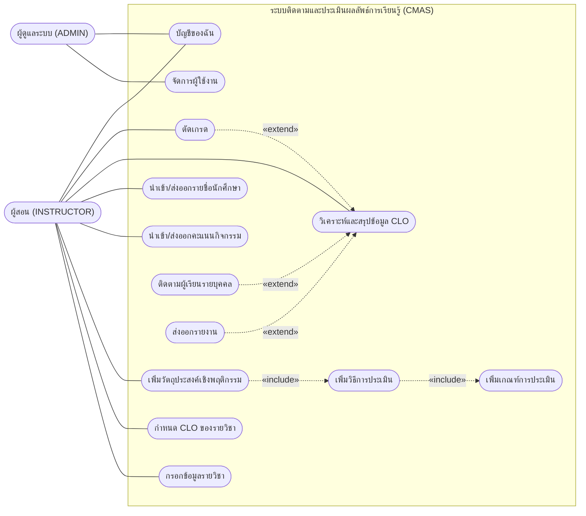
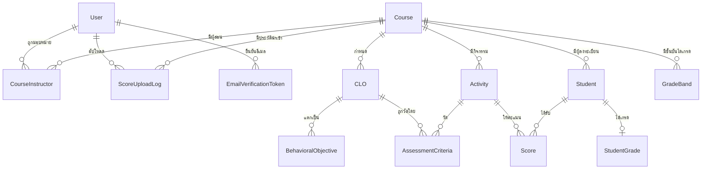
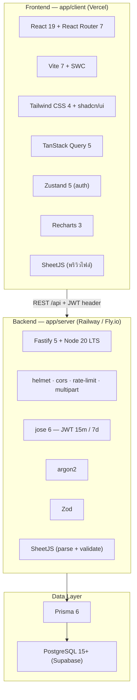
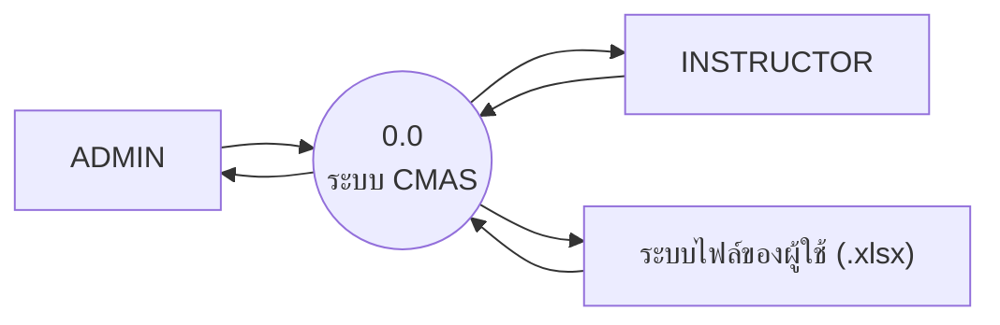

# เอกสารสรุปโครงการระบบ (System Documentation)
## ระบบติดตามและประเมินผลลัพธ์การเรียนรู้ที่คาดหวังระดับรายวิชา — CMAS / CLO System

> **จัดทำ:** 21 กันยายน 2569 · **สถานะโครงงาน:** CLO 3 (ออกแบบสถาปัตยกรรม) ใกล้ปิด · CLO 4 (พัฒนา) อยู่ใน Sprint 2
> **ขอบเขตเอกสาร:** แบ่งตามความรับผิดชอบของสมาชิก 2 ท่าน — **นูรีน** (Technical & General Tasks) · **นัท** (System Design & Architecture)
> **แหล่งอ้างอิง:** อ่านจากโค้ดและเอกสารจริงในรีโพซิทอรี ณ วันที่จัดทำ (ดูภาคผนวก ก)

---

## สารบัญ

- [0. ภาพรวมโครงงาน (บริบทร่วม)](#0-ภาพรวมโครงงาน-บริบทร่วม)
- [ส่วนที่ 1 — นูรีน · Technical & General Tasks](#ส่วนที่-1--นูรีน--technical--general-tasks)
  - [1.1 ข้อมูลด้านเทคนิคที่รับผิดชอบ](#11-ข้อมูลด้านเทคนิคที่รับผิดชอบ)
  - [1.2 สรุปงานที่ดำเนินการแล้ว (Completed Tasks)](#12-สรุปงานที่ดำเนินการแล้ว-completed-tasks)
  - [1.3 แผนงานและขั้นตอนถัดไป (Future Plans & Roadmap)](#13-แผนงานและขั้นตอนถัดไป-future-plans--roadmap)
- [ส่วนที่ 2 — นัท · System Design & Architecture](#ส่วนที่-2--นัท--system-design--architecture)
  - [2.1 การออกแบบหน้าจอ (Mock-up)](#21-การออกแบบหน้าจอ-mock-up)
  - [2.2 Use Case Diagram & Description](#22-use-case-diagram--description)
  - [2.3 ER-Diagram](#23-er-diagram)
  - [2.4 Tech Stack](#24-tech-stack)
  - [2.5 Project Architecture](#25-project-architecture)
  - [2.6 Data Flow Diagram (DFD)](#26-data-flow-diagram-dfd)
- [ภาคผนวก ก — แผนที่ไฟล์อ้างอิง](#ภาคผนวก-ก--แผนที่ไฟล์อ้างอิง)
- [ภาคผนวก ข — ข้อสังเกตและประเด็นค้าง](#ภาคผนวก-ข--ข้อสังเกตและประเด็นค้าง)

---

## 0. ภาพรวมโครงงาน (บริบทร่วม)

| หัวข้อ | รายละเอียด |
|---|---|
| **ชื่อระบบ** | CMAS — Course Learning Outcome Management & Assessment System |
| **ปัญหาที่แก้** | การติดตามผลลัพธ์การเรียนรู้ระดับรายวิชา (CLO) ปัจจุบันทำด้วย Excel แยกไฟล์ต่ออาจารย์ต่อวิชา ทำให้สรุปผลระดับรายวิชาช้า ตรวจสอบย้อนกลับไม่ได้ และมองไม่เห็นนักศึกษากลุ่มเสี่ยงระหว่างภาคเรียน |
| **แนวคิดหลัก** | กำหนด CLO → แตกเป็นวัตถุประสงค์เชิงพฤติกรรม → ผูกกับกิจกรรมประเมิน (Constructive Alignment) → นำเข้าคะแนน → คำนวณระดับการบรรลุ (attainment) และตัดเกรด |
| **ผู้ใช้ระบบ** | 2 บทบาท — **ADMIN** (ผู้ดูแลระบบระดับคณะ) และ **INSTRUCTOR** (ผู้สอน) · นักศึกษาเป็น *ข้อมูล* ไม่ใช่ผู้ใช้ระบบใน v1 |
| **ขอบเขตสถาปัตยกรรม** | **Single-tenant** — ใช้งานคณะเดียว ตัดชั้น Institution / Curriculum ออก (มติ 4 ส.ค. 2569) ขอบเขตข้อมูลที่เหลือคือ **รายวิชา** |
| **ขนาดงาน** | 13 feature / 13 หน้าจอ · 58 endpoint ตามสัญญา API · 99 FR · 19 NFR · 11 กฎการคำนวณ (CR-01…CR-11) |
| **ทีมพัฒนา** | 3 คน — แบ่งเจ้าของราย feature คนละ 3 feature จาก 9 package ใน Use Case Diagram |
| **กำหนดการ** | CLO 4 (พัฒนา) 8 sprint × 2 สัปดาห์ · Feature freeze 13 ธ.ค. 2569 · tag `v1.0.0` 30 ธ.ค. 2569 · CLO 5 (ทดสอบ / เล่ม / สอบป้องกัน) 25 ม.ค. – 27 มี.ค. 2570 |

**สถานะการพัฒนาจริง ณ วันจัดทำ**

| ชั้น | มีแล้ว | ยังไม่มี |
|---|---|---|
| Server | Fastify 5 · Prisma 6 · Zod · jose (JWT) · argon2 · `auth.middleware.ts` · `rbac.middleware.ts` · `authorization.service.ts` · `GET /health` | endpoint ธุรกิจทั้งหมด (ยัง comment ไว้ใน `routes/index.ts`) |
| Client | React 19 · React Router 7 · TanStack Query · Zustand · หน้า `Home` `Login` `Users` `CourseList` | AppShell · component library · ทุกหน้าระดับรายวิชา |
| Database | 13 model · migration 0001–0006 (รวม CHECK constraint + trigger + การตัดเกรด + ลำดับชั้น CLO) | — (schema ปิดแล้ว รอ feature เรียกใช้) |
| เอกสารออกแบบ | SRS · DFD L0–L2 · ER (Prisma + MySQL mirror) · API contract · Design System · ต้นแบบ `index-q.html` | — |

---

# ส่วนที่ 1 — นูรีน · Technical & General Tasks

> **ขอบเขตความรับผิดชอบ:** งานฐานฝั่ง Frontend (AppShell + component library) · ระบบ Excel ทั้งระบบ · ข้อมูลตัวอย่าง (seed) และ 3 feature ตาม Use Case Package — **F7 นำเข้า-ส่งออกรายชื่อ · F6 นำเข้า-ส่งออกคะแนน · F9 บัญชีของฉัน**

## 1.1 ข้อมูลด้านเทคนิคที่รับผิดชอบ

### 1.1.1 งานฐานที่ทั้งทีมต้องใช้ต่อ

| งานฐาน | รายละเอียดเชิงเทคนิค | ผู้รับของ / กำหนดส่ง |
|---|---|---|
| **AppShell** | โครงหน้าจอหลัก — แถบบน · sidebar 2 ระดับ (เมนูระดับระบบ / เมนูระดับรายวิชา) ตามตาราง `ROUTES` ของต้นแบบ · `ErrorBoundary` · ระบบ Toast (Sonner) | ทุกคน · สิ้น Sprint 1 |
| **Component Library** | คอมโพเนนต์ตาม design token: `Table` (เรียง / กรอง / เลือกแถว) · `Field` · `Modal` · `EmptyState` · `Chip` · `Meter` — สร้างบน shadcn/ui + Tailwind CSS 4 | ทุกคน · สิ้น Sprint 1 |
| **`ExcelWorkbookWriter`** | ชั้นกลางสำหรับสร้างไฟล์ `.xlsx` ด้วย SheetJS — กำหนดหัวคอลัมน์ · ชนิดข้อมูล · แผ่นงานคำอธิบาย · การล็อกเซลล์ที่ห้ามแก้ ใช้ร่วมกันทั้งเทมเพลตรายชื่อ เทมเพลตคะแนน ใบส่งเกรด และรายงานส่งออก | นูรีน (F6, F7) + นัท (UC 5.5 ส่งออกรายงาน) · สิ้น Sprint 5 |
| **Seed data** | ชุดข้อมูลตัวอย่าง 4 รายวิชา / 30 การลงทะเบียน / 120 แถวคะแนน ถอดจากต้นแบบ `index-q.html` เข้า `database/seed.ts` เพื่อให้ทุกคนพัฒนาขนานกันได้โดยไม่ต้องรอ API ของกันและกัน | ทุกคน · กลาง Sprint 2 |

### 1.1.2 Feature ที่เป็นเจ้าของ (ทำครบสาย API → หน้าจอ → test)

| # | Feature | Use case ย่อย | Model ที่เกี่ยวข้อง |
|---|---|---|---|
| **F7** | นำเข้า-ส่งออกรายชื่อนักศึกษา | 7.1 นำเข้ารายชื่อ · 7.2 ดาวน์โหลดเทมเพลต · 7.3 ตรวจรูปแบบและรายการซ้ำ · 7.4 ส่งออกรายชื่อ · 7.5 รายงานข้อผิดพลาด · 7.6 ลบนักศึกษา | `Student` |
| **F6** | นำเข้า-ส่งออกคะแนน | 6.1 นำเข้าคะแนน · 6.2 ดาวน์โหลดเทมเพลต · 6.3 ตรวจสอบความถูกต้อง · 6.4 ส่งออกคะแนน · 6.5 รายงานข้อผิดพลาด · 6.6 แก้ไขคะแนนบนหน้าเว็บ | `Score` · `ScoreUploadLog` · `Activity` |
| **F9** | บัญชีของฉัน | 9.1 แก้ไขชื่อ / อีเมลของตนเอง · 9.2 เปลี่ยนรหัสผ่านของตนเอง | `User` |

### 1.1.3 ประเด็นเทคนิคสำคัญของสาย Excel

| ประเด็น | ข้อกำหนด / วิธีจัดการ |
|---|---|
| **ไฟล์อัปโหลด = untrusted input** | ไฟล์ `.xlsx` ข้าม trust boundary จึงถือเป็น data flow ของตัวเองใน DFD (P8) — ต้องผ่าน `@fastify/multipart` → จำกัดขนาด / ชนิดไฟล์ → parse ด้วย SheetJS → validate ด้วย Zod **ก่อน** แตะฐานข้อมูล |
| **ช่องว่าง ≠ 0** | เซลล์คะแนนที่ว่างต้องบันทึกเป็น "ยังไม่ประเมิน" ไม่ใช่ 0 — มีผลโดยตรงต่อการคำนวณ attainment และการระบุนักศึกษากลุ่มเสี่ยงของ F5 / F8 (ข้อตกลงส่งมอบถึงนัท สิ้น Sprint 4) |
| **`score ≤ maxScore`** | บังคับ 2 ชั้น — Zod ที่ชั้นแอป และ trigger ในฐานข้อมูล (migration 0002 / 0004) เพราะ Prisma เขียน CHECK constraint และ trigger ไม่ได้ |
| **Mapping หัวคอลัมน์** | P8 ต้องอ่านตาราง `Activity` เพื่อแปลงหัวคอลัมน์ในไฟล์เป็น `activityId` (data flow f51 ใน DFD v2.5.0) |
| **การเขียนคะแนน** | ใช้ `upsert` ต่อคู่ `(studentId, activityId)` เพื่อให้อัปโหลดซ้ำแก้ของเดิมได้โดยไม่ต้องลบก่อน |
| **บันทึกประวัติ** | ทุกการอัปโหลดลงตาราง `ScoreUploadLog` — จำนวนแถวสำเร็จ / ล้มเหลว · ผู้อัปโหลด · เวลา ใช้ตอบหมวด Repudiation ใน threat model |
| **PDPA** | ข้อมูลนักศึกษา (`Student`) และคะแนน (`Score`) ถูกทำเครื่องหมาย Sensitive · ห้ามเขียน PII ลง application log (ข้อจำกัด CON-02) |

## 1.2 สรุปงานที่ดำเนินการแล้ว (Completed Tasks)

### ก. งานด้านเทคนิค

| # | งาน | สถานะ |
|---|---|---|
| 1 | ตั้งค่า CI (GitHub Actions) — lint + typecheck + test + `prisma validate` | ✅ เสร็จ |
| 2 | ตรวจสอบว่า migration + seed รันจาก clean clone ได้จริง (ร่วมทีม) | ✅ เสร็จ |
| 3 | ร่วมร่างเกณฑ์ประเมินด้านความถูกต้องเชิงฟังก์ชันและด้านประสิทธิภาพ | ✅ เสร็จ |
| 4 | ศึกษาโครงสร้างไฟล์ Excel ที่คณะใช้จริง เพื่อออกแบบเทมเพลตนำเข้า | 🔄 กำลังทำ |
| 5 | AppShell + component library (งานส่งมอบสิ้น Sprint 1) | 🔄 กำลังทำ |

### ข. งานทั่วไป

| # | งาน | สถานะ |
|---|---|---|
| 1 | ค้นคว้า Outcome-Based Education และ CLO / PLO ตามกรอบ มคอ. | ✅ เสร็จ |
| 2 | ค้นคว้าทฤษฎีการประเมินระบบ — Black Box Testing · IOC · Likert Scale | ✅ เสร็จ |
| 3 | จัดทำสารบัญปริญญานิพนธ์ (โครงบท 1–5 + ภาคผนวก ก–ญ) | ✅ เสร็จ |
| 4 | ปรับปรุงเอกสาร SRS · DFD · features-pages ให้ตรงกับขอบเขต single-tenant | ✅ เสร็จ |
| 5 | ทบทวนและเรียบเรียงสมมุติฐาน H1–H7 พร้อมเกณฑ์วัดของแต่ละข้อ | ✅ เสร็จ |
| 6 | ประชุมทีมและ re-baseline แผนการดำเนินงานเป็น v2.1 | ✅ เสร็จ |
| 7 | จัดพิมพ์และจัดรูปแบบรายงานความก้าวหน้าครั้งที่ 2 | ✅ เสร็จ |
| 8 | ออกแบบวิธีจับเวลา + ใบบันทึกผล สำหรับเก็บ baseline การทำงานด้วย Excel | ⚠️ ล่าช้า — เป็นงานวิกฤต ดู §1.3.3 |

> **หมายเหตุสำคัญ:** งาน ข.8 (baseline Excel) เป็นเงื่อนไขบังคับของการพิสูจน์สมมุติฐาน H2 / H3 — ถ้าไม่มีตัวเลข *เวลาที่ใช้ก่อนมีระบบ* จะเปรียบเทียบกับ *เวลาที่ใช้หลังมีระบบ* ไม่ได้ และอ้างว่าระบบ "ลดภาระงาน" ไม่ได้

## 1.3 แผนงานและขั้นตอนถัดไป (Future Plans & Roadmap)

### 1.3.1 Roadmap ราย Sprint

| Sprint | ช่วงเวลา | งานของนูรีน | ผลลัพธ์ที่ต้องสาธิตได้ |
|---|---|---|---|
| **S1** | 7 – 20 ก.ย. 69 | AppShell · Component library | เข้าสู่ระบบแล้วเห็นโครงหน้าจอครบ · คอมโพเนนต์ 6 ตัวใช้งานได้ |
| **S2** | 21 ก.ย. – 4 ต.ค. 69 | Seed data · F9 บัญชีของฉัน · เริ่ม F7 | ทีมพัฒนาบน seed ได้ · ผู้ใช้แก้ชื่อ / อีเมล / รหัสผ่านตนเองได้ |
| **S3** | 5 – 18 ต.ค. 69 | F7 รายชื่อ (API + หน้าจอ) · ปิดงาน F9 | เพิ่ม / แก้ / ลบนักศึกษาในรายวิชาได้ |
| **S4** | 19 ต.ค. – 1 พ.ย. 69 | F6 กรอกคะแนนบนหน้าเว็บ (6.6) | กรอกคะแนนรายกิจกรรมได้ · ส่งตาราง `Score` ที่ **ว่าง ≠ 0** ให้นัทใช้คำนวณ |
| **S5** | 2 – 15 พ.ย. 69 | `ExcelWorkbookWriter` · F7 นำเข้า / ส่งออก | นำเข้ารายชื่อจากไฟล์จริงได้ · ส่งมอบ Writer ให้นัทใช้ทำใบส่งเกรด |
| **S6** | 16 – 29 พ.ย. 69 | F6 นำเข้าคะแนน (6.1–6.3, 6.5) | อัปโหลด `.xlsx` → ตรวจ → รายงานข้อผิดพลาดรายแถว → บันทึก |
| **S7** | 30 พ.ย. – 13 ธ.ค. 69 | F6 ส่งออกคะแนน + หน้าประวัติการนำเข้า | ครบทุก use case ของ F6 / F7 · **Feature freeze 13 ธ.ค.** |
| **S8** | 14 – 27 ธ.ค. 69 | ข้อมูลทดสอบ · ปรับความเร็วการนำเข้า | นำเข้าไฟล์ขนาดจริงผ่านเกณฑ์ NFR · ขึ้น staging 22 ธ.ค. |
| **Release** | 28 – 31 ธ.ค. 69 | ร่วมปล่อยงาน | tag `v1.0.0` วันที่ 30 ธ.ค. 69 |

### 1.3.2 สิ่งที่ต้องส่งให้คนอื่น / ต้องรอจากคนอื่น

| ของ | ทิศทาง | กำหนด | ระหว่างรอทำอย่างไร |
|---|---|---|---|
| AppShell + components | นูรีน → ทุกคน | สิ้น S1 | — |
| Seed data 4 รายวิชา | นูรีน → ทุกคน | กลาง S2 | ทีมสร้างแถวด้วยมือไปก่อน |
| ตาราง `Score` ที่ว่าง ≠ 0 + API | นูรีน → นัท (F5, F8) | สิ้น S4 | นัทคำนวณจาก seed ไปก่อน |
| `ExcelWorkbookWriter` | นูรีน → นัท (ส่งออกรายงาน / ใบส่งเกรด) | สิ้น S5 | — |
| `request.user` จากการล็อกอิน | นัท → นูรีน | สิ้น S1 | — |
| `can(cap, courseId)` ตรวจสิทธิ์ที่ API | นัท → นูรีน | สิ้น S2 | ใช้ตัวแทนที่อนุญาตทุกอย่างใน dev |
| ธงบังคับเปลี่ยนรหัสผ่านหลังรีเซ็ต | นัจญมา → นูรีน (9.2) | สิ้น S2 | — |
| ตาราง `Activity` + API | นัจญมา → นูรีน (map หัวคอลัมน์คะแนน) | สิ้น S4 | ใช้ seed |

### 1.3.3 งานเร่งด่วนที่ต้องปิดก่อน

1. **เก็บ baseline การทำงานด้วย Excel** — ออกแบบใบจับเวลาและเก็บข้อมูลจริงจากอาจารย์ **ก่อน** ระบบเริ่มใช้งาน มิฉะนั้นพิสูจน์ H2 / H3 ไม่ได้อีกเลย
2. **ยืนยันรูปแบบไฟล์ Excel ของคณะ** — เทมเพลตนำเข้าต้องล้อกับแบบฟอร์มบันทึกคะแนนที่ใช้จริง ไม่ใช่รูปแบบที่ทีมคิดขึ้นเอง
3. **ตรวจปฏิทินสอบกลางภาค / ปลายภาคของสมาชิกทั้งสามคน** — ยังไม่มีในเอกสารใด แต่กระทบ capacity ของทุก sprint

### 1.3.4 ความเสี่ยงของสายงานนี้

| ความเสี่ยง | ผลกระทบ | การรับมือ |
|---|---|---|
| ไฟล์ Excel จริงมีรูปแบบหลากหลายกว่าที่ออกแบบไว้ | นำเข้าไม่สำเร็จในการใช้งานจริง | เก็บไฟล์ตัวอย่างจริงอย่างน้อย 3 แบบก่อนเขียน parser · ให้ "ดาวน์โหลดเทมเพลต" เป็นทางหลัก |
| งาน baseline ล่าช้าต่อเนื่อง | พิสูจน์สมมุติฐานหลักของโครงงานไม่ได้ | ยกเป็นวาระแรกของ S2 และกำหนดวันปิดให้ชัด |
| F6 พึ่งตาราง `Activity` ของนัจญมา | เลื่อนได้ถ้าส่งช้า | พัฒนาบน seed ที่มี `Activity` ครบไปก่อน |

---

# ส่วนที่ 2 — นัท · System Design & Architecture

> **ขอบเขตความรับผิดชอบ:** แบบจำลองและสถาปัตยกรรมทั้งระบบ — ต้นแบบหน้าจอ · Use Case · ER · Tech Stack · สถาปัตยกรรมโครงการ · DFD พร้อมงานฐานด้านสิทธิ์และการคำนวณ (F2 จัดการรายวิชา · F5 วิเคราะห์และสรุป CLO · F8 ตัดเกรด)

## 2.1 การออกแบบหน้าจอ (Mock-up)

### 2.1.1 รูปแบบต้นแบบ

ต้นแบบของระบบคือ **`docs/pages/index-q.html`** — ไฟล์ HTML เดียวที่รันได้จริงจาก `file://` โดยไม่ต้องมีเซิร์ฟเวอร์ พึ่งภายนอกเพียง Tailwind CDN และ Google Fonts

| คุณสมบัติ | ค่า |
|---|---|
| จำนวนหน้า | 9 หน้า |
| Entity ที่ CRUD ได้ในต้นแบบ | 7 entity |
| ข้อมูลตัวอย่างในตัว | 4 รายวิชา · 30 การลงทะเบียน · 120 แถวคะแนน |
| ตารางเส้นทาง | `ROUTES` — ใช้เป็นแหล่งจริงของโครงเมนูใน AppShell |
| เอกสารประกอบ | `design-system-preview.html` (design token + คอมโพเนนต์) · `database-preview.html` · `evaluation-criteria.html` · `tech-stack-review.html` |

> **ทำไมต้องเป็นต้นแบบที่รันได้:** ต้นแบบนี้ทำหน้าที่เป็น *ข้อกำหนดที่กดใช้งานได้* — ทีมและอาจารย์ที่ปรึกษาเห็นการไหลของงานจริงก่อนลงมือเขียนระบบ และทีมพัฒนาถอดค่า `ROUTES`, `FORMS`, `derive()` จากต้นแบบไปใช้ได้ตรง ๆ โดยไม่ต้องตีความเอกสารซ้ำ

### 2.1.2 แผนที่หน้าจอของระบบจริง (13 หน้า)

| # | Route | หน้าจอ | สถานะ |
|---|---|---|---|
| 1 | `/` | Home / redirect | ✅ มีแล้ว |
| 2 | `/auth/login` | เข้าสู่ระบบ | ✅ มีแล้ว |
| 3 | `/admin/users` | จัดการผู้ใช้งาน | ✅ มีแล้ว |
| 4 | `/courses` | รายการรายวิชา | ✅ มีแล้ว |
| 5 | `/courses/new` | สร้างรายวิชา | ⬜ ต้องทำ |
| 6 | `/courses/:courseId` | ภาพรวมรายวิชา | ⬜ ต้องทำ |
| 7 | `/courses/:courseId/clos` | กำหนด CLO (+ จุดประสงค์เชิงพฤติกรรม) | ⬜ ต้องทำ |
| 8 | `/courses/:courseId/activities` | กิจกรรมประเมิน + เมทริกซ์เกณฑ์ | ⬜ ต้องทำ |
| 9 | `/courses/:courseId/students` | รายชื่อนักศึกษา | ⬜ ต้องทำ |
| 10 | `/courses/:courseId/scores` | กรอก / นำเข้า / ส่งออกคะแนน | ⬜ ต้องทำ |
| 11 | `/courses/:courseId/scores/uploads` | ประวัติการนำเข้าไฟล์ | ⬜ ต้องทำ |
| 12 | `/courses/:courseId/dashboard` | แดชบอร์ดสรุปผล CLO | ⬜ ต้องทำ |
| 13 | `/courses/:courseId/dashboard/students/:studentId` | รายงานรายบุคคล | ⬜ ต้องทำ |

### 2.1.3 ผลการทบทวนต้นแบบกับผู้ทรงคุณวุฒิ (14 ก.ย. 2569)

ข้อเสนอแนะ 14 ข้อ (F1–F14) ถูกแปลงเป็นมติออกแบบ 7 ข้อ (D1–D7) และแผนแก้เป็นเฟส P1–P9 — เฟส P1, P2, P3, P5, P6, P7, P8 แก้ในต้นแบบเรียบร้อยแล้ว

| มติ | สาระสำคัญ | ผลต่อการออกแบบ |
|---|---|---|
| **D1** | ตัดบทบาทผู้ช่วยสอน (ASSISTANT) และภายหลังตัด `CourseRole` ทั้งหมด | ผู้สอนทุกคนในรายวิชามีสิทธิ์เท่ากัน → ลดเมทริกซ์สิทธิ์ทั้งชุด (migration 0005) |
| **D2** | ตัดเป้าหมาย % ที่ให้กรอกเอง | แดชบอร์ดแสดง "% นักศึกษาที่ผ่าน CLO" ตรง ๆ โดยอ้างเป้าอ้างอิง 100% |
| **D3** | น้ำหนัก CLO กรอกเองและให้ระบบตรวจความสอดคล้องกับน้ำหนักที่คำนวณจากกิจกรรม | ⚠️ ยังไม่ได้ข้อสรุป — เป็นประเด็นค้าง |
| **D4** | ระดับ taxonomy (Bloom vs SOLO) รอเอกสารต้นทางของ คอบ. | ออกแบบ UI ให้สลับ enum ได้ ไม่ hard-code |
| **D5** | ไม่นำ PLO กลับเข้าขอบเขต | คงขอบเขตตาม SRS เดิม |
| **D6** | เปิดให้ **ลงทะเบียนเอง → ยืนยันอีเมล** เฉพาะโดเมนของคณะ | เพิ่มตาราง `EmailVerificationToken` และ enum `AuthProvider` (migration 0005) |
| **D7** | นโยบายรหัสผ่าน ≥ 12 ตัวอักษร + มิเตอร์ความแข็งแรง | มีผลต่อฟอร์มสมัครและหน้าเปลี่ยนรหัสผ่าน (F9) |

## 2.2 Use Case Diagram & Description

### 2.2.1 แผนภาพ



### 2.2.2 Use Case Description — 9 package และเจ้าของงาน

| # | Package | Use case ย่อย | Actor | เจ้าของ |
|---|---|---|---|---|
| 1 | จัดการผู้ใช้งาน | 1.1 เพิ่มบัญชี · 1.2 แก้ไขบัญชี · 1.3 ระงับบัญชี · 1.4 กำหนดบทบาท · 1.5 รีเซ็ตรหัสผ่าน · 1.6 ตรวจสอบประวัติการใช้งาน | ADMIN | นัจญมา |
| 2 | จัดการรายวิชา | 2.1 สร้าง · 2.2 แก้ไข · 2.3 ลบ · 2.4 มอบหมายผู้สอน · 2.5 กำหนดหมู่เรียน / ภาคการศึกษา · 2.6 เชิญผู้สอนร่วม · 2.7 สร้างรายวิชาของตนเอง · 2.8 ถอดผู้สอนร่วม | ADMIN / INSTRUCTOR | **นัท** |
| 3 | กำหนด CLO | 3.1 เพิ่ม · 3.2 แก้ไข · 3.3 กำหนดเกณฑ์ผ่าน · 3.5 ลบ | INSTRUCTOR | นัจญมา |
| 4 | วัตถุประสงค์เชิงพฤติกรรม | 4.1 เพิ่มวัตถุประสงค์ · 4.2 เพิ่มวิธีการประเมิน · 4.3 เพิ่มเกณฑ์การประเมิน · 4.4 จับคู่กับ CLO · 4.5 แก้ไข · 4.6 ลบ | INSTRUCTOR | นัจญมา |
| 5 | วิเคราะห์และสรุป CLO | 5.1 วิเคราะห์ / สรุป · 5.2 คำนวณคะแนนตาม CLO · 5.3 สรุประดับรายวิชา · 5.4 ติดตามรายบุคคล · 5.5 ส่งออกรายงาน · 5.6 ระบุนักศึกษาที่ต้องติดตาม | INSTRUCTOR | **นัท** |
| 6 | นำเข้า-ส่งออกคะแนน | 6.1–6.6 | INSTRUCTOR | นูรีน |
| 7 | นำเข้า-ส่งออกรายชื่อ | 7.1–7.6 | INSTRUCTOR | นูรีน |
| 8 | ตัดเกรด | 8.1 กำหนดขอบเขตเกรด · 8.2 ประมวลผลและตรึงเกรด · 8.3 ปรับเกรดรายบุคคล | INSTRUCTOR | **นัท** |
| 9 | บัญชีของฉัน | 9.1 แก้ไขชื่อ / อีเมล · 9.2 เปลี่ยนรหัสผ่าน | ทุกบทบาท | นูรีน |

### 2.2.3 ตัวอย่าง Use Case Description แบบเต็ม — UC 5.1 วิเคราะห์และสรุปข้อมูล CLO

| ช่อง | รายละเอียด |
|---|---|
| **รหัส / ชื่อ** | UC 5.1 — วิเคราะห์และสรุปข้อมูลผลลัพธ์การเรียนรู้ระดับรายวิชา |
| **Actor หลัก** | ผู้สอน (INSTRUCTOR) ที่ถูกมอบหมายในรายวิชานั้น |
| **เงื่อนไขก่อนเริ่ม** | เข้าสู่ระบบแล้ว · รายวิชามี CLO อย่างน้อย 1 ข้อ · มีกิจกรรมที่ผูกกับ CLO · มีคะแนนอย่างน้อย 1 แถว |
| **ลำดับขั้นหลัก** | 1) เลือกรายวิชา → 2) เปิดแดชบอร์ด → 3) ระบบอ่านคะแนน + เกณฑ์การประเมิน + เกณฑ์ผ่านของ CLO → 4) คำนวณคะแนนรายนักศึกษาต่อ CLO ตาม CR-01…CR-03 → 5) คำนวณระดับการบรรลุระดับชั้นเรียนตาม CR-04 → 6) แสดงกราฟแท่ง attainment · โดนัทสถานะ · ฮิสโทแกรม → 7) แสดงรายชื่อนักศึกษาที่ต้องติดตาม |
| **ทางเลือก / ข้อยกเว้น** | 3a) ยังไม่มีคะแนนเลย → แสดง EmptyState พร้อมลิงก์ไปหน้านำเข้าคะแนน · 4a) กิจกรรมที่น้ำหนักรวมไม่ครบ 100% → แจ้งเตือนแต่ยังคำนวณต่อ พร้อมระบุว่าข้อมูลไม่ครบ |
| **เงื่อนไขหลังจบ** | ผู้สอนเห็นระดับการบรรลุรายข้อ CLO และรายชื่อกลุ่มเสี่ยง · ไม่มีการเขียนข้อมูลกลับ (use case แบบอ่านอย่างเดียว) |
| **กฎที่เกี่ยวข้อง** | CR-01…CR-07 · FR-81 · FR-83 · FR-88 · NFR-07 (ผู้สอนที่ไม่ได้ถูกมอบหมายได้ 404 ไม่ใช่ 403) |

## 2.3 ER-Diagram

### 2.3.1 หลักการออกแบบ

1. **`Course` เป็นราก** — ตัดชั้น Institution / Curriculum ออกตามมติ single-tenant · ความไม่ซ้ำของรายวิชาคือ `(code, semester, year, section)`
2. **`Role` อยู่บน `User`** — หนึ่งคนมีสถานะเดียวในคณะ จึงไม่ต้องเก็บ role รายสถาบัน
3. **ปีการศึกษาเก็บเป็น พ.ศ. ตรงตามที่คณะกรอก** (2568 ไม่ใช่ 2025) — คณะเดียวมีธรรมเนียมเดียว ไม่ต้องมีคอลัมน์ระบุศักราช
4. **ข้อบังคับที่ Prisma เขียนไม่ได้ อยู่ใน migration** — CHECK constraint (คะแนน ≥ 0 · น้ำหนัก 0–100 · `maxScore` > 0) และ trigger (`score ≤ maxScore` · กิจกรรมและนักศึกษาต้องอยู่ในรายวิชาเดียวกัน) จึง **ห้ามใช้ `prisma db push` ทุกสภาพแวดล้อม** เพราะจะลบของเหล่านี้อย่างเงียบ ๆ

### 2.3.2 แผนภาพความสัมพันธ์



### 2.3.3 พจนานุกรมเอนทิตี

| เอนทิตี | หน้าที่ | หมายเหตุ |
|---|---|---|
| `User` | บัญชีผู้ใช้ + บทบาทระดับคณะ | `role` = ADMIN / INSTRUCTOR · `isActive` ใช้ระงับบัญชี · รหัสผ่าน hash ด้วย argon2 |
| `EmailVerificationToken` | โทเคนยืนยันอีเมลตอนลงทะเบียนเอง | เพิ่มตามมติ D6 |
| `Course` | รายวิชาที่เปิดสอนจริงต่อภาคการศึกษา | ถือ `credits` · `gradeScale` · `gradeMethod` · `passCriteria` · `classTarget` |
| `CourseInstructor` | ตารางเชื่อมผู้สอน ↔ รายวิชา | ผู้สอนทุกคนสิทธิ์เท่ากัน (ตัด `CourseRole` แล้ว) |
| `CLO` | ผลลัพธ์การเรียนรู้ระดับรายวิชา | `number` จัดลำดับ · `threshold` เกณฑ์ผ่านรายบุคคล · `bloomLevel` |
| `BehavioralObjective` | จุดประสงค์เชิงพฤติกรรมที่แตกจาก CLO | ชั้นกลางของ constructive alignment |
| `Activity` | กิจกรรมประเมิน (สอบ / งาน / ปฏิบัติ) | มี `weight` · `maxScore` · `order` |
| `AssessmentCriteria` | ผูก Activity ↔ CLO พร้อมน้ำหนักต่อคู่ | น้ำหนักรวมต่อกิจกรรมต้องเป็น 100% |
| `Student` | รายชื่อนักศึกษาในรายวิชา | ขอบเขตด้วย `courseId` · ข้อมูลอ่อนไหวตาม PDPA |
| `Score` | คะแนนรายนักศึกษาต่อกิจกรรม | **ว่าง ≠ 0** · บังคับ `score ≤ maxScore` ด้วย trigger |
| `ScoreUploadLog` | ประวัติการนำเข้าไฟล์ | จำนวนแถวสำเร็จ / ล้มเหลว · ใช้ตอบหมวด Repudiation |
| `GradeBand` | ขั้นบันไดเกรดของรายวิชา | หน่วยเป็น % (อิงเกณฑ์) หรือ T-score (อิงกลุ่ม) |
| `StudentGrade` | เกรดที่ตรึงแล้วของนักศึกษา | เก็บเป็นค่าจริง เพื่อให้เกรดไม่เปลี่ยนเมื่อข้อมูลอื่นเปลี่ยน |

### 2.3.4 Enum สำคัญ

| Enum | ค่า | ความหมาย |
|---|---|---|
| `Role` | ADMIN · INSTRUCTOR | บทบาทระดับคณะ |
| `GradeScale` | LETTER · PASS_FAIL | **สเกลผลลัพธ์** — บางรายวิชารายงานผ่าน / ไม่ผ่าน (S/U) |
| `GradingMethod` | CRITERION_REFERENCED (อิงเกณฑ์) · NORM_REFERENCED (อิงกลุ่ม) | **วิธีหาเส้นแบ่งเกรด** — หน่วยของขั้นบันไดตามมาจากวิธี |
| `BloomLevel` / `SoloLevel` | ตาม taxonomy | ระดับพฤติกรรมของ CLO ขับ constructive alignment |
| `ActivityType` / `AssessmentMethod` | ชนิดกิจกรรม / วิธีประเมิน | ใช้ตรวจความเหมาะสมของวิธีวัดกับระดับ CLO |
| `AuthProvider` | ช่องทางยืนยันตัวตน | รองรับการลงทะเบียนเอง (D6) |

### 2.3.5 ไฟล์ประกอบ

| ไฟล์ | ใช้ทำอะไร |
|---|---|
| `database/schema.prisma` | **แหล่งจริง** ของโครงสร้างข้อมูล (PostgreSQL) |
| `database/migrations/0001…0006` | ลำดับการเปลี่ยนโครงสร้าง + CHECK constraint + trigger |
| `docs/reference/db/mysql/cmas_app_mysql_v4.sql` | สำเนาเชิง MySQL สำหรับ reverse-engineer เป็น EER Diagram ใน MySQL Workbench (13 ตาราง · 80 คอลัมน์ · 16 FK) |
| `docs/uml/index-q/ER-INDEX-Q.drawio` / `.pdf` | ไดอะแกรมสำหรับใส่เล่มและพรีเซนต์ |

## 2.4 Tech Stack

### 2.4.1 ตารางสรุป

| ชั้น | เทคโนโลยี | เหตุผลที่เลือก |
|---|---|---|
| **Frontend** | React 19 · React Router 7 (SPA) · Vite 7 + plugin-react-swc · TypeScript 5.9 | ระบบเป็นเครื่องมือหลังล็อกอิน ไม่ต้องการ SEO จึงใช้ SPA ล้วน |
| **UI** | Tailwind CSS 4 · shadcn/ui · Sonner (toast) · Recharts 3 (กราฟ) | design token ชุดเดียวใช้ได้ทั้งระบบ · Recharts ตอบโจทย์กราฟแดชบอร์ดโดยไม่ต้องเขียน D3 เอง |
| **State / Data** | TanStack Query 5 (ข้อมูลจากเซิร์ฟเวอร์) · Zustand 5 (สถานะ auth เท่านั้น) | แยก server state ออกจาก client state ชัดเจน ลดปัญหาข้อมูลค้าง |
| **Backend** | Node.js ≥ 20 LTS · Fastify 5 · TypeScript | Fastify เร็วกว่า Express และมี schema validation ในตัว |
| **ความปลอดภัย** | helmet · cors · rate-limit · multipart · jose 6 (JWT access 15 นาที / refresh 7 วัน) · argon2 | ครอบ OWASP พื้นฐาน · argon2 เป็นมาตรฐานปัจจุบันของการ hash รหัสผ่าน |
| **Validation** | Zod | สคีมาเดียวใช้ได้ทั้ง validate และ type — ไม่เชื่อ input จากไคลเอนต์เกินขอบเขตสคีมา |
| **Excel** | SheetJS (`xlsx`) ทั้งฝั่ง parse และสร้างไฟล์ | คณะทำงานด้วย Excel อยู่แล้ว การนำเข้า / ส่งออกจึงเป็นฟีเจอร์หลัก ไม่ใช่ของแถม |
| **ORM / DB** | Prisma 6 · PostgreSQL 15+ (Supabase) | Prisma ให้ type-safety ถึงชั้น query · Supabase ให้ฐานข้อมูลที่ใช้ได้ทั้ง dev และ prod |
| **Tooling** | npm workspaces (monorepo) · ESLint + typescript-eslint · Prettier · Vitest · Docker Compose | `npm run verify` = format + lint + typecheck + test + build รันก่อน push ทุกครั้ง |
| **CI/CD** | GitHub Actions — verify pipeline + Docker image build ทุก PR | ตรวจอัตโนมัติก่อน merge |
| **Deploy** | Client → Vercel · Server → Railway / Fly.io · DB → Supabase | สองแอปดีพลอยแยกกัน แชร์กันแค่สัญญา API และ `schema.prisma` |

### 2.4.2 แผนภาพ



## 2.5 Project Architecture

### 2.5.1 รูปแบบสถาปัตยกรรม

**Monorepo (npm workspaces) → 2 แอปที่ดีพลอยอิสระ → ฐานข้อมูลเดียว**
ฝั่งเซิร์ฟเวอร์ใช้ **Layered Architecture** ที่แต่ละชั้นมีสัญญาชัดเจน และมี `README.md` กำกับในทุกโฟลเดอร์

```
CMAS/
├── app/
│   ├── client/                 React 19 SPA → Vercel
│   │   └── src/
│   │       ├── api/            fetch wrapper · แนบ JWT · จัดการ error toast
│   │       ├── components/     UI components (design system)
│   │       ├── hooks/          TanStack Query — ที่เดียวที่เรียก API
│   │       ├── pages/          เป้าหมายของ route (default export)
│   │       └── store/          Zustand — เก็บเฉพาะสถานะ auth
│   └── server/                 Fastify 5 → Railway / Fly.io
│       └── src/
│           ├── routes/         ลงทะเบียน path + middleware เท่านั้น
│           ├── controllers/    ชั้นบาง ๆ รับ request / ส่ง response
│           ├── services/       ตรรกะทางธุรกิจทั้งหมด
│           ├── validators/     Zod schema ต่อ resource
│           ├── middlewares/    auth · rbac · error handler
│           └── lib/            env · prisma · jwt · response helper
├── database/                   schema.prisma (แหล่งจริง) + seed.ts + migrations/
├── scripts/                    setup.mjs และสคริปต์สร้างเอกสาร
└── docs/                       SRS · DFD · ER · design system · ต้นแบบ
```

### 2.5.2 กฎสถาปัตยกรรมที่บังคับใช้

| กฎ | เหตุผล |
|---|---|
| **ตรรกะธุรกิจอยู่ใน `services/` เท่านั้น** | `controllers/` ต้องบางพอที่จะเปลี่ยน transport ได้โดยไม่แตะตรรกะ |
| **ทุก request ที่ต้องยืนยันตัวตนผ่าน `authMiddleware`** ซึ่งอ่านแถว `User` สดทุกครั้ง | บัญชีที่เพิ่งถูกระงับต้องใช้งานไม่ได้ทันที ไม่ต้องรอ token หมดอายุ |
| **ทุก route ที่รับ `:courseId` ต้องเรียก `assertCourseAccess()`** | single-tenant ทำให้ *รายวิชา* เป็นขอบเขตข้อมูลชั้นเดียวที่เหลือ — ข้ามการตรวจนี้คือเปิดข้อมูลรายวิชาของเพื่อนร่วมงาน |
| **ผู้สอนที่แตะ `courseId` ที่ไม่ใช่ของตน ได้ 404 ไม่ใช่ 403** (NFR-07) | 403 เป็นการยืนยันว่ารายวิชานั้นมีอยู่จริง ซึ่งถือเป็นการรั่วข้อมูล |
| **สูตรคำนวณทั้งหมด (CR-01…CR-11) อยู่ที่เดียว** (FR-88) | ป้องกันการคำนวณซ้ำคนละที่แล้วได้ตัวเลขไม่ตรงกัน จึงรวมไว้ในสาย feature ของนัท |
| **`prisma db push` ถูกห้ามทุกสภาพแวดล้อม** | จะลบ CHECK constraint และ trigger ที่ Prisma มองไม่เห็นออกอย่างเงียบ ๆ |
| **ไคลเอนต์เรียก API ผ่าน `hooks/` เท่านั้น** | คุม cache · retry · การจัดการ error ไว้จุดเดียว |
| **`/health` เป็น route เดียวที่ไม่ต้องยืนยันตัวตน** | ทุกอย่างที่เหลือถือว่าต้องล็อกอิน เป็นค่าเริ่มต้นที่ปลอดภัย |

### 2.5.3 รูปแบบสัญญา API

- Response envelope มาตรฐาน `{ success, data, error }` ทุก endpoint (SRS §5.2)
- ชุดรหัสข้อผิดพลาดกลาง ใช้ร่วมกันทั้งระบบ
- รวม **58 endpoint** ครอบคลุมทุกโมดูล — รายละเอียดใน `docs/markdown/dev/api-design.md`

## 2.6 Data Flow Diagram (DFD)

> เอกสาร DFD ฉบับเต็ม (v2.5.0) เป็นทั้งภาพประกอบบทที่ 3 และ **input ของการทำ Threat Modeling** ด้วย Microsoft Threat Modeling Tool 2016 ตามแนวทาง STRIDE

### 2.6.1 กฎการเขียน DFD ชุดนี้

| กฎ | เหตุผล |
|---|---|
| สิ่งที่ยังไม่มีในโค้ด ต้องทำเครื่องหมาย `(planned)` | ไดอะแกรมที่วาดจากความตั้งใจจะให้ threat list ที่ผิด |
| นักศึกษา **ไม่ใช่** external entity | นักศึกษาเป็น *ข้อมูล* ไม่ใช่ผู้ใช้ใน v1 แต่เป็น data subject ตาม PDPA |
| Middleware chain เป็น process แยก (P3) | เพื่อให้เห็น threat ที่เกิดจาก "route ที่ลืมต่อ middleware" |
| ขอบเขตข้อมูลคือ **รายวิชา** ไม่ใช่สถาบัน | บังคับที่ชั้นแอปพลิเคชัน ไม่ใช่ที่ network layer |
| ไฟล์ Excel = ช่องทางรับ input ที่ไม่น่าเชื่อถือ | ต้องเป็น data flow ของตัวเอง ไม่ใช่รายละเอียดภายใน process |

### 2.6.2 Level 0 — Context Diagram

มองจากภายนอก ระบบเป็น **1 process** ตอบคำถามเดียวว่า *ใครคุยกับระบบ และคุยเรื่องอะไร*



### 2.6.3 Level 1 — การแตกกระบวนการ

แตก process 0.0 เป็น **10 process · 9 data store · 4 trust boundary · 56 data flow**

| รหัส | Process | หน้าที่ | สถานะ |
|---|---|---|---|
| P1 | SPA Client | หน้าจอทั้งหมดฝั่งเบราว์เซอร์ | ยังไม่ครบ |
| P2 | Auth & Session | login / refresh / logout · ออก JWT | ยังไม่ครบ |
| P3 | Access Control Gate | `authMiddleware → rbac → assertCourseAccess` | ยังไม่ครบ |
| P4 | User Admin | จัดการบัญชีระดับคณะ (นอกขอบเขตรายวิชา) | ยังไม่ครบ |
| P5 | Course & Instructor | รายวิชาและการมอบหมายผู้สอน | ยังไม่ครบ |
| P6 | CLO · Activity · Criteria | CLO · จุดประสงค์ · กิจกรรม · เมทริกซ์เกณฑ์ | ยังไม่ครบ |
| P7 | Roster & Score Entry | รายชื่อนักศึกษาและการกรอกคะแนน | ยังไม่ครบ |
| P8 | Excel Import/Export | นำเข้า / ส่งออกไฟล์ `.xlsx` | ยังไม่ครบ |
| P9 | Health | `GET /health` | ✅ ใช้งานได้ |
| P10 | Attainment & Reporting | คำนวณระดับการบรรลุ CLO · ตัดเกรด · รายงาน | ยังไม่ครบ |

| Data store | เนื้อหา | ความอ่อนไหว |
|---|---|---|
| D1 | `User` | ✅ (รหัสผ่าน hash) |
| D2 | `Course` · `CourseInstructor` | — |
| D3 | `CLO` · `BehavioralObjective` · `Activity` · `AssessmentCriteria` · `ObjectiveAssessment` | — |
| D4 | `Student` | ✅ PDPA |
| D5 | `Score` | ✅ PDPA |
| D6 | `ScoreUploadLog` | — |
| D7 | Upload Buffer (ไฟล์ที่กำลัง parse) | ✅ ชั่วคราว |
| D8 | Token Store ฝั่งเบราว์เซอร์ | ✅ (เสี่ยง XSS) |
| D9 | Application Log | ❌ ห้ามมี PII (CON-02) |

| Trust boundary | แบ่งอะไร |
|---|---|
| **TB-1** | เบราว์เซอร์ / อินเทอร์เน็ต ↔ เซิร์ฟเวอร์ |
| **TB-2** | แอปพลิเคชัน ↔ ฐานข้อมูล PostgreSQL |
| **TB-3** | เขตที่ยังไม่ยืนยันตัวตน (P2, P9) |
| **TB-4** | **ขอบเขตรายวิชา** — บังคับที่ `assertCourseAccess()` |

### 2.6.4 Level 2 — สองกระบวนการที่ซับซ้อนที่สุด

1. **P8 Excel Import/Export** — รับไฟล์ → ตรวจชนิด / ขนาด → parse → map หัวคอลัมน์เป็น `activityId` (อ่าน D3) → validate ทีละแถว → `upsert` ลง D5 → เขียนสรุปลง D6 → ส่งรายงานข้อผิดพลาดกลับผู้ใช้
2. **P10 Attainment & Reporting** — อ่านคะแนน (D5) + เกณฑ์การประเมิน (D3) + `passCriteria` / `classTarget` / `gradeScale` จากรายวิชา (D2) → คำนวณตาม CR-01…CR-07 → สรุประดับรายวิชา → ระบุนักศึกษาที่ต้องติดตาม → ส่งออกรายงาน

### 2.6.5 จุดที่ต้องตอบให้ได้ในการทำ Threat Model (STRIDE)

| หมวด | จุดเสี่ยงหลัก |
|---|---|
| **Spoofing** | การล็อกอิน (P2) · ที่เก็บ token ในเบราว์เซอร์ (D8) |
| **Tampering** | ไฟล์ Excel ที่อัปโหลด (D7 → P8) · การแก้คะแนนตรง ๆ ใน D5 |
| **Repudiation** | ต้องมี `ScoreUploadLog` (D6) และประวัติการใช้งาน (UC 1.6) |
| **Information disclosure** | D4 / D5 เป็นข้อมูลตาม PDPA · การข้าม TB-4 คือการรั่วข้ามรายวิชา |
| **Denial of service** | rate-limit ที่การล็อกอิน · จำกัดขนาดไฟล์อัปโหลด |
| **Elevation of privilege** | route ที่ลืมต่อ middleware · INSTRUCTOR แตะ `courseId` ที่ไม่ใช่ของตน |

---

## ภาคผนวก ก — แผนที่ไฟล์อ้างอิง

| หัวข้อในเอกสารนี้ | ไฟล์ต้นทางในรีโพซิทอรี |
|---|---|
| ขอบเขต feature / หน้าจอ | `docs/markdown/dev/features-pages.md` |
| ข้อกำหนดระบบ (FR / NFR / CR) | `docs/markdown/dev/srs.md` |
| Use Case Diagram | `docs/markdown/graph/usecase.md` · `docs/uml/index-q/index-q-usecase.drawio` |
| ER-Diagram | `database/schema.prisma` · `docs/markdown/sql/mysql-er-diagram.md` · `docs/uml/index-q/ER-INDEX-Q.drawio` |
| Tech Stack | `docs/markdown/graph/tech-stack.md` · `docs/markdown/dev/dev.md` §1 |
| Architecture | `README.md` §Structure · `docs/uml/CMAS/UML.md` · `docs/uml/index-q/index-q-architecture.md` |
| DFD | `docs/markdown/dev/dfd.md` (v2.5.0) |
| Mock-up | `docs/pages/index-q.html` · `docs/pages/design-system-preview.html` |
| ผลทบทวน mockup | `docs/markdown/dev/mockup-feedback-plan.md` |
| แผนงาน | `docs/markdown/dev/project-plan.md` (WBS / Gantt) · `docs/markdown/dev/sprint-plan-2026.md` |
| รายงานความก้าวหน้า | `docs/markdown/dev/progress-report-02.md` |
| สัญญา API | `docs/markdown/dev/api-design.md` (58 endpoint) |
| กฎของทีม | `docs/markdown/rule/code-rule.md` · `git-rule.md` · `security-rule.md` |

## ภาคผนวก ข — ข้อสังเกตและประเด็นค้าง

| # | ประเด็น | ผลกระทบ | ผู้รับผิดชอบ |
|---|---|---|---|
| 1 | **OI-10** ยังไม่ชี้ขาดว่าใช้สูตรน้ำหนัก CR-02 หรือ CR-03 — สองสูตรให้ผลต่างกันถึง 20 จุดบนข้อมูลชุดเดียวกัน | เขียน unit test ของการคำนวณ attainment ไม่ได้ · บล็อกการพิสูจน์ H1 | นัท (ต้องให้อาจารย์ที่ปรึกษาชี้ขาด) |
| 2 | **OI-12** ยังไม่นิยามว่านักศึกษาที่ยังไม่มีคะแนนเลยถือเป็นกลุ่มเสี่ยงหรือไม่ | กระทบ FR-83 และการพิสูจน์ H2 | นัท |
| 3 | **D3** น้ำหนัก CLO กรอกเองหรือคำนวณ ยังไม่ได้ข้อสรุป | กระทบ CR-02 · FR-32 และหน้าจอกำหนด CLO | นัท + นัจญมา |
| 4 | **D4** ชื่อระดับ SOLO รอเอกสาร คอบ. หน้า 33 | ออกแบบ UI เป็น enum สลับได้ไปก่อน ห้ามเดาเอง | นัท |
| 5 | **Baseline Excel** ยังไม่เริ่มเก็บ | พิสูจน์ H2 / H3 ไม่ได้ ถ้าปล่อยจนระบบเริ่มใช้งานจริง | นูรีน + นัจญมา |
| 6 | ปฏิทินสอบกลางภาค / ปลายภาคของทีมยังไม่อยู่ในแผนใด | ประเมิน capacity ราย sprint คลาดเคลื่อน | ทีม (ก่อนเริ่ม S2) |
| 7 | เอกสารบางฉบับยังอ้าง MySQL หรือจำนวน model เดิม | ให้ยึด `database/schema.prisma` เป็นแหล่งจริงเสมอ | ทีม |

---

_เอกสารนี้สรุปจากสถานะจริงของโค้ดและเอกสารในรีโพซิทอรี ณ วันที่ 21 กันยายน 2569 — เมื่อขอบเขตเปลี่ยน ให้แก้เอกสารต้นทางตามภาคผนวก ก ก่อน แล้วจึงปรับเอกสารฉบับนี้ตาม_
