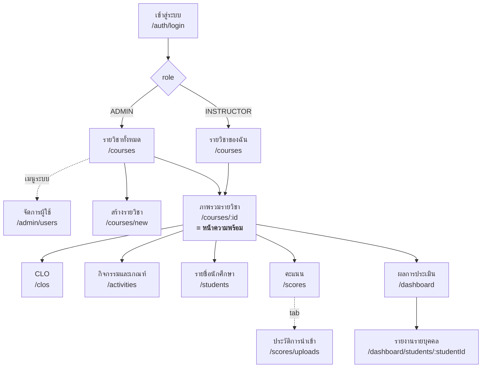
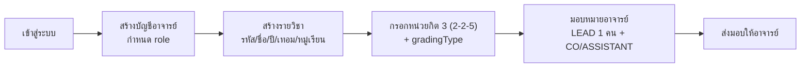
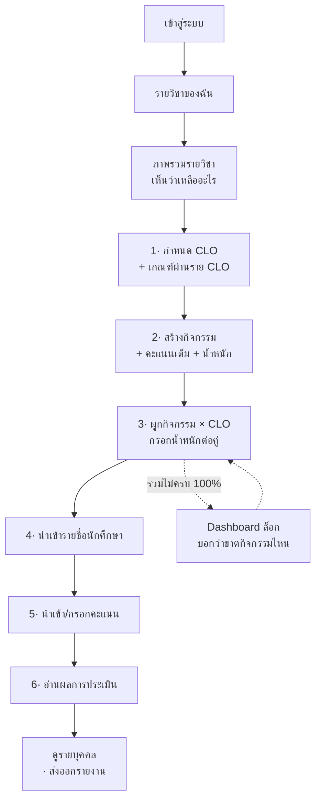
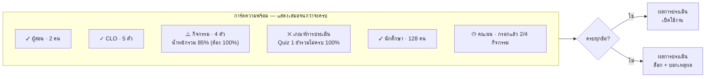
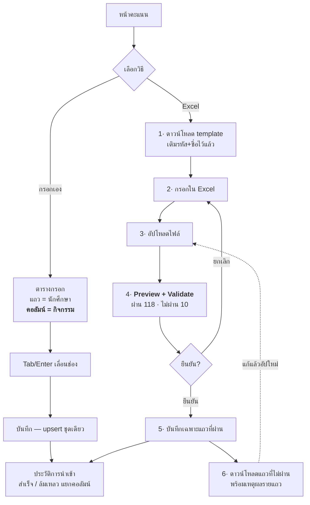
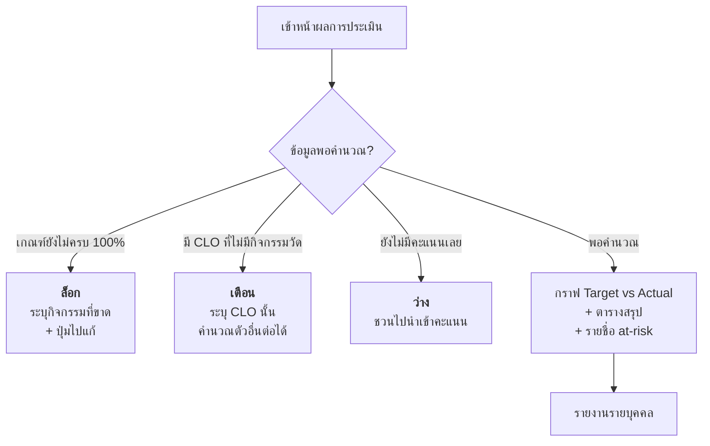

# User Flow & UX Design — CMAS

See also: [[srs]] · [[features-pages]] · [[design-system]] · [[dev]] · [[usecase]]

> **Version:** 1.0.0 | **Created:** 2026-08-07
> **Baseline:** [[srs]] v2.0.0 (single-tenant, 11 models) · [[features-pages]] (13 หน้า)
> **ขอบเขตเอกสารนี้:** UX / UI flow เท่านั้น — ไม่แตะ API, schema หรือ implementation
> เมื่อขัดกับ [[srs]] ให้ยึด [[srs]] แล้วแก้เอกสารนี้ตาม

---

## สารบัญ

1. [ข้อค้นพบที่กำหนดรูปร่างของ flow ทั้งหมด](#1-ข้อค้นพบที่กำหนดรูปร่างของ-flow-ทั้งหมด)
2. [หลักการออกแบบ](#2-หลักการออกแบบ)
3. [Information Architecture](#3-information-architecture)
4. [Role Journey](#4-role-journey)
5. [Critical Path — ตั้งค่ารายวิชาครั้งแรก](#5-critical-path--ตั้งค่ารายวิชาครั้งแรก)
6. [Flow นำเข้าคะแนน — บททดสอบ 10 นาที](#6-flow-นำเข้าคะแนน--บททดสอบ-10-นาที)
7. [Flow อ่านผล — Dashboard และรายงานรายบุคคล](#7-flow-อ่านผล--dashboard-และรายงานรายบุคคล)
8. [Screen Inventory × 4 สถานะ](#8-screen-inventory--4-สถานะ)
9. [หน้าจอที่ยังไม่มีในไฟล์ออกแบบ](#9-หน้าจอที่ยังไม่มีในไฟล์ออกแบบ)
10. [Open UX Decisions](#10-open-ux-decisions)

---

## 1. ข้อค้นพบที่กำหนดรูปร่างของ flow ทั้งหมด

อ่าน [[srs]] ทั้งฉบับแล้ว ปัญหา UX ของระบบนี้ **ไม่ใช่** "มี 13 หน้า จะเรียงยังไง"
แต่คือข้อเท็จจริงข้อเดียวนี้:

> **Dashboard คำนวณไม่ได้ จนกว่าจะทำครบ 5 ขั้นตอนก่อนหน้า — และแต่ละขั้นล้วนอยู่คนละหน้า**

| ขั้น | ต้องมี | บังคับโดย |
|---|---|---|
| 1 | รายวิชา + ถูกมอบหมายเป็นผู้สอน | FR-20, FR-25 |
| 2 | CLO อย่างน้อย 1 ตัว พร้อม `threshold` | FR-30 |
| 3 | Activity อย่างน้อย 1 ตัว พร้อม `maxScore > 0` | FR-40, FR-41 |
| 4 | **Assessment Criteria ครบ 100% ต่อ 1 กิจกรรม** | **FR-45 — บล็อกการคำนวณ Dashboard** |
| 5 | รายชื่อนักศึกษา + คะแนนอย่างน้อยบางส่วน | FR-50, FR-60 |

ถ้าอาจารย์กด "Dashboard" เป็นหน้าแรก (ซึ่งเป็นพฤติกรรมปกติที่สุด เพราะเป็นเมนูที่ฟังดูมีค่าที่สุด)
เขาจะเจอหน้าว่าง และ **FR-84 ห้ามแสดง 0%** ดังนั้นทางเลือกมีสองทางเท่านั้น:
แสดงข้อความว่าทำไมยังคำนวณไม่ได้ หรือปล่อยให้ผู้ใช้งง

**การตัดสินใจหลักของเอกสารนี้:** ทำ **Course Overview เป็นหน้า "ความพร้อมของรายวิชา" (Readiness)**
ไม่ใช่หน้าสรุปข้อมูลเฉย ๆ — มันคือ checklist ที่บอกว่าเหลืออะไร และกดข้ามไปทำได้ทันที
และ **ทุกหน้าที่ยังใช้งานไม่ได้ ต้องบอกเหตุผลพร้อมลิงก์ไปยังขั้นที่ขาด** ไม่ใช่แค่ empty state เปล่า ๆ

นี่คือสิ่งเดียวที่ทำให้ **NFR-09** (อาจารย์ที่ไม่เคยใช้ระบบ นำเข้าคะแนนสำเร็จใน 10 นาที
โดยไม่ต้องมีคู่มือ) เป็นไปได้จริง ถ้าไม่มีสิ่งนี้ NFR-09 คือ requirement ที่เขียนไว้แล้วสอบตก

### ข้อค้นพบรอง 3 ข้อ ที่เปลี่ยนหน้าจอจริง

| # | ข้อค้นพบ | ผลต่อ UX |
|---|---|---|
| 1 | **Score Entry ใน Figma กรอกราย CLO แต่ schema เก็บราย Activity** (OI-01, FR-60) | ต้อง **redesign ทั้งหน้า** คอลัมน์ = กิจกรรม ไม่ใช่ CLO — ถ้าไม่แก้ ทั้ง Activity และ Assessment Criteria จะไม่มีความหมาย |
| 2 | **Assessment Criteria เป็น checkbox** (OI-04, FR-44) | ต้องเป็น **เมทริกซ์ช่องกรอกตัวเลข %** พร้อมผลรวมต่อแถวแบบ live — เพราะ 100% ต่อกิจกรรมคือเงื่อนไขปลดล็อก Dashboard |
| 3 | **`cloScore = NULL` ไม่ใช่ at-risk** (OI-12) | สถานะนักศึกษามี **3 ค่า ไม่ใช่ 2** — ผ่าน / at-risk / ยังประเมินไม่ครบ ต้องมีสีและตำแหน่งของตัวเองบน Dashboard |

---

## 2. หลักการออกแบบ

| # | หลักการ | ที่มา |
|---|---|---|
| P1 | **รายวิชาคือบริบท** — เมื่อเข้าวิชาแล้ว ทุกอย่างอยู่ใต้ `/courses/:courseId` และ `courseId` อยู่ใน URL เสมอ (deep link ได้ ปุ่ม back ทำงาน เปิดสองแท็บสองวิชาได้) | ASM-04 |
| P2 | **บอกเหตุผล ไม่ใช่แค่บอกว่าว่าง** — ทุก empty state ต้องตอบว่า *ทำไมว่าง* และ *กดตรงไหนต่อ* | FR-84 |
| P3 | **เตือน ไม่บล็อก ระหว่างกรอก · บล็อกเฉพาะตอนคำนวณ** — น้ำหนักยังไม่ครบ 100 ระหว่างทำงานเป็นเรื่องปกติ | FR-43, FR-45 |
| P4 | **ค่าที่คำนวณได้ ห้ามให้แก้** — น้ำหนัก CLO เป็น read-only ทุกที่ | FR-32, CR-02 |
| P5 | **ว่าง ≠ ศูนย์** — ช่องคะแนนว่างคือ "ยังไม่ประเมิน" ต้องแสดง `—` ไม่ใช่ `0` ทุกหน้าจอ | FR-62, CR-03 |
| P6 | **ลบต้องบอกตัวเลข** — dialog ยืนยันต้องระบุจำนวน CLO / กิจกรรม / นักศึกษา / คะแนน ที่จะหายไป | FR-26, FR-53 |
| P7 | **IA ภาษาไทยชุดเดียว** — เมนู ปุ่ม และข้อความ error เป็นภาษาไทยทั้งหมด | OI-07, NFR-10 |
| P8 | **Desktop-first ≥1280px** — ตารางกรอกคะแนนคือหน้าจอหลัก ไม่ออกแบบ mobile ใน v1 | CON-01 |
| P9 | **ซ่อนเมนูไม่ใช่การควบคุมสิทธิ์** — UI ซ่อนเพื่อลดความสับสนเท่านั้น สิทธิ์จริงบังคับที่ API | NFR-06 |

---

## 3. Information Architecture

เมนู 2 ระดับ: **ระดับระบบ** (sidebar ซ้าย) และ **ระดับรายวิชา** (tab บนสุดของหน้าวิชา)
รูปแบบเดียวกับ template `CMAS.html` — หัวเรื่อง + tab แถวเดียว ไม่มี sidebar ซ้อน



### เมนูรายวิชา — ป้ายภาษาไทย 5 แท็บ

| ลำดับ | ป้าย (ไทย) | Route | หมายเหตุ |
|---|---|---|---|
| 1 | **ภาพรวม** | `/courses/:id` | หน้าความพร้อม (§5) |
| 2 | **CLO** | `/courses/:id/clos` | รวมจุดประสงค์เชิงพฤติกรรมเป็น sub-row |
| 3 | **กิจกรรมและเกณฑ์** | `/courses/:id/activities` | รวม Activity + Criteria Matrix เป็น 2 tab ย่อย |
| 4 | **นักศึกษาและคะแนน** | `/courses/:id/students` · `/scores` | รวมรายชื่อ + กรอกคะแนน + ประวัตินำเข้า |
| 5 | **ผลการประเมิน** | `/courses/:id/dashboard` | Dashboard + รายงานรายบุคคล |

> **ทำไมยุบจาก 8 route เหลือ 5 แท็บ:** Activity กับ Assessment Criteria แก้สลับไปมาตลอดเวลา
> จนกว่าน้ำหนักจะครบ 100% (FR-45) — แยกคนละหน้าทำให้ต้องเด้งไปมา ส่วน Upload Log
> ถูกเปิดเฉพาะตอนนำเข้าพลาด ไม่คู่ควรกับแท็บระดับบนสุด **route ยังคงมีครบ 13 ตาม [[features-pages]]**
> เปลี่ยนแค่การจัดกลุ่มบนเมนู

---

## 4. Role Journey

### 4.1 ADMIN — เตรียมระบบให้อาจารย์เริ่มงานได้



**จุดที่ ADMIN พลาดได้ และ UI ต้องกัน**

| ความเสี่ยง | การป้องกันบนหน้าจอ | อ้างอิง |
|---|---|---|
| สร้างวิชาซ้ำ | ตรวจ `(รหัส, เทอม, ปี, หมู่เรียน)` ตอน blur แล้วขึ้นข้อความ *"รหัสวิชานี้มีอยู่แล้วในภาคเรียนนี้"* ทันที ไม่รอกด submit | FR-21 |
| สร้างวิชาแล้วไม่มอบหมายใคร | หน้ารายวิชาแสดงป้าย **"ยังไม่มีผู้สอน"** สีเตือน และ Course Overview ขึ้นเป็นขั้นแรกที่ยังไม่ผ่าน | FR-23 |
| ตั้ง LEAD เกิน 1 คน | dropdown บทบาทตัด LEAD ออกเมื่อมีคนถืออยู่แล้ว พร้อมข้อความว่าใครถือ | FR-23, DC-07 |
| กรอกหน่วยกิต 0 ไม่ได้ | ช่องหน่วยกิตต้องรับ `0` (วิชา 90641008 = `0 (0-0-45)`) — ห้าม validate ว่า "ต้องมากกว่า 0" | FR-27, DC-15 |
| ลบผู้ใช้ที่ยังสอนอยู่ | ปุ่มลบเปลี่ยนเป็น **"ปิดการใช้งาน"** เมื่อผู้ใช้ผูกกับรายวิชา | FR-06, DC-08 |

### 4.2 INSTRUCTOR — เส้นทางหลักของระบบ



**ขั้น 1–3 คือการตั้งค่าครั้งเดียวต่อเทอม · ขั้น 5 คือสิ่งที่ทำซ้ำทุกสัปดาห์**
UI ต้องสะท้อนสัดส่วนนี้ — ขั้น 5 ต้องเข้าถึงได้ใน 1 คลิกจากหน้าแรก เมื่อขั้น 1–3 ผ่านแล้ว

---

## 5. Critical Path — ตั้งค่ารายวิชาครั้งแรก

### 5.1 หน้า "ภาพรวมรายวิชา" = Readiness Checklist

หน้านี้คือคำตอบของข้อค้นพบใน §1 **ไม่ใช่หน้าสรุปตัวเลข** แต่เป็นหน้าที่ตอบว่า
*"วิชานี้พร้อมคำนวณผลหรือยัง ถ้ายัง เหลืออะไร"*



**กติกาของการ์ดนี้**

1. แต่ละแถวคลิกได้ → ไปยังหน้าที่ต้องแก้ **พร้อม scroll ไปยังแถวที่ผิด** ไม่ใช่แค่เปิดหน้า
2. สถานะมี 4 แบบ: ✓ ผ่าน · ⚠ เตือน (ยังทำงานต่อได้) · ✕ บล็อก (Dashboard คำนวณไม่ได้) · ◷ กำลังดำเนินการ
3. **เฉพาะ ✕ เท่านั้นที่ล็อก Dashboard** — ⚠ ไม่ล็อก ตามหลักการ P3
4. เมื่อครบทุกข้อแล้ว การ์ดยุบเป็นแถบเดียว *"วิชานี้พร้อมแล้ว"* กดขยายดูได้ — ไม่หายไปเฉย ๆ
   เพราะเมื่อมีคนเพิ่มกิจกรรมใหม่กลางเทอม น้ำหนักจะหลุด 100% อีกครั้ง และต้องเห็น

### 5.2 หน้า CLO

| องค์ประกอบ | ข้อกำหนด | อ้างอิง |
|---|---|---|
| ตาราง CLO | `number` · คำอธิบาย · **เกณฑ์ผ่าน (%)** · น้ำหนัก (read-only) · จำนวนกิจกรรมที่วัด | FR-30, FR-32 |
| คอลัมน์น้ำหนัก | **read-only มีไอคอนอธิบายว่าคำนวณจากอะไร** ห้ามแก้ไขเด็ดขาด | FR-32, P4 |
| จัดลำดับ | ลากสลับได้ · บันทึกทันทีแบบ transaction | FR-31 |
| จุดประสงค์เชิงพฤติกรรม | แถวย่อยพับ/กางใต้ CLO แต่ละตัว ไม่แยกหน้า | FR-33 |
| เตือน | CLO ที่ยังไม่มีกิจกรรมใดวัด → ป้าย **"ยังไม่มีกิจกรรมวัด"** สีเตือนบนแถวนั้น | FR-48 |
| ลบ CLO ที่มีคะแนนแล้ว | dialog เตือนว่า *"ผลการประเมินที่คำนวณไว้จะเปลี่ยน"* พร้อมจำนวนที่กระทบ | FR-36, P6 |

### 5.3 หน้ากิจกรรมและเกณฑ์ — 2 tab ย่อย

**Tab ก: กิจกรรม**

- คอลัมน์: ชื่อ · วิธีวัด · คะแนนเต็ม · **น้ำหนัก (%)** · ลำดับ (ลากได้)
- แถบสรุปด้านล่างติดหน้าจอ: **`น้ำหนักรวม 85% — ต้องเท่ากับ 100%`** เป็นสีเตือน
  **ไม่บล็อกการบันทึก** (FR-43) — ระหว่างกรอกยังไม่ครบเป็นเรื่องปกติ
- `maxScore` ต้อง > 0 — validate ทันทีที่พิมพ์ ไม่รอ submit (FR-41)

**Tab ข: เกณฑ์การประเมิน (เมทริกซ์)**

```
                CLO1   CLO2   CLO3   CLO4   CLO5    รวมแถว
  Quiz 1        [ 40]  [ 60]  [   ]  [   ]  [   ]   100%  ✓
  Midterm       [ 30]  [ 30]  [ 40]  [   ]  [   ]   100%  ✓
  Project       [   ]  [   ]  [ 50]  [ 30]  [   ]    80%  ✕ ขาด 20%
  Final         [ 20]  [ 20]  [ 20]  [ 20]  [ 20]   100%  ✓
  ─────────────────────────────────────────────────────────
  น้ำหนัก CLO    22.5   26.0   31.0   14.5    6.0    100%  (คำนวณ · read-only)
```

- **ช่องกรอกตัวเลข ไม่ใช่ checkbox** (FR-44, OI-04)
- ผลรวมรายแถวคำนวณสด ๆ ขณะพิมพ์ · แถวที่ไม่ครบ 100% ขึ้นสีบล็อก
- แถวล่างสุดคือ **น้ำหนัก CLO ตาม CR-02** — read-only เชื่อมกับ P4 และเป็นที่เดียวที่ตัวเลขนี้ปรากฏพร้อมที่มา
- ปุ่ม **"คำนวณผล"** ปิดใช้งานพร้อม tooltip ระบุชื่อกิจกรรมที่ยังไม่ครบ — ไม่ใช่ปุ่มเทาเฉย ๆ (FR-45, P2)

---

## 6. Flow นำเข้าคะแนน — บททดสอบ 10 นาที

นี่คือ flow ที่ **NFR-09** วัดผล และเป็นงานที่อาจารย์ทำซ้ำมากที่สุด
ทุกหน้าจออื่นทำครั้งเดียวต่อเทอม หน้านี้ทำทุกสัปดาห์



### กติกาที่ห้ามพลาดบนหน้านี้

| # | กติกา | เหตุผล | อ้างอิง |
|---|---|---|---|
| 1 | **คอลัมน์เป็นกิจกรรม ไม่ใช่ CLO** | Figma เดิมผิด ถ้าทำตาม Figma ระบบจะไม่มีจุดขาย | FR-60, OI-01 |
| 2 | **ช่องว่าง แสดง `—` ไม่ใช่ `0`** และต่างกันในทุกการคำนวณ | FR-62, CR-03, P5 |
| 3 | **Preview ก่อน commit เสมอ** ห้ามอัปโหลดแล้วเข้าฐานทันที | FR-67 |
| 4 | **แถวผิดไม่ทำให้ทั้งไฟล์ล้ม** — commit เฉพาะแถวที่ผ่าน | FR-68 |
| 5 | **เหตุผลรายแถว ไม่ใช่ "ไฟล์ผิดรูปแบบ"** — ระบุแถวที่เท่าไร ผิดอะไร | FR-69, NFR-10 |
| 6 | บันทึกทั้งหมดเป็น transaction เดียว | FR-63, NFR-11 |
| 7 | แสดงความคืบหน้า `กรอกแล้ว 96/128 คน` ต่อกิจกรรม | FR-64 |
| 8 | เตือนเมื่อออกจากหน้าโดยยังไม่บันทึก | FR-65 |
| 9 | Tab / Enter เลื่อนช่องได้ทั้งตาราง | NFR-15 |
| 10 | จับคู่ด้วย `studentCode` เท่านั้น **ห้ามจับคู่ด้วยชื่อ** | §5.3 |

### ข้อความ error ที่ต้องมีในขั้น Preview

ต้องเป็นภาษาไทย บอกสาเหตุและวิธีแก้ ห้ามแสดง stack trace (NFR-10)

| กรณี | ข้อความ |
|---|---|
| รหัสไม่มีในวิชา | `แถว 12: ไม่พบรหัส 65010999 ในรายวิชานี้ — ตรวจรายชื่อนักศึกษา หรือเพิ่มนักศึกษาก่อน` |
| ไม่ใช่ตัวเลข | `แถว 30: คะแนน "ขาดสอบ" ไม่ใช่ตัวเลข — เว้นว่างไว้ถ้ายังไม่ประเมิน` |
| เกินคะแนนเต็ม | `แถว 45: คะแนน 105 เกินคะแนนเต็มของ Quiz 1 (100)` |
| ติดลบ | `แถว 51: คะแนนติดลบไม่ได้` |
| รหัสซ้ำในไฟล์ | `แถว 60 และ 88: รหัส 65010047 ซ้ำกันในไฟล์` |
| คอลัมน์ไม่ตรง | `หัวคอลัมน์ "Quiz 2" ไม่ตรงกับกิจกรรมในระบบ — ดาวน์โหลด template ใหม่` |

> **PDPA:** ข้อความเหล่านี้แสดงบนหน้าจอได้ แต่ **ห้ามเขียนชื่อหรือคะแนนลง application log** (CON-02, NFR-08)

---

## 7. Flow อ่านผล — Dashboard และรายงานรายบุคคล

### 7.1 สถานะของ Dashboard มี 3 แบบ ไม่ใช่ 2



**ห้ามแสดง 0% ในทั้งสามกรณีแรก** (FR-84) — `0%` แปลว่า "ไม่มีใครผ่านเลย"
ซึ่งเป็นข้อมูลคนละเรื่องกับ "ยังคำนวณไม่ได้" และเป็นตัวเลขที่อาจารย์ใช้ตัดสินใจแทรกแซงนักศึกษา

### 7.2 สถานะนักศึกษา 3 ค่า (OI-12)

| สถานะ | เงื่อนไข | สี | ตำแหน่งบน Dashboard |
|---|---|---|---|
| **ผ่าน** | ทุก CLO มี `cloScore ≥ threshold` | เขียว | นับรวมใน attainment |
| **ต้องปรับปรุง (at-risk)** | มี CLO ≥ 1 ตัวที่ `cloScore < threshold` | แดง | **รายการ at-risk พร้อมระบุ CLO ที่ไม่ผ่าน** |
| **ยังประเมินไม่ครบ** | มี CLO ที่ `cloScore = NULL` | เทา | **แยกกลุ่มของตัวเอง ไม่ใช่ at-risk** |

> ถ้าไม่แยกกลุ่มที่สาม ตัวเลข at-risk ต้นเทอมจะต่ำกว่าความจริง — และเป็นตัวเลขที่อาจารย์ใช้ตัดสินใจ
> ว่าจะเข้าไปช่วยนักศึกษาคนไหน การรายงานต่ำเกินจริงจึงแย่กว่าการไม่รายงาน

### 7.3 รายงานรายบุคคล

- คะแนนราย CLO · Target · สถานะ · คะแนนรวม · สถานะรายวิชา (FR-85)
- **วิชา PASS_FAIL แสดง `ผ่าน (S)` / `ไม่ผ่าน (U)` เท่านั้น ห้ามแสดงเกรดตัวอักษร** (FR-86, CR-06)
- **ห้ามแสดง อีเมล / ชั้นปี / สาขา / คณะ / เกรด** — ไม่มีใน `Student` (FR-54, OI-05)
- เข้าถึงจากรายการ at-risk ได้ในคลิกเดียว (FR-83)
- ปัดทศนิยม 2 ตำแหน่ง **เฉพาะตอนแสดงผล** (CR-07)

---

## 8. Screen Inventory × 4 สถานะ

[[srs]] §5.1 ระบุว่า Figma ปัจจุบันมีแค่ success (ช่องว่าง F11) ตารางนี้คือสิ่งที่ต้องออกแบบเพิ่ม

| หน้า | Loading | Empty | Error | หมายเหตุ |
|---|---|---|---|---|
| Login | ปุ่ม spinner | — | ข้อความเดียวกันทั้งรหัสผิดและบัญชีปิด (FR-03) | ห้ามเปิดเผยว่าบัญชีมีอยู่ |
| จัดการผู้ใช้ | skeleton ตาราง | *"ยังไม่มีผู้ใช้"* | โหลดไม่สำเร็จ + ปุ่มลองใหม่ | |
| รายวิชา | skeleton การ์ด | ADMIN: *"สร้างรายวิชาแรก"* · INSTRUCTOR: *"ยังไม่ได้รับมอบหมายรายวิชา ติดต่อผู้ดูแลระบบ"* | | **สอง empty state คนละข้อความ** |
| ภาพรวมรายวิชา | skeleton การ์ดความพร้อม | ไม่มี — มีเช็กลิสต์เสมอ | | §5.1 |
| CLO | skeleton ตาราง | *"ยังไม่มี CLO — เริ่มจากกำหนด CLO แรก"* | | |
| กิจกรรม | skeleton ตาราง | *"ยังไม่มีกิจกรรมประเมิน"* | | |
| เกณฑ์ (เมทริกซ์) | skeleton เมทริกซ์ | *"ต้องมี CLO และกิจกรรมก่อน"* + ลิงก์ทั้งสอง | | empty ต้องบอก **สอง** ทางออก |
| รายชื่อนักศึกษา | skeleton ตาราง | *"ยังไม่มีรายชื่อ"* + ปุ่มนำเข้า Excel | | |
| คะแนน | skeleton ตาราง | *"ต้องมีกิจกรรมและรายชื่อนักศึกษาก่อน"* | ระบุแถวที่ผิด | |
| ประวัตินำเข้า | skeleton | *"ยังไม่เคยนำเข้าไฟล์"* | | สำเร็จ/ล้มเหลว แยกคอลัมน์ (FR-72) |
| ผลการประเมิน | skeleton กราฟ | **3 แบบตาม §7.1** | | ห้าม 0% |
| รายงานรายบุคคล | skeleton | *"นักศึกษาคนนี้ยังไม่มีคะแนน"* | 404 เมื่อไม่ใช่วิชาของตน | 404 ไม่ใช่ 403 (NFR-07) |

**กติกาข้ามทุกหน้า**

- toast ตอบสนองทุก action ภายใน 200 ms (§5.1)
- confirm dialog ที่ทำลายข้อมูลต้องระบุตัวเลขผลกระทบ (P6)
- ตารางต้องแสดงผลใน < 2 วินาที ที่ 200 นักศึกษา / 20 กิจกรรม (NFR-01) — ถ้าเกิน ใช้ virtualized row
- contrast ≥ 4.5:1 · ใช้งานด้วยคีย์บอร์ดได้ทั้งหมด (NFR-15)

---

## 9. หน้าจอที่ยังไม่มีในไฟล์ออกแบบ

ปิด OI-09 — ต้องออกแบบก่อนเริ่ม Sprint 1 มิฉะนั้น rework แน่นอน

| # | หน้าจอ | ทำไมขาดไม่ได้ | FR |
|---|---|---|---|
| 1 | **ฟอร์มสร้าง/แก้ไขรายวิชา** | ไม่มีหน้านี้ = สร้างวิชาไม่ได้เลย ต้องมี section / semester / หน่วยกิต 4 ช่อง / gradingType | FR-20, FR-27, FR-28 |
| 2 | **มอบหมายอาจารย์** | LEAD ≤ 1 คน และ ≥ 1 คน บังคับไม่ได้ถ้าไม่มี UI | FR-22, FR-23 |
| 3 | **จัดการผู้ใช้ (ฟอร์ม)** | มี `Users.tsx` แล้วแต่ยังไม่มีฟอร์มสร้าง/แก้ไข/รีเซ็ตรหัส | FR-05, FR-07 |
| 4 | **การ์ดความพร้อมรายวิชา** | หัวใจของเอกสารนี้ (§5.1) ไม่มีใน Figma เลย | FR-84, NFR-09 |
| 5 | **Preview + Validate การนำเข้า** | FR-67 ระบุชัด แต่ Figma ข้ามไปหน้าผลลัพธ์เลย (F9) | FR-67, FR-68 |

> ข้อ 4 และ 5 **ไม่ได้อยู่ในรายการ OI-09 เดิม** — พบเพิ่มจากการไล่ flow ในเอกสารนี้
> ทั้งสองเป็นหน้าที่ FR บังคับไว้แล้ว แต่ไม่มีใครนับเป็น "หน้าจอ" เพราะดูเหมือนเป็นสถานะของหน้าอื่น

---

## 10. Open UX Decisions

ต้อง sign-off ก่อนเริ่มออกแบบ Figma เพิ่ม

| ID | ประเด็น | ข้อเสนอ (ใช้ไปก่อน) | ผลถ้าตัดสินใจตรงข้าม |
|---|---|---|---|
| **UX-01** | ยุบ 8 route ของรายวิชาเหลือ 5 แท็บ (§3) | ยุบตามที่เสนอ — Activity + Criteria อยู่หน้าเดียวกัน เพราะแก้สลับกันตลอดจนกว่าน้ำหนักครบ 100% | ถ้าแยกหน้า ต้องมีปุ่มข้ามไปมาที่ชัดเจนมาก ไม่งั้นอาจารย์หลงว่าน้ำหนักครบแล้วทั้งที่ยัง |
| **UX-02** | การ์ดความพร้อมแสดงตลอด หรือซ่อนเมื่อครบ | **ยุบเป็นแถบเดียว ไม่ซ่อน** — เพิ่มกิจกรรมกลางเทอมทำให้น้ำหนักหลุด 100% ได้อีก | ถ้าซ่อนถาวร อาจารย์จะไม่รู้ว่า Dashboard ล็อกเพราะอะไรเมื่อมันล็อกครั้งที่สอง |
| **UX-03** | Score Entry แสดงกี่กิจกรรมพร้อมกัน | แสดงทุกกิจกรรมเป็นคอลัมน์ + freeze คอลัมน์รหัส/ชื่อ · 20 กิจกรรมยังอ่านได้ที่ 1280px | ถ้าเลือกทีละกิจกรรม จะกรอกเร็วขึ้นแต่เทียบข้ามกิจกรรมไม่ได้ และขัดกับ template Excel ที่เป็นคอลัมน์ |
| **UX-04** | สถานะ "ยังประเมินไม่ครบ" แสดงที่ไหน | **การ์ดที่สามข้าง at-risk บน Dashboard** ไม่ใช่แค่แถวสีเทาในตาราง | ถ้าไม่แยกการ์ด ตัวเลข at-risk ต้นเทอมจะอ่านผิด (OI-12) |
| **UX-05** | ปุ่มลบรายวิชาอยู่ที่ไหน | ในหน้าตั้งค่ารายวิชาเท่านั้น ไม่อยู่บนการ์ดในรายการ | ถ้าวางบนการ์ด ความเสี่ยงกดพลาดสูงมากเทียบกับผลลัพธ์ (cascade ลบคะแนนทั้งวิชา) |
| **UX-06** | ภาษาของ IA | **ไทยทั้งหมด** ตาม OI-07 — รวมถึงหัวคอลัมน์ Excel template | ถ้าผสมสองภาษา ทีม 3 คนจะ implement คนละชุด (ปัญหาเดิมที่ OI-07 ระบุ) |

---

## Pre-mortem — ถ้า UX นี้ล้มเหลวใน 6 เดือน สาเหตุที่น่าเชื่อที่สุด

**อาจารย์ตั้งค่าครบทุกหน้า แล้วเปิด Dashboard เจอหน้าล็อก โดยไม่รู้ว่าพลาดตรงไหน**
— เพราะ "เกณฑ์ต้องรวม 100% ต่อ **กิจกรรม**" ไม่ใช่กติกาที่เดาได้จากหน้าจอ
มันเป็นเงื่อนไขที่เกิดจากสูตร CR-03 ซึ่งผู้ใช้ไม่เคยเห็น

การ์ดความพร้อมใน §5.1 มีไว้เพื่อกันข้อนี้ข้อเดียว ถ้าตัดออกเพราะ "ดูรก"
ระบบจะกลับไปมีปัญหานี้ทันที และจะกลับมาในรูปคำถาม *"ทำไม Dashboard ไม่ขึ้นเลข"*
ซึ่งตอบได้ยากมากถ้าไม่มีเช็กลิสต์

**สาเหตุรองที่น่าเชื่อ:** Score Entry ถูก implement ตาม Figma เดิม (คอลัมน์ = CLO)
เพราะ Figma คือสิ่งที่ dev เปิดดูจริง ไม่ใช่ [[srs]] — OI-01 ปิดไปแล้วในเอกสาร
แต่ยังไม่ปิดในไฟล์ออกแบบ **ต้องแก้ Figma ไม่ใช่แค่แก้เอกสาร**

---

_เอกสารนี้เป็น source of truth ของ **flow และสถานะหน้าจอ** — [[srs]] ยังเป็น source of truth
ของ requirement และ `schema.prisma` ของ data เมื่อ scope เปลี่ยน ให้แก้ [[srs]] ก่อน แล้วจึงแก้เอกสารนี้และ Figma ตาม_
