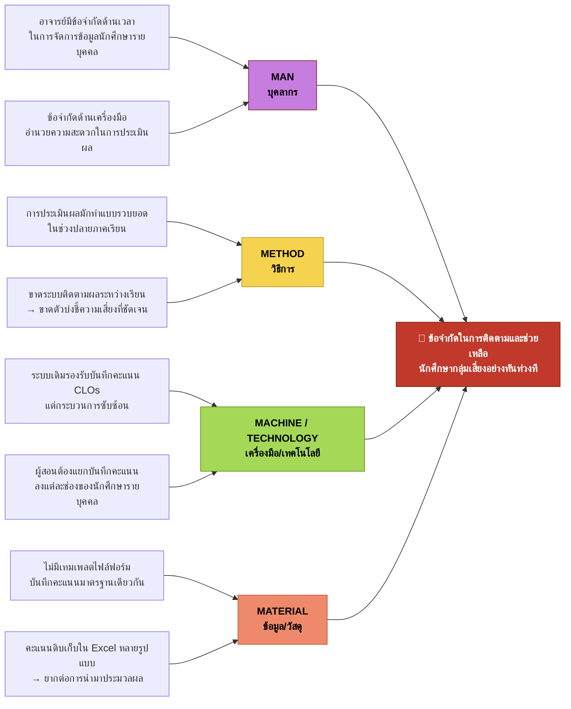

# แผนภาพก้างปลา (Fishbone / 4M) — CMAS

> **ที่มาข้อมูล:** `docs/pdf/เอกสารอนุมัติหัวข้อโปรเจคกลุ่ม-gxx.pdf` (PD01 — แบบขออนุมัติหัวข้อโครงงาน)
> **โครงงาน:** ระบบติดตามและประเมินผลลัพธ์การเรียนรู้ที่คาดหวังระดับรายวิชา (CMAS)
> **วิธีวิเคราะห์:** แผนภาพก้างปลา (Ishikawa) จัดกลุ่มสาเหตุตามหมวดมาตรฐาน **4M** — Man / Method / Machine / Material

ดูเพิ่มเติม: [[fishbone]] (ฉบับวิเคราะห์ 5 Why) · [[features-pages]] · [[dev]]

---

## 🎯 ปัญหาหลัก (หัวปลา)

> **ข้อจำกัดในการติดตามและช่วยเหลือนักศึกษากลุ่มเสี่ยงอย่างทันท่วงที**
> *Lack of Timely Intervention for At-Risk Students*

ในการสอนแบบเน้นผลลัพธ์ (OBE) อาจารย์ต้องการช่วยนักศึกษาที่เรียนไม่ทันให้ทันก่อนหมดภาคเรียน แต่ปัจจุบันทำได้ยาก เพราะกว่าจะเห็นสัญญาณความเสี่ยงก็มักเป็นช่วงปลายภาคเรียนแล้ว

---

## แผนภาพก้างปลา (4M)

```text
   MAN (บุคลากร)                          METHOD (วิธีการ)
        │                                       │
  • อาจารย์มีข้อจำกัดด้านเวลา            • การประเมินผลมักทำแบบรวบยอด
    ในการจัดการข้อมูลนักศึกษารายบุคคล        ในช่วงปลายภาคเรียน
  • ข้อจำกัดด้านเครื่องมืออำนวย           • ขาดระบบติดตามผลระหว่างเรียน
    ความสะดวกในการประเมินผล                 → ขาดตัวบ่งชี้ความเสี่ยงที่ชัดเจน
        │                                       │
        ╲                                       ╱
         ╲                                     ╱
  ════════════════════════════════════════════════▶ ┏━━━━━━━━━━━━━━━━━━━━━┓
         ╱                                     ╲     ┃ ข้อจำกัดในการติดตาม  ┃
        ╱                                       ╲    ┃ และช่วยเหลือนักศึกษา ┃
        │                                       │    ┃ กลุ่มเสี่ยงอย่าง     ┃
  • ระบบเดิมรองรับการบันทึกคะแนน         • ไม่มีเทมเพลตไฟล์ฟอร์ม      ┃ ทันท่วงที           ┃
    CLOs แต่กระบวนการซับซ้อน                บันทึกคะแนนมาตรฐานเดียวกัน  ┗━━━━━━━━━━━━━━━━━━━━━┛
  • ผู้สอนต้องแยกบันทึกคะแนนลงใน         • คะแนนดิบเก็บใน Excel
    แต่ละช่องของนักศึกษารายบุคคล             หลายรูปแบบ → ยากต่อการประมวลผล
        │                                       │
 MACHINE / TECHNOLOGY                     MATERIAL (ข้อมูล/วัสดุ)
   (เครื่องมือ/เทคโนโลยี)
```

### แบบเรนเดอร์ (Mermaid)



---

## สาเหตุตามหมวด 4M

| หมวด | สาเหตุ (Cause) | เชื่อมโยงกับปัญหาหลัก |
|---|---|---|
| **MAN** บุคลากร | อาจารย์มีข้อจำกัดด้านเวลาในการจัดการข้อมูลนักศึกษาเป็นรายบุคคล | เวลาไม่พอ → ติดตามรายคนไม่ไหว |
| | อาจารย์ประสบปัญหาข้อจำกัดด้านเครื่องมืออำนวยความสะดวกในการประเมินผล | ไม่มีเครื่องมือช่วย → งานประเมินหนัก |
| **METHOD** วิธีการ | การประเมินผลมักทำแบบรวบยอดในช่วงปลายภาคเรียน | รู้ผลช้า → สายเกินช่วยเหลือ |
| | ขาดระบบติดตามผลผู้เรียนระหว่างการเรียน ทำให้ขาดตัวบ่งชี้ความเสี่ยงที่ชัดเจน | ไม่มีสัญญาณเตือน → มองไม่เห็นความเสี่ยง |
| **MACHINE / TECHNOLOGY** เครื่องมือ/เทคโนโลยี | ระบบเดิมรองรับการบันทึกคะแนน CLOs แต่กระบวนการซับซ้อน | ใช้งานยาก → กรอกไม่ต่อเนื่อง |
| | ระบบเดิม ผู้สอนต้องแยกบันทึกคะแนนลงในแต่ละช่องข้อมูลของนักศึกษาเป็นรายบุคคล | กรอกทีละช่องทีละคน → ใช้เวลามาก |
| **MATERIAL** ข้อมูล/วัสดุ | ไม่มีเทมเพลตไฟล์แบบฟอร์มบันทึกคะแนนที่เป็นมาตรฐานเดียวกัน | ฟอร์มไม่มาตรฐาน → รวมข้อมูลยาก |
| | ข้อมูลคะแนนดิบถูกเก็บในโปรแกรมตารางคำนวณ (Excel) ในรูปแบบที่หลากหลาย ทำให้ยากต่อการนำมาประมวลผล | รูปแบบหลากหลาย → ประมวลผลอัตโนมัติไม่ได้ |

---

## จาก 4M → ทางแก้ในโครงงาน CMAS

| หมวด 4M | แก่นของปัญหา | ฟีเจอร์ CMAS ที่ตอบโจทย์ |
|---|---|---|
| **MAN** | ภาระเวลา + เครื่องมือไม่เอื้อ | นำเข้าคะแนนเป็นชุด (Excel import) แทนการกรอกทีละคน — ลดเวลางานของอาจารย์ |
| **METHOD** | ประเมินรวบยอด ไม่มีการติดตามระหว่างเรียน | ติดตามผล CLO ต่อเนื่องรายกิจกรรม + แดชบอร์ดกลุ่มเสี่ยงระหว่างภาค |
| **MACHINE** | ระบบเดิมซับซ้อน กรอกทีละช่อง | ระบบกลางกรอก/นำเข้าคะแนนแล้วคำนวณผลสัมฤทธิ์ให้อัตโนมัติ |
| **MATERIAL** | ไฟล์คะแนนไม่มาตรฐาน หลากหลายรูปแบบ | เทมเพลต Excel มาตรฐาน + ตัวตรวจรูปแบบตอนนำเข้า |

---

## อ้างอิง (จาก PD01 หน้า 9)

- **[1] Chefrour et al. (2024)** — การระบุนักศึกษากลุ่มเสี่ยงตั้งแต่เนิ่น ๆ ช่วยให้เข้าช่วยเหลือได้ทันเวลา
- **[2] Helal et al. (2018)** — การระบุปัจจัยเสี่ยงระหว่างเรียนเป็นสิ่งจำเป็นต่อการช่วยเหลืออย่างมีประสิทธิภาพ
- **[3] Jisc (2016)** — กรณีศึกษา Signals ที่ Purdue: การรอผลกลางภาคมักสายเกินกว่าจะช่วยเหลือได้ทัน
- **[4] Seliwati & Al Razaq (2024)** — การออกแบบฟีเจอร์เตือนภัยล่วงหน้าในระบบจัดการคะแนน

_ฉบับนี้จัดกลุ่มสาเหตุตามหมวด 4M ให้ตรงกับแผนภาพก้างปลาที่ทีมจัดทำ — ใช้คู่กับ [[fishbone]] ที่เจาะรากปัญหาแบบ 5 Why อัปเดตไฟล์นี้ทุกครั้งที่กรอบปัญหาใน PD01 เปลี่ยน_
