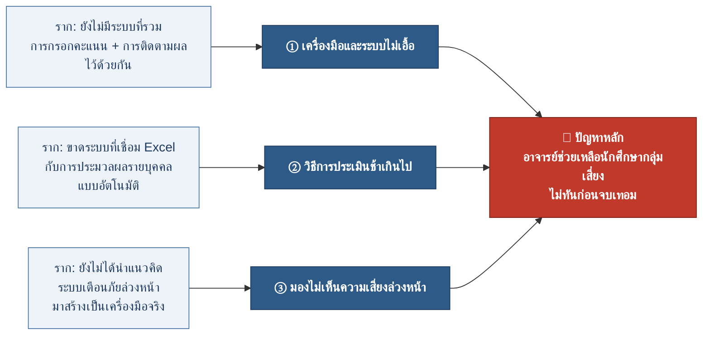

# แผนภาพก้างปลา (Fishbone) + วิเคราะห์ 5 Why — CMAS

> **ที่มาข้อมูล:** `docs/pdf/เอกสารอนุมัติหัวข้อโปรเจคกลุ่ม-gxx.pdf` (PD01 — แบบขออนุมัติหัวข้อโครงงาน)
> **โครงงาน:** ระบบติดตามและประเมินผลลัพธ์การเรียนรู้ที่คาดหวังระดับรายวิชา (CMAS)
> **วิธีวิเคราะห์:** แผนภาพก้างปลา (Ishikawa) หา 3 สาเหตุหลัก แล้วใช้เทคนิค **5 Why** เจาะลงไปทีละสาเหตุจนพบ "รากของปัญหา"

ดูเพิ่มเติม: [[features-pages]] · [[dev]]

---

## 🎯 ปัญหาหลัก (หัวปลา)

> **อาจารย์ไม่สามารถช่วยเหลือนักศึกษากลุ่มเสี่ยงได้ทันเวลา ก่อนสิ้นสุดภาคเรียน**
> *(Lack of Timely Intervention for At-Risk Students)*

**อธิบายง่าย ๆ:** ในการสอนแบบเน้นผลลัพธ์ (OBE) อาจารย์อยากช่วยนักศึกษาที่เรียนไม่ทันให้ทันก่อนหมดเทอม แต่ทุกวันนี้ทำไม่ได้ เพราะกว่าจะรู้ว่าใครเสี่ยงก็ตอนคะแนนสอบปลายภาคออกแล้ว ซึ่งสายเกินกว่าจะแก้ไขอะไรได้

**ผู้ที่ได้รับผลกระทบ:** อาจารย์ผู้สอน (หลัก) · นักศึกษากลุ่มเสี่ยงที่ไม่ได้รับการช่วยเหลือทัน · ผู้ดูแลระบบ

---

## แผนภาพก้างปลา

```text
        ① เครื่องมือและระบบไม่เอื้อ                ② วิธีการประเมินช้าเกินไป
                 │                                          │
   • กรอกคะแนนทีละช่อง ทีละคน               • ประเมินแบบรวบยอด ครั้งเดียวปลายภาค
   • ระบบทำไว้เพื่อ "บันทึกคะแนน             • กรอกคะแนนรายกิจกรรมต่อเนื่อง
     ปลายทาง" ไม่ใช่ติดตามระหว่างเรียน          ใช้เวลามาก จึงทำครั้งเดียว
                 │                                          │
                 ▼                                          ▼
  ═══════════════════════════════════════════════════▶ ┏━━━━━━━━━━━━━━━━━━━━━━━┓
                                                        ┃  ปัญหาหลัก             ┃
                 ▲                                       ┃  อาจารย์ช่วยเหลือ       ┃
                 │                                       ┃  นักศึกษากลุ่มเสี่ยง     ┃
   • ไม่เห็นภาพรวมผลการเรียนราย CLO                     ┃  ไม่ทันก่อนจบเทอม      ┃
   • ไม่มีแดชบอร์ดสรุปผล / ไม่มีสัญญาณเตือน              ┗━━━━━━━━━━━━━━━━━━━━━━━┛
                 │
        ③ มองไม่เห็นความเสี่ยงล่วงหน้า
```

### แบบเรนเดอร์ (Mermaid)



---

## การวิเคราะห์ 5 Why (ถาม "ทำไม" 5 ครั้ง)

แต่ละสาเหตุหลักถูกเจาะด้วยคำถาม "ทำไม" 5 ชั้น จนถึงรากของปัญหาในชั้นที่ 5

### ① สาเหตุด้านเครื่องมือและระบบ

| ชั้น | คำถาม "ทำไม" | คำตอบ |
|---|---|---|
| Why 1 | ทำไมอาจารย์ถึงช่วยนักศึกษากลุ่มเสี่ยงไม่ทัน? | เพราะไม่มีเครื่องมือที่ช่วย **ติดตามผลระหว่างเรียน** ได้สะดวก |
| Why 2 | ทำไมถึงไม่มีเครื่องมือที่สะดวก? | เพราะระบบเดิมของสถาบันต้อง **กรอกคะแนนทีละช่อง ทีละคน** |
| Why 3 | ทำไมระบบถึงเป็นแบบนั้น? | เพราะระบบถูกออกแบบไว้เพื่อ **บันทึกคะแนนสรุปปลายทาง** ไม่ใช่ติดตามระหว่างเรียน |
| Why 4 | ทำไมจึงออกแบบเพื่อบันทึกปลายทาง? | เพราะแนวปฏิบัติเดิมวัดผลแค่ **กลางภาค/ปลายภาค** ไม่ได้เน้นติดตามต่อเนื่อง |
| Why 5 | ทำไมจึงวัดแค่กลางภาค/ปลายภาค? | 🎯 **ราก:** ยังไม่มีระบบที่ **รวมการกรอกคะแนนเข้ากับการแสดงผลติดตามความก้าวหน้า** ไว้ในที่เดียว |

### ② สาเหตุด้านวิธีการประเมิน

| ชั้น | คำถาม "ทำไม" | คำตอบ |
|---|---|---|
| Why 1 | ทำไมถึงรู้ว่านักศึกษาเสี่ยงช้าเกินไป? | เพราะอาจารย์ประเมินผลแบบ **รวบยอดครั้งเดียว** ตอนปลายภาค |
| Why 2 | ทำไมจึงประเมินแค่ครั้งเดียว? | เพราะการกรอกคะแนน **รายกิจกรรมอย่างต่อเนื่อง** ใช้เวลามาก |
| Why 3 | ทำไมจึงใช้เวลามาก? | เพราะต้อง **กรอกด้วยมือทีละคน** ไม่มีการนำเข้าไฟล์ |
| Why 4 | ทำไมจึงยังต้องกรอกด้วยมือ? | เพราะไม่มีเครื่องมือรองรับการ **นำเข้า/ส่งออกคะแนนผ่าน Excel** |
| Why 5 | ทำไมจึงไม่มีเครื่องมือนั้น? | 🎯 **ราก:** ขาดระบบที่ **เชื่อมการกรอกคะแนนบน Excel กับการประมวลผลผลสัมฤทธิ์รายบุคคลแบบอัตโนมัติ** |

### ③ สาเหตุด้านการมองเห็นความเสี่ยง

| ชั้น | คำถาม "ทำไม" | คำตอบ |
|---|---|---|
| Why 1 | ทำไมอาจารย์จึงไม่รู้ว่าใครเป็นกลุ่มเสี่ยง? | เพราะไม่มี **ภาพรวมผลการเรียนรายบุคคลตาม CLO** (ผลลัพธ์การเรียนรายวิชา) |
| Why 2 | ทำไมจึงไม่มีภาพรวม? | เพราะไม่มี **แดชบอร์ด** ที่สรุปผลเป็นร้อยละและเจาะลึกรายคนได้ |
| Why 3 | ทำไมจึงไม่มีแดชบอร์ด? | เพราะข้อมูลคะแนนถูกเก็บแบบ **ดิบ ๆ** ไม่ได้ถูกนำมาวิเคราะห์ต่อ |
| Why 4 | ทำไมข้อมูลจึงไม่ถูกนำมาวิเคราะห์? | เพราะไม่มี **ระบบเตือนภัยล่วงหน้า** (Early Warning) คอยชี้กลุ่มเสี่ยง |
| Why 5 | ทำไมจึงยังไม่มีระบบเตือนภัย? | 🎯 **ราก:** ยังไม่ได้นำแนวคิด **Early Warning System มาสร้างเป็นเครื่องมือจริง** ให้อาจารย์ใช้ |

---

## สรุปรากของปัญหา → ทางแก้

รากของทั้ง 3 สาเหตุ ชี้ไปที่เรื่องเดียวกัน คือ **"ยังไม่มีเครื่องมือกลางที่รวมการกรอกคะแนน (Excel) + การติดตามผล CLO รายบุคคลอย่างต่อเนื่อง + การเตือนภัยล่วงหน้า ไว้ด้วยกัน"**

ซึ่งตรงกับสิ่งที่โครงงาน CMAS เสนอไว้ใน PD01 (ข้อ 3) คือ พัฒนาระบบที่ให้อาจารย์ยังกรอกคะแนนบน Excel ได้ตามปกติ แล้วอัปเดตเข้าระบบ พร้อม **แดชบอร์ดวิเคราะห์ผลรายบุคคล** และ **การแจ้งเตือนกลุ่มเสี่ยงอัตโนมัติ** เพื่อให้ช่วยเหลือนักศึกษาได้ทันเวลา

| สาเหตุหลัก | รากของปัญหา | ทางแก้ในโครงงาน CMAS |
|---|---|---|
| ① เครื่องมือและระบบ | ไม่มีระบบรวมกรอกคะแนน + ติดตามผล | ระบบกลางที่กรอก/นำเข้าคะแนนแล้วติดตาม CLO ได้ทันที |
| ② วิธีการประเมิน | ขาดการเชื่อม Excel กับการประมวลผลอัตโนมัติ | นำเข้า/ส่งออกคะแนนผ่าน Excel แล้วคำนวณผลสัมฤทธิ์ให้อัตโนมัติ |
| ③ การมองเห็นความเสี่ยง | ยังไม่มีระบบเตือนภัยล่วงหน้าจริง | แดชบอร์ด + แจ้งเตือนกลุ่มเสี่ยง (Early Warning System) |

---

## อ้างอิง (จาก PD01 หน้า 9)

- **[1] Chefrour et al. (2024)** — การระบุนักศึกษากลุ่มเสี่ยงตั้งแต่เนิ่น ๆ ช่วยให้เข้าช่วยเหลือได้ทันเวลา
- **[2] Helal et al. (2018)** — การระบุปัจจัยเสี่ยงระหว่างเรียนเป็นสิ่งจำเป็นต่อการช่วยเหลืออย่างมีประสิทธิภาพ
- **[3] Jisc (2016)** — กรณีศึกษา Signals ที่ Purdue: การรอผลกลางภาคมักสายเกินกว่าจะช่วยเหลือได้ทัน
- **[4] Seliwati & Al Razaq (2024)** — การออกแบบฟีเจอร์เตือนภัยล่วงหน้าในระบบจัดการคะแนน

_อัปเดตไฟล์นี้ทุกครั้งที่กรอบปัญหาใน PD01 เปลี่ยน — ถือเป็นเอกสารวิเคราะห์รากปัญหาของโครงงาน_
