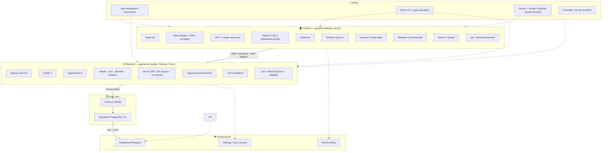

# Tech Stack

> อ้างอิงจาก [[dev]] §1 — CLO System (สถานะจริง ณ 2026-07)

## Infrastructure & Containerization

| Component | Technology | Usage |
|---|---|---|
| **Local Dev** | Docker + Docker Compose | client (:5173) + server (:3001), connects to Supabase |
| **Server Container** | `node:20-alpine` (dev), multi-stage build (prod) | Fastify app, hot reload, Supabase connection |
| **Client Container** | `node:20-alpine` (dev), nginx:alpine (prod) | React SPA, static files |
| **Database** | Supabase PostgreSQL 15 | Single database: dev + prod (no local postgres container) |

For more, see [[dev]] §2.2b Docker Setup

---

