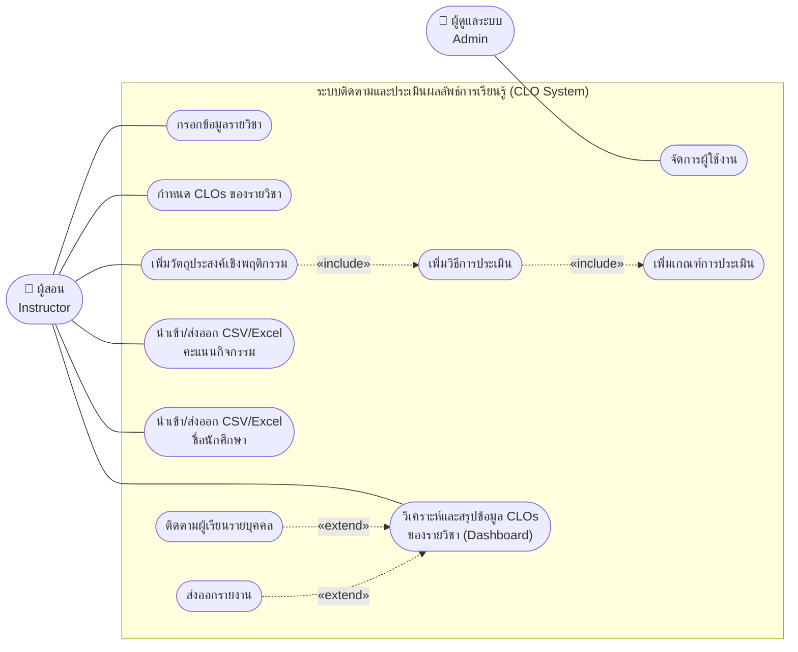

# Use Case Diagram

> อ้างอิงจากเอกสารอนุมัติหัวข้อ (PD01) หน้า 5 และ §5 ขีดความสามารถของโครงงาน

```mermaid
flowchart LR
    admin(["👤 ผู้ดูแลระบบ<br/>Admin"])
    instructor(["👤 ผู้สอน<br/>Instructor"])

    subgraph SYSTEM["ระบบติดตามและประเมินผลลัพธ์การเรียนรู้ (CLO System)"]
        direction TB
        UC1(["จัดการผู้ใช้งาน"])
        UC2(["กรอกข้อมูลรายวิชา"])
        UC3(["กำหนด CLOs ของรายวิชา"])
        UC4(["เพิ่มวัตถุประสงค์เชิงพฤติกรรม"])
        UC5(["เพิ่มวิธีการประเมิน"])
        UC6(["เพิ่มเกณฑ์การประเมิน"])
        UC7(["นำเข้า/ส่งออก CSV/Excel<br/>คะแนนกิจกรรม"])
        UC8(["นำเข้า/ส่งออก CSV/Excel<br/>ชื่อนักศึกษา"])
        UC9(["วิเคราะห์และสรุปข้อมูล CLOs<br/>ของรายวิชา (Dashboard)"])
        UC10(["ติดตามผู้เรียนรายบุคคล"])
        UC11(["ส่งออกรายงาน"])
    end

    admin --- UC1

    instructor --- UC2
    instructor --- UC3
    instructor --- UC4
    instructor --- UC7
    instructor --- UC8
    instructor --- UC9

    UC4 -. "«include»" .-> UC5
    UC5 -. "«include»" .-> UC6

    UC10 -. "«extend»" .-> UC9
    UC11 -. "«extend»" .-> UC9
```
