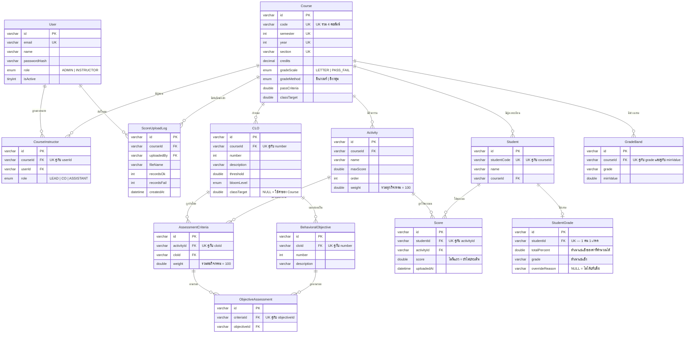

# CMAS — MySQL ER Diagram

Companion doc for the MySQL-dialect DDL used to generate **Entity–Relationship
(EER) diagrams in MySQL Workbench**. The scripts live in
[`reference/db/mysql/`](../../reference/db/mysql/); this page explains what they contain and how the
entities relate.

See also: [`schema.md`](./schema.md) (app schema narrative, Thai) ·
[`reference/db/schema.sql`](../../reference/db/schema.sql) (PostgreSQL full institutional reference model) ·
[`../../../database/schema.prisma`](../../../database/schema.prisma) (app source of truth).

> **Updated 2026-09-06 — ตารางตัดเกรดเหลือ 2 ตาราง.** ตัด `GradeScheme` และ `GradeRun` ออก
> · `GradeScheme` ยุบเป็นคอลัมน์ `Course.gradeMethod` (อิงเกณฑ์ / อิงกลุ่ม) เพราะหน่วยของ
> เส้นแบ่งเกรดตามมาจากวิธีอยู่แล้ว · `GradeRun` ตัดทิ้งพร้อม `n / mean / sd` ซึ่งแลกกับการที่
> เกรดอิงกลุ่มย้อนพิสูจน์ที่มาไม่ได้ (ตัวเกรดยังคงที่ เพราะเก็บเป็นค่าจริง) · ทั้งระบบเหลือ
> **13 ตาราง 80 คอลัมน์ 16 FK** · เหตุผลเต็มอยู่ในหัวไฟล์ `cmas_app_mysql_v4.sql` และ SRS v2.2.0
> · **ต้อง re-import ไฟล์ v4 ใหม่** ถ้าเคยวาดไดอะแกรมไว้ก่อนวันนี้

> **Updated 2026-08-23 — v4 adds การตัดเกรด (grading).** Four new tables
> (`GradeScheme`, `GradeBand`, `GradeRun`, `StudentGrade`), `CLO.bloomLevel`,
> `CLO.classTarget`, and `Course.gradingType` renamed to `Course.gradeScale`.
> **Import `cmas_app_mysql_v4.sql`** — v3 no longer matches `schema.prisma`.
>
> **Updated 2026-08-04 — the app model is now SINGLE-TENANT.** `Institution`,
> `Membership`, `Curriculum` and `CurriculumCourse` were deleted; `Course` is the
> root and carries the five columns `CurriculumCourse` used to hold. The v3 files
> below already reflect this.

## Files

| File | Model | Size | Translated from |
|---|---|---|---|
| [`reference/db/mysql/cmas_enterprise_mysql.sql`](../../reference/db/mysql/cmas_enterprise_mysql.sql) | Full institutional design — **reference only** | 36 tables, 4 views, 59 FKs | `schema.sql` (PostgreSQL 14+) |
| [`reference/db/mysql/cmas_app_mysql_v4.sql`](../../reference/db/mysql/cmas_app_mysql_v4.sql) | **Live app schema — diagramming mirror. USE THIS ONE.** | 13 tables, 16 FKs | `database/schema.prisma` (Prisma) |
| [`reference/db/mysql/cmas_app_mysql_v3.sql`](../../reference/db/mysql/cmas_app_mysql_v3.sql) | ~~Diagramming mirror~~ — **superseded by v4**, kept for history | 11 tables, 14 FKs | — |
| [`reference/db/mysql/cmas_app_production_v3.sql`](../../reference/db/mysql/cmas_app_production_v3.sql) | Live app schema — executable, hardened | 11 tables, CHECKs, triggers, views | `database/migrations/` |
| [`mysql-dumps.md`](./mysql-dumps.md) | How-to | — | Workbench steps + translation table |

**Requires MySQL 8.0.16+** (for `CHECK`, expression defaults, and the stored
generated column). All tables are `InnoDB` + `utf8mb4` so Thai `_th` columns
store correctly.

> These `.sql` files are a **diagramming / presentation artifact**. The
> authoritative schemas remain `schema.prisma` (app) and `schema.sql` (full
> design), both PostgreSQL. Regenerate the MySQL files if those models change.

---

## How to build the diagram

MySQL Workbench → **File ▸ Import ▸ Reverse Engineer MySQL Create Script…** →
pick a `.sql` file → tick **"Place imported objects on a diagram"** → **Execute**.
An EER canvas opens with every table and all FK relationship lines. Then
**Arrange ▸ Autolayout**, and export via **File ▸ Export ▸ Export as SVG/PNG/PDF**.

Full steps (including the live-database route and the `.mwb` model save) are in
[`mysql-dumps.md`](./mysql-dumps.md).

---

## แผนภาพ ER ของระบบจริง (13 ตาราง)

เรนเดอร์ได้ทันทีใน Obsidian / GitHub — ใช้ตรวจรูปทรงก่อนเปิด Workbench
โครงสร้างตรงกับ [`cmas_app_mysql_v4.sql`](../../reference/db/mysql/cmas_app_mysql_v4.sql)
ซึ่งเป็นไฟล์ที่ใช้ reverse-engineer จริง (13 ตาราง · 80 คอลัมน์ · 16 FK)



**รูปทรงที่ควรเห็น** — `Course` อยู่กลาง มี 6 ตารางแตกออก (CourseInstructor, CLO,
Activity, Student, GradeBand, ScoreUploadLog) ถ้า `Course` ไม่ใช่จุดที่มีเส้นเยอะที่สุด
แปลว่า import ผิดหรือ FK หาย

**ตารางเชื่อม (associative) 3 ตัว** — `CourseInstructor` (อาจารย์ × รายวิชา),
`AssessmentCriteria` (กิจกรรม × CLO พร้อมน้ำหนัก), `ObjectiveAssessment`
(เกณฑ์ × จุดประสงค์) ทั้งสามมี UNIQUE บนคู่ FK เสมอ เพื่อกันแถวซ้ำ

---

## Enterprise model — entity groups

The 36-table enterprise diagram breaks into nine functional clusters.

| # | Cluster | Tables | Core relationships |
|---|---|---|---|
| 1 | **Institutional hierarchy** | `institutions`, `faculties`, `departments`, `programs`, `curriculum_versions` | strict 1→N chain; a program has many curriculum revisions over time |
| 2 | **Curriculum structure** | `course_categories` (self-ref หมวด→กลุ่ม), `courses`, `course_category_map`, `course_code_segments`, `course_prerequisites` | N↔N course⇄category via map; course⇄course prereqs; 1:1 code segments |
| 3 | **Learning outcomes** | `plos`, `clos`, `clo_plo_map`, `identity_categories`, `identity_attributes`, `identity_attribute_plo_map` | **CLO⇄PLO N↔N with I/R/M strength (1–3)** — the OBE traceability core |
| 4 | **Study plan** | `study_plan_terms`, `study_plan_courses` | term→course rows, nullable course for elective slots |
| 5 | **Academic operations** | `academic_years`, `terms`, `instructors`, `course_sections`, `section_instructors`, `students`, `enrollments` | SIS-style; section⇄instructor N↔N (co-teaching) |
| 6 | **Assessment & CLO scoring** | `assessment_methods`, `assessment_instruments`, `clo_instrument_map`, `student_clo_scores` | one instrument → many CLOs; `student_clo_scores` is the atomic fact table |
| 7 | **Attainment rollups** | `clo_attainment_results`, `plo_attainment_results` | cached batch aggregates per section / per cohort |
| 8 | **Field experience** | `field_experience_types`, `field_experience_learning_outcomes`, `field_experience_placements`, `field_experience_scores` | practicum/internship, dual evaluator (supervisor + advisor) |
| 9 | **Audit** | `curriculum_change_log` | change history per curriculum version |

### Key cardinalities (enterprise)

```
institutions 1─N faculties 1─N departments 1─N programs 1─N curriculum_versions
curriculum_versions 1─N course_categories ─┐ (self-ref parent_category_id)
courses N─N course_categories        (via course_category_map)
courses 1─1 course_code_segments
courses N─N courses                  (via course_prerequisites)
courses 1─N clos      ;   curriculum_versions 1─N plos
clos   N─N plos                      (via clo_plo_map, strength 1–3)
courses 1─N course_sections N─1 terms N─1 academic_years
course_sections N─N instructors      (via section_instructors)
students 1─N enrollments N─1 course_sections
assessment_instruments N─N clos      (via clo_instrument_map)
enrollments 1─N student_clo_scores N─1 assessment_instruments, N─1 clos   ← fact table
```

The atomic grain is **`student_clo_scores`**: one row per (enrollment,
instrument, CLO). `percent_score` is a **stored generated column**
(`raw_score / max_score * 100`). Everything in cluster 7 aggregates from it.

---

## Application model — entity groups

The 13-table app diagram is the working system today (React + Fastify + Prisma).
`cuid()` string PKs; simpler than the enterprise design.

| Cluster | Tables | Relationships |
|---|---|---|
| **Identity** | `User` (`role` = ADMIN/INSTRUCTOR, a plain column) | N─N `Course` via `CourseInstructor` (co-teaching) |
| **Live course** | `Course` 1─N `CLO` 1─N `BehavioralObjective` | `Course` is the ROOT — nothing sits above it. It carries `credits`, the three hour columns and `gradeScale`, which moved up from the deleted `CurriculumCourse`, plus `gradeMethod` |
| **Assessment** | `Course` 1─N `Activity`; `Activity` N─N `CLO` via `AssessmentCriteria` | weighted CLO tagging per activity |
| **Enrollment & scoring** | `Course` 1─N `Student`; `Student` N─N `Activity` via `Score` | one score per (student, activity) |
| **Grading** | `Course` 1─N `GradeBand`; `Student` 1─1 `StudentGrade` | the ladder and the result. The method is `Course.gradeMethod`, not a table |
| **Audit** | `ScoreUploadLog` | FKs to `Course` + `User` in the production DDL |

### Key cardinalities (app)

```
User N─N Course     (via CourseInstructor, role = LEAD | CO | ASSISTANT)
Course 1─N CLO 1─N BehavioralObjective
Course 1─N Activity ;  Activity N─N CLO   (via AssessmentCriteria)
Course 1─N Student  ;  Student  N─N Activity (via Score, one per student+activity)
AssessmentCriteria N─N BehavioralObjective (via ObjectiveAssessment, traceability only)
Course 1─N GradeBand ;  Student 1─1 StudentGrade
Course 1─N ScoreUploadLog N─1 User
```

No self-referencing relationship survives in v3: `Curriculum.clonedFrom` was the
only one, and it went with the table.

> **Two files, two purposes.** [`reference/db/mysql/cmas_app_mysql_v3.sql`](../../reference/db/mysql/cmas_app_mysql_v3.sql)
> is the diagramming mirror — tables and FKs only, so Workbench imports cleanly.
> [`reference/db/mysql/cmas_app_production_v3.sql`](../../reference/db/mysql/cmas_app_production_v3.sql) is the
> executable one: cascade rules, CHECK constraints, the LEAD generated column,
> triggers and reporting views. Both are 11 tables and both are single-tenant.

---

## Translation & fidelity notes

Postgres/Prisma → MySQL 8 highlights (full table in
[`mysql-dumps.md`](./mysql-dumps.md)):

- `BIGSERIAL` → `BIGINT AUTO_INCREMENT`; Prisma `cuid()` PKs → `VARCHAR(30)`.
- `TIMESTAMPTZ`/`now()` → `TIMESTAMP`/`DATETIME(3)` + `CURRENT_TIMESTAMP`;
  `updated_at` gains `ON UPDATE CURRENT_TIMESTAMP`.
- `TEXT` used in a `UNIQUE`/`PK` → `VARCHAR(n)` (MySQL can't index full `TEXT`).
- `NUMERIC`→`DECIMAL`, `Float`→`DOUBLE`, `Boolean`→`TINYINT(1)`.
- FKs are **table-level** constraints (MySQL ignores inline `REFERENCES`) — this
  is what makes Workbench draw the relationship lines.
- `plo_attainment_results.cohort_label` became `NOT NULL DEFAULT ''` so its
  unique key keeps the one-row-per-cohort rule (MySQL treats multiple NULLs as
  distinct).
- `ScoreUploadLog` DOES have FKs in v3 (`courseId` → `Course`, `uploadedBy` →
  `User` with RESTRICT): an audit trail that loses its actor is not an audit trail.
- The `AcademicYearEra` ENUM ('BE'/'CE') no longer appears anywhere — it was a
  column on the deleted `Institution`. `Course.year` is written in whatever era
  the faculty uses (2568), now an app-level constant rather than per-row data.

> **Not yet loaded against a live MySQL server** in this environment (no local
> MySQL/Docker daemon). Verified offline: all 36 source tables present, FK
> constraint names globally unique, reserved words back-ticked. Run one
> `mysql < file.sql` against 8.0.16+ before treating as production-blessed.
