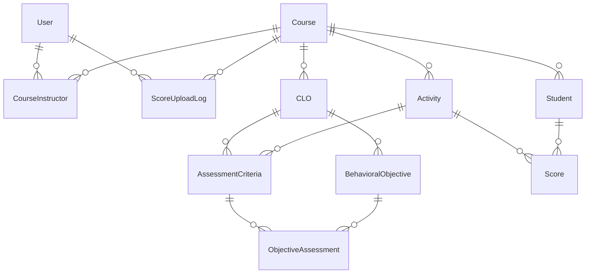

See also: [[dev]] · [[srs]] · [[Summary Project]] · [[concept-clo MOC]]

# โครงสร้างฐานข้อมูล CMAS — 11 ตาราง และเหตุผลที่ต้องมีแต่ละตาราง

> ⚠️ **`database/schema.prisma` เป็น source of truth ของโครงสร้าง** ไฟล์นี้อธิบาย **"ทำไม"**
> ไม่ใช่ **"อะไร"** — ถ้าสองไฟล์ขัดกันให้ยึด `schema.prisma` แล้วมาแก้ไฟล์นี้
> ไฟล์นี้เคยหลุดจากของจริงมาแล้ว (เคยมี `Curriculum.createdBy` ที่ไม่มีอยู่จริง)
>
> DDL ที่รันได้: `database/migrations/` (Postgres — ของจริง) ·
> [`reference/db/mysql/cmas_app_production_v3.sql`](../../reference/db/mysql/cmas_app_production_v3.sql) (MySQL — สำหรับทำ ER
> ใน MySQL Workbench)
>
> **v2 (2026-08-04): single-tenant** — ตัด `Institution` · `Membership` · `Curriculum` ·
> `CurriculumCourse` ออก จาก 15 ตาราง เหลือ **11 ตาราง** `Course` เป็นรากของลำดับชั้น
>
> ⚠️ **ต้อง re-verify กับ Postgres จริงอีกครั้ง** — ผลเดิม (2026-07-30: 37 CHECK · 22 FK ·
> 7 trigger) เป็นของ schema 15 ตารางที่ถูกแทนที่ไปแล้ว โครงสร้างใหม่คือ 11 ตาราง · 3 trigger ·
> partial index 1 ตัว (งาน 3.1.5)

---

## 1. หลักการที่ใช้ตัดสินว่า "อะไรควรเป็นตาราง"

ทุกตารางในระบบนี้มีอยู่ด้วยเหตุผล **ข้อใดข้อหนึ่ง** จาก 4 ข้อนี้ ถ้าตารางใหม่ตอบไม่ได้ว่าเป็นข้อไหน แปลว่ายังไม่ควรสร้าง:

| # | เหตุผล | ตัวอย่างในระบบนี้ |
|---|---|---|
| **R1** | **เป็นสิ่งของจริงในโลก** ที่มีตัวตนของตัวเอง | `User`, `Course`, `Student`, `CLO` |
| **R2** | **ความสัมพันธ์ M:N ที่มีคุณสมบัติของตัวเอง** — คุณสมบัตินั้นไม่ได้เป็นของฝั่งใดฝั่งหนึ่ง จึงเก็บที่ FK 2 ตัวไม่ได้ | `CourseInstructor` (มี `role`), `AssessmentCriteria` (มี `weight`) |
| **R3** | **จำนวนไม่จำกัด (1:N)** — ถ้าใช้คอลัมน์จะต้องมี `clo1`, `clo2`, `clo3`, … ซึ่งผิด 1NF | `CLO` ต่อ `Course`, `Activity` ต่อ `Course`, `Score` ต่อ `Student` |
| **R4** | **บันทึกเหตุการณ์ (audit)** ที่ต้องเก็บไว้แม้ของที่อ้างถึงจะเปลี่ยนไปแล้ว | `ScoreUploadLog` |

**กฎที่สำคัญที่สุดคือ R2** และเป็นคำตอบของคำถาม "ทำไมต้องมีตารางนี้" บ่อยที่สุด:

> `CourseInstructor.role = LEAD` — คำว่า "ผู้ประสานงานรายวิชา" **ไม่ใช่**คุณสมบัติของอาจารย์
> (เขาเป็น LEAD ของวิชานี้ แต่เป็น CO ของวิชาอื่น) และ**ไม่ใช่**คุณสมบัติของวิชา
> (วิชาเดียวมีทั้ง LEAD และ CO) มันเป็นคุณสมบัติของ **"คู่ (อาจารย์ × วิชา)"**
> → คู่ต้องมีที่อยู่ → คู่ต้องเป็นตาราง

---

## 2. ระบบแบ่งเป็น 5 ชั้น

| ชั้น | ตาราง | ตอบคำถามว่า |
|---|---|---|
| **1 · IDENTITY** | `User` | ใครเข้าระบบได้ และมีสิทธิ์ระดับใด |
| **2 · THE COURSE** | `Course`, `CourseInstructor` | เทอมนี้เปิดสอนอะไร ใครสอน |
| **3 · THE CRITERIA** | `CLO`, `BehavioralObjective`, `Activity`, `AssessmentCriteria`, `ObjectiveAssessment` | วัด**อะไร** ด้วย**อะไร** น้ำหนัก**เท่าไร** |
| **4 · THE FACTS** | `Student`, `Score` | ใครได้**คะแนนเท่าไร** |
| **5 · AUDIT** | `ScoreUploadLog` | ใครนำเข้าคะแนน เมื่อไร ด้วยไฟล์อะไร |

**เดิมมี 7 ชั้น (0 · TENANCY และ 2 · THE PLAN) — ถูกตัดทิ้งเมื่อ 2026-08-04**

| ชั้นที่หายไป | ตารางเดิม | ทำไมถึงตัด |
|---|---|---|
| 0 · TENANCY | `Institution` | ระบบใช้ในคณะเดียว (single-tenant) ไม่มีขอบเขตข้ามสถาบันให้โมเดล |
| 1 (บางส่วน) | `Membership` | เมื่อมีสถาบันเดียว ตาราง role ราย (คน × สถาบัน) เหลือค่าเดียวเสมอ → `role` ย้ายกลับไปเป็นคอลัมน์บน `User` |
| 2 · THE PLAN | `Curriculum`, `CurriculumCourse` | นอกขอบเขต v1 — แต่ **5 คอลัมน์ที่ระบบใช้จริง** (`credits`, ชั่วโมง 3 ตัว, `gradingType`) ถูกย้ายขึ้นมาไว้บน `Course` ไม่ได้หายไปด้วย |

**สิ่งที่แลกไป (ต้องเขียนในเล่ม ไม่ใช่ซ่อน):** ชั้น 2 เคยแยก "แผน" ออกจาก "ของจริง" ทำให้แก้ชื่อวิชา
ปีนี้ไม่กระทบเอกสารหลักสูตรที่สภาอนุมัติไปแล้ว เมื่อตัดชั้นนั้นออก ระบบ**ไม่มีสำเนาที่แช่แข็ง**
ของเอกสารหลักสูตรอีกต่อไป — ยอมรับได้ใน v1 เพราะขอบเขตคือการติดตาม CLO รายวิชา
ไม่ใช่การบริหารหลักสูตร แต่ถ้า PLO / มคอ.2 เข้ามาในภายหลัง ต้องสร้างตารางแม่แล้ว **backfill**
ซึ่งไม่ใช่ migration แบบเพิ่มอย่างเดียว (ดู §5)

---

## 3. รายละเอียดทีละตาราง

### ชั้น 1 — IDENTITY

#### `User` — คนที่ล็อกอินได้

| ฟิลด์ | หมายเหตุ |
|---|---|
| `email` | **unique** — 1 คน 1 credential |
| `passwordHash` | argon2 เท่านั้น (CHECK: ความยาว ≥ 20 กันรหัส plaintext หลุดลงคอลัมน์) |
| `role` | ADMIN \| INSTRUCTOR — **คอลัมน์ธรรมดาบน `User`** |
| `isActive` | สวิตช์ปิดบัญชี (FR-03) |
| `createdAt` / `updatedAt` | `updatedAt` มีไว้เพราะการเปลี่ยน role / ปิดบัญชี เป็นเหตุการณ์ที่ต้องตามรอยได้ (NFR-19) |

**ทำไม `role` กลับมาอยู่บน `User`:** เดิมอยู่บน `Membership` เพราะ ADMIN ที่ ม.A ต้องไม่เป็น ADMIN
ที่ ม.B — เมื่อมีสถาบันเดียว เงื่อนไขนั้นไม่มีอยู่จริง ตาราง `Membership` จึงเหลือค่าเดียวต่อคน
คือ FK ตัวเดียวที่แต่งตัวเป็นตาราง

**ทำไมไม่มี `isSuperAdmin` แล้ว:** มันมีไว้สำหรับคนที่**สร้างสถาบัน**และตั้ง ADMIN คนแรกของสถาบัน
ซึ่งต้องมีอยู่ก่อน membership ใด ๆ เมื่อไม่มีสถาบันให้สร้าง ก็ไม่มีชั้นที่อยู่เหนือ ADMIN

**ทำไม `@@index([role, isActive])` เป็น composite ไม่ใช่ 2 index:** ทุกหน้าจอที่ list ผู้ใช้กรอง
ด้วย **ทั้งสองค่าพร้อมกัน** ("อาจารย์ที่ยังใช้งานอยู่") ไม่เคยกรองด้วย role อย่างเดียว

**ทำไม `role` ใน JWT เชื่อไม่ได้:** token อายุ 15 นาที ค่าที่อยู่ในนั้นจึงเก่าได้ถึง 15 นาที
`authMiddleware` จึงอ่านแถวนี้ใหม่ทุก request — การปิดบัญชีหรือลดสิทธิ์มีผลทันที (NFR-19)

---

### ชั้น 2 — THE COURSE

#### `Course` — วิชาที่เปิดสอนจริงเทอมนี้

`@@unique([code, semester, year, section])` — **รากของลำดับชั้นข้อมูลทั้งระบบ**

| ฟิลด์ | หมายเหตุ |
|---|---|
| `section` | หมู่เรียน default `"01"` |
| `passCriteria` / `classTarget` | เกณฑ์ระดับวิชา (OI-03) — เก็บรายวิชา ไม่ใช่ค่ากลางของคณะ |
| `nameEn` | ชื่ออังกฤษ (nullable) |
| `credits` | `Decimal(3,1)` — **ย้ายขึ้นมาจาก `CurriculumCourse`** (FR-27) |
| `lectureHours` / `practiceHours` / `selfStudyHours` | `Decimal(4,1)` — ย้ายขึ้นมาเช่นกัน |
| `gradingType` | LETTER \| PASS_FAIL — ย้ายขึ้นมา ทำให้ CR-06 ตัดสินได้แน่นอน (FR-28) |
| `createdAt` / `updatedAt` | |

**ทำไม unique key ไม่มี `institutionId` แล้ว:** ระบบเป็น single-tenant — รหัส `90641001` unique
ภายในคณะเดียวอยู่แล้ว error message ของ FR-21 จึงเป็น "รหัสวิชานี้มีอยู่แล้วในภาคเรียนนี้"
นี่คือจุดเดียวที่การตัด tenancy **เปลี่ยน** constraint เดิม ไม่ใช่แค่ลบทิ้ง

**ทำไม `credits` เป็น `Decimal(3,1)` ไม่ใช่ `Int` และพื้นต้องเป็น 0:** หลักสูตรเขียนว่า `3 (2-2-5)`
= หน่วยกิต (บรรยาย-ปฏิบัติ-ศึกษาเอง) `Int` ทิ้งข้อมูล 3 ตัวหลัง และ CHECK เดิม
`credits BETWEEN 1 AND 30` **ปฏิเสธวิชาที่มีจริง**: `90641008` = `0 (0-0-45)`

**ทำไม `passCriteria` / `classTarget` เก็บรายวิชา ไม่ใช่ค่ากลางแล้ว resolve ตอนอ่าน:**
ถ้าอ่านจากค่ากลาง แล้วแอดมินแก้ค่านั้นวันนี้ → **รายงาน attainment ของเทอมที่แล้วเปลี่ยนย้อนหลัง
เงียบ ๆ** เพราะ CR-04/CR-05 กินค่านี้ทั้งคู่ ทุกคำตัดสิน "CLO บรรลุ" และ "ผ่านรายวิชา" จะพลิก

**ทำไมต้องมี `section` (ประวัติสำคัญ):** เดิม unique key คือ `(code, semester, year, instructorId)` — `instructorId` ทำหน้าที่**แอบ**เป็นตัวแยกหมู่เรียน เมื่อการสอนเปลี่ยนเป็น M:N (`CourseInstructor`) `instructorId` หายไป ถ้าไม่เพิ่ม `section` มาแทน key จะเหลือ `(code, semester, year)` = **เปิดวิชาเดียวได้หมู่เดียวต่อเทอม** ซึ่งผิดความจริง

**ทำไม `nameEn` เป็น paired column ไม่ใช่ JSON หรือตารางแปลภาษา:** มี 2 ภาษาคงที่ ไม่มีแผน i18n · JSON เสีย `NOT NULL` บนชื่อไทย เสีย index สำหรับ search และบังคับ `as any` (ผิด NFR-13) · ตารางแปลภาษาเหมาะกับ ≥3 ภาษา ที่นี่จะได้ JOIN เพิ่มทุก query แลกกับความยืดหยุ่นที่ไม่มีใครขอ

#### `CourseInstructor` — ทีมผู้สอน

`@@unique([courseId, userId])` + partial index `uq_courseinstructor_lead`

**ทำไมต้องมีตารางนี้ (R2):** ดู §1 — `role` เป็นคุณสมบัติของคู่
เดิม `Course.instructorId` บังคับ 1 วิชา = 1 อาจารย์ ซึ่ง**ใช้กับวิชาปฏิบัติการที่สอนร่วมกันไม่ได้เลย**

**ทำไม "LEAD ไม่เกิน 1 คน" อยู่ที่ DB แต่ "ต้องมี LEAD อย่างน้อย 1 คน" อยู่ที่แอป:**
- ไม่เกิน 1 → partial unique index ทำได้ตรง ๆ (`WHERE role = 'LEAD'`)
- อย่างน้อย 1 → **บังคับที่ DB ไม่ได้** เพราะแถว `Course` ต้องมีอยู่ก่อนจะมอบหมายใครได้ → INSERT แรกจะเป็นไปไม่ได้ตลอดกาล

---

### ชั้น 3 — THE CRITERIA (หัวใจของโครงงาน)

#### `CLO` — ผลลัพธ์การเรียนรู้ระดับรายวิชา

`@@unique([courseId, number])` · `threshold Float @default(60)`

**ทำไมต้องมีตารางนี้ (R1 + R3):** CLO คือหน่วยวิเคราะห์ของโครงงานทั้งหมด และ 1 วิชามีหลาย CLO

**ทำไม `number` ต้อง unique ต่อวิชา:** มี "CLO 1" สองตัวในวิชาเดียว = **ทุกรายงาน attainment เพี้ยนเงียบ ๆ** เพราะไม่รู้ว่าเลขที่รายงานหมายถึงตัวไหน

**ทำไม `CLO` ไม่มีคอลัมน์ `weight`:** น้ำหนักของ CLO เป็น**ค่าคำนวณ** (CR-02) จาก `Activity.weight × AssessmentCriteria.weight` ถ้าเก็บซ้ำจะมีวันที่ค่าที่เก็บขัดกับค่าที่คำนวณ แล้วต้องนิยามว่าเชื่ออันไหน (ดู OI-02) → หน้า CLO แสดงน้ำหนักเป็น **read-only**

#### `BehavioralObjective` — จุดประสงค์เชิงพฤติกรรม

`@@unique([cloId, number])`

**ทำไมต้องมีตารางนี้ (R3):** 1 CLO แตกเป็นข้อย่อยได้หลายข้อ และต้องอ้างได้ว่า "ข้อ 2 ของ CLO 1"

#### `Activity` — กิจกรรมประเมิน

| ฟิลด์ | หมายเหตุ |
|---|---|
| `maxScore` | **ต้อง > 0** (CHECK) |
| `weight` | สัดส่วนต่อคะแนนรวมวิชา — ผลรวมทุก Activity = 100 |
| `order` | ลำดับแสดงผล (drag-reorder เขียนค่านี้) |

**ทำไม `maxScore > 0` เป็น CHECK ที่ห้ามหาย:** **ทุกสูตรใน SRS §3 หารด้วยค่านี้** `maxScore = 0` ทำให้ทุกรายงานพังด้วย division-by-zero (ทดสอบแล้ว DB ปฏิเสธจริง)

**ทำไม `weight` รวม = 100 ไม่เป็น constraint:** เพราะมันจริงเฉพาะตอน**กรอกเสร็จแล้ว** ระหว่างกรอกยังไม่ครบเป็นเรื่องปกติ ถ้าบังคับต่อแถวจะ insert แถวแรกไม่ได้ → ทำเป็น **view สำหรับ audit** (`v_activity_weight_audit`) ให้ UI เตือนแทน (FR-43)

**ทำไมไม่มี `@@unique([courseId, order])`:** drag-reorder เขียนสถานะกลางทางที่ order ชนกันชั่วคราว ถ้า unique จะล้มกลางทาง (Postgres/MySQL ไม่มี deferred check ที่ใช้ได้ตรงนี้)

#### `AssessmentCriteria` — ผูก Activity ↔ CLO พร้อมน้ำหนัก

`@@unique([activityId, cloId])` · `weight Float`

**ทำไมต้องมีตารางนี้ (R2 — ตัวอย่างที่ชัดที่สุด):** Activity ↔ CLO เป็น M:N (สอบปลายภาควัดได้หลาย CLO / 1 CLO วัดได้หลายกิจกรรม) และ **`weight` เป็นของ "คู่"** — ไม่ใช่ของกิจกรรม (กิจกรรมเดียวแบ่งน้ำหนักให้ CLO ต่างกันได้) ไม่ใช่ของ CLO (CLO เดียวถูกวัดหลายกิจกรรมด้วยน้ำหนักต่างกัน)

**ตารางนี้คือจุดขายของโครงงาน** — ถ้าตัดออก ระบบจะเหลือแค่ตารางคะแนนธรรมดา (ดู OI-01)

**มี trigger บังคับว่า Activity และ CLO ต้องอยู่วิชาเดียวกัน:** การผูกข้ามวิชาให้ตัวเลข attainment ที่**ดูสมเหตุสมผลแต่ไม่มีความหมาย** ซึ่งอันตรายกว่า error

#### `ObjectiveAssessment` — traceability ของจุดประสงค์

`@@unique([criteriaId, objectiveId])`

**ทำไมต้องมีตารางนี้ (R2):** ผูก "เกณฑ์นี้เป็นหลักฐานของจุดประสงค์ข้อไหน" แบบ M:N

**ทำไมผูกกับ `AssessmentCriteria` ไม่ใช่ `Activity`:** เพื่อให้การ map จุดประสงค์เป็น **ข้อมูลเสริมที่ไม่กระทบคะแนน** (FR-35) น้ำหนักอยู่ชั้นบน ดังนั้นไม่ว่าจะ map หรือไม่ map คะแนน CLO เท่าเดิมเป๊ะ

> ⚠️ ตารางนี้ยังไม่มีหน้าจอ (OI-08) ถ้าตัดถาวรควร**ลบ model ออก** ไม่ปล่อยตารางร้าง

---

### ชั้น 4 — THE FACTS

#### `Student` — **การลงทะเบียน ไม่ใช่คน**

`@@unique([studentCode, courseId])` · `@@index([studentCode])`

**ทำไมต้องมีตารางนี้ (R3):** 1 วิชามีนักศึกษาหลายคน

**⚠️ ทำไม 1 คนลง 5 วิชา = 5 แถว (ชื่อซ้ำ 5 ครั้ง):** เพราะตารางนี้โมเดล **enrolment** (ASM-01) การแยก `Student`(คน) ออกจาก `Enrolment`(คน × วิชา) **เลื่อนไป v2** เพราะ OI-05 ตัด field ระดับบุคคล (อีเมล/ชั้นปี/สาขา/คณะ) ออกจาก v1 แล้ว → ตาราง `Person` วันนี้จะมี 2 คอลัมน์ และซื้ออะไรไม่ได้นอกจาก JOIN เพิ่มทุก query
**เลื่อนได้อย่างปลอดภัยเพราะ** natural key ของ `Person` ในอนาคตคือ `studentCode` = index ที่มีอยู่แล้วพอดี → v2 เป็นการเพิ่มตาราง + backfill ด้วย index-only scan ไม่แตะ unique key ไม่มี downtime

**ทำไม `@@index([studentCode])` เปล่า ๆ ปลอดภัยแล้ว:** ตอนเป็น multi-tenant index นี้เป็น**กับดัก** — รหัสนักศึกษาไทย 8 หลักชนกันข้ามสถาบันเกือบแน่นอน `where: { studentCode }` เดี่ยว ๆ จะคืนนักศึกษาของอีกมหาวิทยาลัย = ข้อมูลส่วนบุคคลรั่วตาม PDPA (CON-02) จึงต้อง denormalise `institutionId` ลงมาเพื่อให้ index เป็น `(institutionId, studentCode)`
เมื่อเป็น single-tenant รหัสนักศึกษาหนึ่งค่าหมายถึงคนเดียวในฐานข้อมูลทั้งใบ → คอลัมน์ denormalise และ trigger ที่คอยเฝ้ามันถูกลบทิ้งทั้งคู่

#### `Score` — คะแนนราย Activity

`@@unique([studentId, activityId])`

**ทำไมต้องมีตารางนี้ (R3):** 1 นักศึกษามีหลายคะแนน

**ทำไมเก็บราย Activity ไม่ใช่ราย CLO:** คะแนน CLO เป็น**ค่าคำนวณ** (ASM-02, CR-03) ถ้ากรอกราย CLO ตรง ๆ `Activity` และ `AssessmentCriteria` จะไม่มีความหมาย และเสียจุดขายของโครงงาน (OI-01)

**ทำไม "ยังไม่ประเมิน" = ไม่มีแถว ไม่ใช่ `score = 0` (FR-62):** เว้นว่าง ≠ ได้ 0 คะแนน ต้องแยกกันในทุกการคำนวณ — ถ้าใช้ 0 แทนจะดึงคะแนน CLO ลงทั้งที่ยังไม่ได้สอบ
**ทดสอบแล้ว:** ลบแถว Score → `cloScore` ออกมาเป็น `NULL` (แสดง `—`) ไม่ใช่ `0` ✅

**มี trigger บังคับ 2 ข้อ:** `score ≤ Activity.maxScore` และ Student/Activity ต้องอยู่วิชาเดียวกัน (การ import ที่จับ ID ผิดจะโยนคะแนนไปผิดห้องเงียบ ๆ)

---

### ชั้น 5 — AUDIT

#### `ScoreUploadLog`

**ทำไมต้องมีตารางนี้ (R4):** NFR-16 บังคับว่าการนำเข้าคะแนนทุกครั้งต้องตามรอยได้ว่า**ใคร เมื่อไร ไฟล์อะไร** และ FR-71 บังคับให้บันทึกแม้ไฟล์ล้มทั้งไฟล์

**ทำไม `uploadedBy` เป็น `Restrict` ไม่ใช่ `Cascade`:** audit trail ที่เสียตัวผู้กระทำไปแล้วไม่ใช่ audit trail — ห้ามลบ User ที่เคยอัปโหลด ให้ปิด `isActive` แทน

**ตารางนี้อยู่นอกเส้นทางคำนวณ** — ไม่มีอะไรอ้างอิงแถวเหล่านี้ ลบทิ้งได้ไม่กระทบตัวเลขใด ๆ

---

## 4. คำถามที่ถูกถามซ้ำ

### ทำไมทุกตารางมีทั้ง `id` และ `code`/`number`?

| | `id` | `code` / `number` / `studentCode` |
|---|---|---|
| ใครใช้ | **ระบบ** (FK, JOIN) | **คน** (อาจารย์, เอกสาร, มคอ.) |
| ค่า | cuid สุ่ม `cms7afb050001…` | มีความหมาย `90641001`, `67030098`, `CLO 1` |
| เปลี่ยนได้ไหม | **ห้าม** — FK ทั้งระบบชี้อยู่ | เปลี่ยนได้ (มหาวิทยาลัยเปลี่ยนรหัสวิชาจริง) |
| unique แบบไหน | ทั้งระบบ | **ในขอบเขต** (`(code, semester, year, section)`, `(studentCode, courseId)`) |

ถ้ามีแต่ `code` → เมื่อมหาวิทยาลัยเปลี่ยนรหัสวิชา ต้องอัปเดต FK ทุกแถวในทุกตาราง
ถ้ามีแต่ `id` → อาจารย์เห็น "วิชา cms7afb050001" บนรายงาน มคอ.5

### ตัด multi-tenant ออกแล้ว อะไรมาแทนการกันข้อมูลรั่ว?

**`courseId` เพียงอย่างเดียว** — และนั่นคือประเด็นที่ต้องระวังที่สุดหลังการเปลี่ยน

เดิมมี 2 ด่านซ้อนกัน: ชั้น Prisma extension กรองทุก query ด้วย `institutionId` แล้วจึงตรวจสิทธิ์
รายวิชาอีกชั้น ตอนนี้เหลือด่านเดียวคือ `assertCourseAccess()` ใน
[`authorization.service.ts`](../../../app/server/src/services/authorization.service.ts)
ซึ่งเป็น**โค้ดที่คนต้องจำเรียก** ไม่ใช่กลไกที่บังคับอัตโนมัติ

ผลที่ตามมา: route ใหม่ที่รับ `:courseId` แล้วลืมเรียก จะไม่มีอะไรมารับไว้เลย —
จึงต้องมี integration test ต่อทุก route ไม่ใช่พึ่งการรีวิว (บันทึกไว้ใน [[dfd]] §7 TB-4)

### ทำไมบางกฎอยู่ที่ DB บางกฎอยู่ที่แอป?

| กฎ | อยู่ที่ | เพราะ |
|---|---|---|
| `score ≥ 0`, `maxScore > 0`, `threshold 0-100` | **CHECK** | เป็นความจริงของคอลัมน์เดียว ตรวจได้ทันที |
| Activity/CLO วิชาเดียวกัน, Student/Activity วิชาเดียวกัน | **trigger** | ข้ามตาราง — SQL ห้าม subquery ใน CHECK |
| LEAD ไม่เกิน 1 คน | **partial index** | Postgres ทำได้ตรง ๆ |
| LEAD **อย่างน้อย** 1 คน | **แอป** | แถว Course ต้องมีก่อน → INSERT แรกเป็นไปไม่ได้ |
| น้ำหนักรวม = 100 | **แอป + view** | จริงเฉพาะตอนกรอกเสร็จ |
| เฉพาะวิชาที่ถูกมอบหมาย | **แอป (`assertCourseAccess`)** | ขึ้นกับผู้ใช้ที่เรียก DB ไม่รู้จักผู้ใช้ — ต้องมี test ต่อ route กำกับ |

> `prisma db push` **ลบ CHECK/trigger/partial index ทิ้งเงียบ ๆ** → ห้ามใช้ในทุก environment รวมถึงเครื่องตัวเอง ใช้ `prisma migrate dev` เท่านั้น

---

## 5. สิ่งที่ยังค้าง

| เรื่อง | สถานะ |
|---|---|
| `Course.gradingType` | ✅ **OI-11 ปิดแล้ว** — ย้ายมาอยู่บน `Course` เป็นคอลัมน์เดียว NOT NULL default LETTER พร้อมกับการตัด `CurriculumCourse` |
| แยก `Student` / `Person` | เลื่อน v2 — seam พร้อมแล้ว (ดู `Student` ข้างบน) |
| `Faculty` / `Department` / `Program` / PLO | เลื่อน — **ไม่ใช่ตารางเพิ่มล้วนอีกแล้ว** เพราะไม่มี `Institution` ให้ห้อย ต้องสร้างตารางแม่แล้ว backfill คีย์ลงทุกแถว `Course` (โครงอ้างอิงอยู่ใน [`reference/db/schema.sql`](../../reference/db/schema.sql)) |
| `ObjectiveAssessment` ไม่มีหน้าจอ | **OI-08** |
