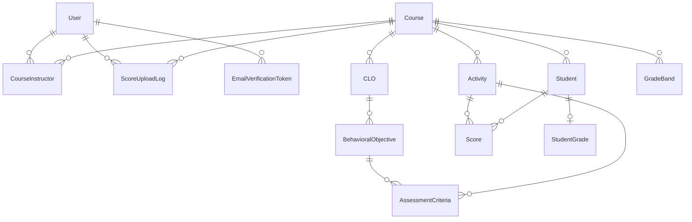

See also: [[dev]] · [[srs]] · [[Summary Project]] · [[concept-clo MOC]]

# โครงสร้างฐานข้อมูล CMAS — 13 ตาราง และเหตุผลที่ต้องมีแต่ละตาราง

> ⚠️ **`database/schema.prisma` เป็น source of truth ของโครงสร้าง** ไฟล์นี้อธิบาย **"ทำไม"**
> ไม่ใช่ **"อะไร"** — ถ้าสองไฟล์ขัดกันให้ยึด `schema.prisma` แล้วมาแก้ไฟล์นี้
> ไฟล์นี้เคยหลุดจากของจริงมาแล้ว (เคยมี `Curriculum.createdBy` ที่ไม่มีอยู่จริง)
>
> DDL ที่รันได้: `database/migrations/` (Postgres — ของจริง) ·
> [`reference/db/mysql/index-q.sql`](../../reference/db/mysql/index-q.sql) (MySQL — สำหรับทำ ER
> ใน MySQL Workbench · ไฟล์ `*_v3.sql` เดิมย้ายไป `superseded/` แล้ว)
>
> **ฉบับปัจจุบัน (2026-09-26): 13 ตาราง · migration `0001`–`0007`** — ตรวจกับ `schema.prisma` แล้ว
>
> | เวอร์ชัน | วันที่ | ตาราง | สิ่งที่เปลี่ยน |
> |---|---|---:|---|
> | v2 | 2026-08-04 | 11 | single-tenant — ตัด `Institution` · `Membership` · `Curriculum` · `CurriculumCourse` (จาก 15) |
> | v3 | 2026-08-23 | 13 | migration `0003`/`0004` — เพิ่มตัดเกรด `GradeBand` · `StudentGrade` (ตัด `GradeScheme` · `GradeRun` ทิ้ง 2026-09-06) · `CLO.bloomLevel` · `Course.gradingType` → `gradeScale` |
> | v4 | 2026-09-14 | 14 | migration `0005` — เพิ่ม `EmailVerificationToken` · ตัด `CourseRole` (D1) · `CLO.soloLevel` (D4) · ลงทะเบียนเอง (D6) |
> | **v5** | **2026-09-17** | **13** | migration `0006` — **ตัด `ObjectiveAssessment`** ยุบเข้า `AssessmentCriteria` (ผูก Activity ↔ จุดประสงค์ ไม่ใช่ CLO) · ตัด `CLO.threshold` → `Course.cloPassMark` · เพิ่ม `CLO.weight` / `BehavioralObjective.weight` / `Activity.type` · `assessmentMethod` · `criteriaNote` · `passMark` |
> | v5.1 | 2026-09-23 | 13 | migration `0007` — `User.status` (`PENDING` / `ACTIVE`) รอผู้ดูแลอนุมัติ Google นอกโดเมน (FR-08) · `CLO.levelSource` เปลี่ยนความหมายเป็น AUTO/MANUAL ของ SOLO (O3) |
>
> ⚠️ เลขเวอร์ชันในตารางนี้ **ไม่ตรงกับเลขในชื่อไฟล์ MySQL** — `cmas_app_mysql_v3.sql` คือ v2 ของตารางนี้
> และ `cmas_app_mysql_v4.sql` คือ v3 · ตารางเทียบเลขทั้งสองชุดกับเลข migration อยู่ที่ [`docs/VERSIONS.md`](../../VERSIONS.md)
>
> DDL ที่รันได้: `database/migrations/` (Postgres — ของจริง) ·
> [`reference/db/mysql/index-q.sql`](../../reference/db/mysql/index-q.sql) (MySQL — เท่ากับ `schema.prisma` ถึง `0007` + ส่วนที่ต้นแบบ
> `index-q.html` เสนอเพิ่ม ใช้ทำ ER ใน MySQL Workbench) — ส่วนที่ **ยังไม่อยู่ใน Prisma**
> (`AuthEvent` · `UploadReject` · `CourseGroupWeight` · `Course.weightMode` · `Activity.passScore` ฯลฯ) ดู [[mysql-dumps]]
>
> ⚠️ **ต้อง re-verify กับ Postgres จริงอีกครั้ง** — ตัวเลข CHECK / trigger ที่เคยรายงาน (2026-07-30: 37 CHECK · 22 FK ·
> 7 trigger) เป็นของ schema 15 ตารางที่ถูกแทนที่ไปแล้ว ปัจจุบัน migration เขียน **41 CHECK** (0002: 28 · 0004: 7 · 0005: 3 · 0006: 4 — หัก `chk_clo_threshold` ที่หายไปพร้อมคอลัมน์ใน 0006) และ **3 trigger**
> (`trg_score_validate` · `trg_criteria_same_course` · `gradeband_passfail`) · partial index `uq_courseinstructor_lead` ถูกทิ้งแล้วใน `0005`

---

## 1. หลักการที่ใช้ตัดสินว่า "อะไรควรเป็นตาราง"

ทุกตารางในระบบนี้มีอยู่ด้วยเหตุผล **ข้อใดข้อหนึ่ง** จาก 4 ข้อนี้ ถ้าตารางใหม่ตอบไม่ได้ว่าเป็นข้อไหน แปลว่ายังไม่ควรสร้าง:

| # | เหตุผล | ตัวอย่างในระบบนี้ |
|---|---|---|
| **R1** | **เป็นสิ่งของจริงในโลก** ที่มีตัวตนของตัวเอง | `User`, `Course`, `Student`, `CLO` |
| **R2** | **ความสัมพันธ์ M:N ที่มีคุณสมบัติของตัวเอง** — คุณสมบัตินั้นไม่ได้เป็นของฝั่งใดฝั่งหนึ่ง จึงเก็บที่ FK 2 ตัวไม่ได้ | `AssessmentCriteria` (มี `weight`) |
| **R3** | **จำนวนไม่จำกัด (1:N)** — ถ้าใช้คอลัมน์จะต้องมี `clo1`, `clo2`, `clo3`, … ซึ่งผิด 1NF | `CLO` ต่อ `Course`, `Activity` ต่อ `Course`, `Score` ต่อ `Student` |
| **R4** | **บันทึกเหตุการณ์ (audit)** ที่ต้องเก็บไว้แม้ของที่อ้างถึงจะเปลี่ยนไปแล้ว | `ScoreUploadLog` |

**กฎที่สำคัญที่สุดคือ R2** และเป็นคำตอบของคำถาม "ทำไมต้องมีตารางนี้" บ่อยที่สุด:

> `AssessmentCriteria.weight` — "น้ำหนักที่กิจกรรมนี้วัดจุดประสงค์ข้อนี้" **ไม่ใช่**คุณสมบัติของกิจกรรม
> (กิจกรรมเดียวแบ่งน้ำหนักให้จุดประสงค์ต่างกันได้) และ**ไม่ใช่**คุณสมบัติของจุดประสงค์
> (จุดประสงค์เดียวถูกวัดหลายกิจกรรมด้วยน้ำหนักต่างกัน) มันเป็นคุณสมบัติของ **"คู่ (กิจกรรม × จุดประสงค์)"**
> → คู่ต้องมีที่อยู่ → คู่ต้องเป็นตาราง
>
> *(ตัวอย่างเดิมคือ `CourseInstructor.role = LEAD` — หมดไปพร้อม `CourseRole` ใน migration `0005`)*

---

## 2. ระบบแบ่งเป็น 5 ชั้น

```mermaid
erDiagram
    User        ||--o{ CourseInstructor : ""
    User        ||--o{ ScoreUploadLog : ""
    User        ||--o{ EmailVerificationToken : ""
    Course      ||--o{ CourseInstructor : ""
    Course      ||--o{ CLO : ""
    Course      ||--o{ Activity : ""
    Course      ||--o{ Student : ""
    Course      ||--o{ ScoreUploadLog : ""
    Course      ||--o{ GradeBand : ""
    CLO         ||--o{ BehavioralObjective : ""
    BehavioralObjective ||--o{ AssessmentCriteria : ""
    Activity    ||--o{ AssessmentCriteria : ""
    Activity    ||--o{ Score : ""
    Student     ||--o{ Score : ""
    Student     ||--o| StudentGrade : ""
```

| ชั้น | ตาราง | ตอบคำถามว่า |
|---|---|---|
| **1 · IDENTITY** | `User`, `EmailVerificationToken` | ใครเข้าระบบได้ และมีสิทธิ์ระดับใด · อีเมลนี้ยืนยันแล้วหรือยัง |
| **2 · THE COURSE** | `Course`, `CourseInstructor` | เทอมนี้เปิดสอนอะไร ใครสอน |
| **3 · THE CRITERIA** | `CLO`, `BehavioralObjective`, `Activity`, `AssessmentCriteria` | วัด**อะไร** ด้วย**อะไร** น้ำหนัก**เท่าไร** — สายเดียว: CLO → จุดประสงค์ → กิจกรรม |
| **4 · THE FACTS** | `Student`, `Score` | ใครได้**คะแนนเท่าไร** |
| **5 · GRADING** | `GradeBand`, `StudentGrade` | เกรดขั้นบันไดของวิชา · เกรดสุดท้ายของนักศึกษาแต่ละคน |
| **6 · AUDIT** | `ScoreUploadLog` | ใครนำเข้าคะแนน เมื่อไร ด้วยไฟล์อะไร |

> **`ObjectiveAssessment` ไม่มีแล้ว (migration `0006`)** — เดิมเป็นตารางเสริมผูกเกณฑ์กับจุดประสงค์ ตอนนี้
> `AssessmentCriteria` ผูก **Activity ↔ BehavioralObjective** ตรง ๆ และไปถึง CLO ผ่านจุดประสงค์
> ทำให้กิจกรรมวัด CLO โดยไม่ระบุจุดประสงค์ไม่ได้อีก

**เดิมมี 7 ชั้น (0 · TENANCY และ 2 · THE PLAN) — ถูกตัดทิ้งเมื่อ 2026-08-04**

| ชั้นที่หายไป | ตารางเดิม | ทำไมถึงตัด |
|---|---|---|
| 0 · TENANCY | `Institution` | ระบบใช้ในคณะเดียว (single-tenant) ไม่มีขอบเขตข้ามสถาบันให้โมเดล |
| 1 (บางส่วน) | `Membership` | เมื่อมีสถาบันเดียว ตาราง role ราย (คน × สถาบัน) เหลือค่าเดียวเสมอ → `role` ย้ายกลับไปเป็นคอลัมน์บน `User` |
| 2 · THE PLAN | `Curriculum`, `CurriculumCourse` | นอกขอบเขต v1 — แต่ **5 คอลัมน์ที่ระบบใช้จริง** (`credits`, ชั่วโมง 3 ตัว, `gradeScale`) ถูกย้ายขึ้นมาไว้บน `Course` ไม่ได้หายไปด้วย |

**สิ่งที่แลกไป (ต้องเขียนในเล่ม ไม่ใช่ซ่อน):** ชั้น 2 เคยแยก "แผน" ออกจาก "ของจริง" ทำให้แก้ชื่อวิชา
ปีนี้ไม่กระทบเอกสารหลักสูตรที่สภาอนุมัติไปแล้ว เมื่อตัดชั้นนั้นออก ระบบ**ไม่มีสำเนาที่แช่แข็ง**
ของเอกสารหลักสูตรอีกต่อไป — ยอมรับได้ใน v1 เพราะขอบเขตคือการติดตาม CLO รายวิชา
ไม่ใช่การบริหารหลักสูตร แต่ถ้า PLO / มคอ.2 เข้ามาในภายหลัง ต้องสร้างตารางแม่แล้ว **backfill**
ซึ่งไม่ใช่ migration แบบเพิ่มอย่างเดียว (ดู §5)

---

## 3. รายละเอียดทีละตาราง

### ชั้น 1 — IDENTITY

#### `User` — คนที่ล็อกอินได้

| ฟิลด์ | หมายเหตุ |
|---|---|
| `email` | **unique** — 1 คน 1 credential |
| `passwordHash` | argon2id เท่านั้น · **nullable** (บัญชีที่เข้าด้วย Google อย่างเดียวไม่มีรหัสผ่าน) · CHECK ความยาว ≥ 20 กัน plaintext หลุด และ `chk_user_has_credential` บังคับว่าต้องมี `passwordHash` หรือ `googleSub` อย่างน้อยหนึ่งอย่าง (0005) |
| `role` | ADMIN \| INSTRUCTOR — **คอลัมน์ธรรมดาบน `User`** |
| `isActive` | สวิตช์ปิดบัญชี (FR-03) — ปิดแล้วเปิดกลับได้ |
| `status` | `PENDING` \| `ACTIVE` (0007, FR-08) — Google จากนอกโดเมนสถาบันเกิดเป็น `PENDING` จนกว่า ADMIN อนุมัติ · เดินทางเดียว `PENDING → ACTIVE` · มี `@@index([status])` ให้หน้ารออนุมัติ |
| `authProvider` | `EMAIL` \| `GOOGLE` — ช่องทางที่สร้างบัญชีครั้งแรก (D6) เป็นข้อมูลอ้างอิง ไม่ใช่กุญแจ |
| `googleSub` | **unique** · subject id จาก ID token ที่ตรวจแล้ว — จับคู่บัญชีด้วยค่านี้ ไม่ใช่อีเมล เพราะแอดมิน Workspace ย้ายอีเมลได้ |
| `emailVerifiedAt` | `NULL` = ยังไม่ยืนยัน (ล็อกอินไม่ได้) · Google ตั้งค่านี้ให้ตั้งแต่สร้าง |
| `createdAt` / `updatedAt` | `updatedAt` มีไว้เพราะการเปลี่ยน role / ปิดบัญชี เป็นเหตุการณ์ที่ต้องตามรอยได้ (NFR-19) |

**ทำไม `role` กลับมาอยู่บน `User`:** เดิมอยู่บน `Membership` เพราะ ADMIN ที่ ม.A ต้องไม่เป็น ADMIN
ที่ ม.B — เมื่อมีสถาบันเดียว เงื่อนไขนั้นไม่มีอยู่จริง ตาราง `Membership` จึงเหลือค่าเดียวต่อคน
คือ FK ตัวเดียวที่แต่งตัวเป็นตาราง

**ทำไมไม่มี `isSuperAdmin` แล้ว:** มันมีไว้สำหรับคนที่**สร้างสถาบัน**และตั้ง ADMIN คนแรกของสถาบัน
ซึ่งต้องมีอยู่ก่อน membership ใด ๆ เมื่อไม่มีสถาบันให้สร้าง ก็ไม่มีชั้นที่อยู่เหนือ ADMIN

**ทำไม `@@index([role, isActive])` เป็น composite ไม่ใช่ 2 index:** ทุกหน้าจอที่ list ผู้ใช้กรอง
ด้วย **ทั้งสองค่าพร้อมกัน** ("อาจารย์ที่ยังใช้งานอยู่") ไม่เคยกรองด้วย role อย่างเดียว

**ทำไม `status` แยกจาก `isActive`:** สองคำถามที่ต่างกัน — "มีใครตรวจบัญชีนี้แล้วหรือยัง" (`status`) กับ "ตอนนี้ยอมให้เข้าไหม" (`isActive`) ถ้ารวมเป็นบิตเดียว การระงับซ้ำกับการอนุมัติจะแย่งบิตกัน · `status` กั้นเฉพาะเคส Google นอกโดเมน **ไม่ได้** เอามาแทนการยืนยันอีเมล (EMAIL / Google ในโดเมน = `ACTIVE` ตั้งแต่สร้าง)

**ทำไม `role` ใน JWT เชื่อไม่ได้:** token อายุ 15 นาที ค่าที่อยู่ในนั้นจึงเก่าได้ถึง 15 นาที
`authMiddleware` จึงอ่านแถวนี้ใหม่ทุก request — การปิดบัญชีหรือลดสิทธิ์มีผลทันที (NFR-19)

#### `EmailVerificationToken` — ลิงก์ยืนยันอีเมล (D6)

`tokenHash` **unique** · `@@index([userId])` · FK → `User` เป็น `Cascade`

เก็บเฉพาะ **SHA-256 ของ token** — อ่านฐานข้อมูลแล้วเอาไปเล่นเป็นลิงก์ซ้ำไม่ได้ · ใช้ครั้งเดียว (`usedAt`) · อายุ 24 ชม. (`expiresAt` — CHECK ว่าหมดอายุหลังวันออกลิงก์) · ออกลิงก์ใหม่แล้วลิงก์เก่าถูกทำให้ใช้ไม่ได้ที่ชั้นแอป

**ทำไมเป็นตารางแยก (R3):** ผู้ใช้ 1 คนขอลิงก์ได้หลายครั้ง · **ทำไม `Cascade` ไม่ใช่ `Restrict`:** token ไม่ใช่หลักฐานย้อนหลัง ลบผู้ใช้แล้วลบมันตามได้

---

### ชั้น 2 — THE COURSE

#### `Course` — วิชาที่เปิดสอนจริงเทอมนี้

`@@unique([code, semester, year, section])` — **รากของลำดับชั้นข้อมูลทั้งระบบ**

| ฟิลด์ | หมายเหตุ |
|---|---|
| `section` | หมู่เรียน default `"01"` |
| `passCriteria` / `cloPassMark` / `classTarget` | เกณฑ์ระดับวิชา (OI-03) — เก็บรายวิชา ไม่ใช่ค่ากลางของคณะ · `passCriteria` = ผ่านวิชา (CR-05, default 60) · **`cloPassMark`** = คะแนน CLO ที่ถือว่าผ่าน **ค่าเดียวทั้งวิชา** (E1, default 60 — แทน `CLO.threshold` รายข้อ) · `classTarget` = สัดส่วนผู้ผ่านที่ทำให้ CLO บรรลุ (CR-04, **default 100** ตาม D2) |
| `nameEn` | ชื่ออังกฤษ (nullable) |
| `credits` | `Decimal(3,1)` — **ย้ายขึ้นมาจาก `CurriculumCourse`** (FR-27) |
| `lectureHours` / `practiceHours` / `selfStudyHours` | `Decimal(4,1)` — ย้ายขึ้นมาเช่นกัน |
| `gradeScale` | LETTER \| PASS_FAIL — ย้ายขึ้นมา ทำให้ CR-06 ตัดสินได้แน่นอน (FR-28) · **เดิมชื่อ `gradingType`** เปลี่ยนชื่อ 2026-08-23 ไม่ให้ใกล้ `gradeMethod` เกินไป |
| `gradeMethod` | `CRITERION_REFERENCED` (อิงเกณฑ์ — แถบเป็น %) \| `NORM_REFERENCED` (อิงกลุ่ม — แถบเป็น T-score) · คอนฟิกตัดเกรดทั้งหมดของวิชา หน่วยของ `GradeBand.minValue` ตามจากค่านี้ ไม่มีคอลัมน์หน่วยแยก |
| `createdAt` / `updatedAt` | |

**ทำไม unique key ไม่มี `institutionId` แล้ว:** ระบบเป็น single-tenant — รหัส `90641001` unique
ภายในคณะเดียวอยู่แล้ว error message ของ FR-21 จึงเป็น "รหัสวิชานี้มีอยู่แล้วในภาคเรียนนี้"
นี่คือจุดเดียวที่การตัด tenancy **เปลี่ยน** constraint เดิม ไม่ใช่แค่ลบทิ้ง

**ทำไม `credits` เป็น `Decimal(3,1)` ไม่ใช่ `Int` และพื้นต้องเป็น 0:** หลักสูตรเขียนว่า `3 (2-2-5)`
= หน่วยกิต (บรรยาย-ปฏิบัติ-ศึกษาเอง) `Int` ทิ้งข้อมูล 3 ตัวหลัง และ CHECK เดิม
`credits BETWEEN 1 AND 30` **ปฏิเสธวิชาที่มีจริง**: `90641008` = `0 (0-0-45)`

**ทำไม `passCriteria` / `cloPassMark` / `classTarget` เก็บรายวิชา ไม่ใช่ค่ากลางแล้ว resolve ตอนอ่าน:**
ถ้าอ่านจากค่ากลาง แล้วแอดมินแก้ค่านั้นวันนี้ → **รายงาน attainment ของเทอมที่แล้วเปลี่ยนย้อนหลัง
เงียบ ๆ** เพราะ CR-04/CR-05 กินค่านี้ทั้งคู่ ทุกคำตัดสิน "CLO บรรลุ" และ "ผ่านรายวิชา" จะพลิก

**ทำไมต้องมี `section` (ประวัติสำคัญ):** เดิม unique key คือ `(code, semester, year, instructorId)` — `instructorId` ทำหน้าที่**แอบ**เป็นตัวแยกหมู่เรียน เมื่อการสอนเปลี่ยนเป็น M:N (`CourseInstructor`) `instructorId` หายไป ถ้าไม่เพิ่ม `section` มาแทน key จะเหลือ `(code, semester, year)` = **เปิดวิชาเดียวได้หมู่เดียวต่อเทอม** ซึ่งผิดความจริง

**ทำไม `nameEn` เป็น paired column ไม่ใช่ JSON หรือตารางแปลภาษา:** มี 2 ภาษาคงที่ ไม่มีแผน i18n · JSON เสีย `NOT NULL` บนชื่อไทย เสีย index สำหรับ search และบังคับ `as any` (ผิด NFR-13) · ตารางแปลภาษาเหมาะกับ ≥3 ภาษา ที่นี่จะได้ JOIN เพิ่มทุก query แลกกับความยืดหยุ่นที่ไม่มีใครขอ

#### `CourseInstructor` — ทีมผู้สอน

`@@unique([courseId, userId])` · `@@index([userId])` · `assignedAt`

**ทำไมยังต้องเป็นตาราง (M:N):** วิชาหนึ่งมีผู้สอนได้หลายคน อาจารย์หนึ่งคนสอนได้หลายวิชา — เดิม `Course.instructorId` บังคับ 1 วิชา = 1 อาจารย์ ซึ่งใช้กับวิชาปฏิบัติการที่สอนร่วมกันไม่ได้เลย

> **ไม่มี `role` แล้ว (D1, migration `0005`, 2026-09-14)** — `CourseRole` (LEAD / CO / ASSISTANT) ถูกตัดทั้ง enum และคอลัมน์ พร้อมกับ partial index `uq_courseinstructor_lead`
> ผู้สอนทุกคนในรายวิชามีสิทธิ์เท่ากัน รวมถึงแก้ CLO และตัดเกรด ตารางนี้จึงเหลือความหมายเดียวคือ "คนนี้สอนวิชานี้" — ตัวอย่างของ R2 ตอนนี้คือ `AssessmentCriteria`

**ทำไม "ต้องมีผู้สอนอย่างน้อย 1 คน" อยู่ที่แอป (FR-23):** บังคับที่ DB ไม่ได้ เพราะแถว `Course` ต้องมีอยู่ก่อนจะมอบหมายใครได้ → INSERT แรกจะเป็นไปไม่ได้ตลอดกาล

**`onDelete`:** ฝั่ง `Course` เป็น `Cascade` · ฝั่ง `User` เป็น `Restrict` — ห้ามลบผู้สอนที่ยังถูกมอบหมายอยู่ ให้ปิด `isActive`

---

### ชั้น 3 — THE CRITERIA (หัวใจของโครงงาน)

#### `CLO` — ผลลัพธ์การเรียนรู้ระดับรายวิชา

`@@unique([courseId, number])`

| ฟิลด์ | หมายเหตุ |
|---|---|
| `weight` | **nullable** — สัดส่วนของ CLO ต่อวิชาที่อาจารย์กรอกเอง รวมทุก CLO ควร = 100 (T1/E2, 0006) |
| `bloomLevel` | `REMEMBER` … `CREATE` (6 ระดับ Bloom) · nullable — แถวเก่าไม่มีค่า ระดับผิดแย่กว่าไม่มี UI จึงถามแทนการเดา `REMEMBER` |
| `soloLevel` | `SURFACE` / `DEEP` / `TRANSFER` — ⚠ **ชื่อระดับยังเป็นค่าชั่วคราว** ยังไม่ตรวจกับเอกสาร คอบ. หน้า 33 (D4) |
| `levelSource` | `AUTO` = อาจารย์เลือก Bloom แล้ว SOLO ตามตารางคงที่ (REMEMBER/UNDERSTAND→SURFACE · APPLY/ANALYZE→DEEP · EVALUATE/CREATE→TRANSFER) · `MANUAL` = เลือกเองทั้งสอง (O3, 0007) |
| `classTarget` | nullable — override `Course.classTarget` ราย CLO · `NULL` = ใช้ค่าวิชา |

**ทำไมต้องมีตารางนี้ (R1 + R3):** CLO คือหน่วยวิเคราะห์ของโครงงานทั้งหมด และ 1 วิชามีหลาย CLO

**ทำไม `number` ต้อง unique ต่อวิชา:** มี "CLO 1" สองตัวในวิชาเดียว = **ทุกรายงาน attainment เพี้ยนเงียบ ๆ**

**ไม่มี `threshold` แล้ว (E1/T7, 0006):** เดิมแต่ละ CLO มีเกณฑ์ผ่านของตัวเอง ตอนนี้ใช้ `Course.cloPassMark` ค่าเดียว · migration เฉลี่ย `threshold` เดิมลงค่านั้น และเตือนไว้ในไฟล์ว่าวิชาที่ CLO เคยมีเกณฑ์ต่างกันต้องรีวิว

**`CLO.weight` (เอกสารเดิมเคยระบุว่า "ไม่มีคอลัมน์ weight"):** ตอนแรกน้ำหนัก CLO เป็นค่าคำนวณล้วน (CR-02) ข้อเสนอแนะ T1 ให้อาจารย์กรอกเอง จึงเก็บทั้งคู่ — ค่าที่กรอกกับค่าที่คำนวณจาก `Activity.weight × AssessmentCriteria.weight` อาจไม่ตรงกัน ตัดสินว่า **แจ้งเตือน ไม่บล็อก** (OI-02 ปิดในแนวนั้น)

#### `BehavioralObjective` — จุดประสงค์เชิงพฤติกรรม

`@@unique([cloId, number])` · `weight` (nullable — สัดส่วนต่อ CLO นี้ รวมทุกข้อใน CLO เดียว = 100, T6)

**ทำไมต้องมีตารางนี้ (R3):** 1 CLO แตกเป็นข้อย่อยได้หลายข้อ **และตั้งแต่ 0006 คือระดับที่กิจกรรมผูกด้วย** — CLO → จุดประสงค์ → กิจกรรม · คะแนน CLO = คะแนนจุดประสงค์ที่รวมกันด้วย `weight`

#### `Activity` — กิจกรรมประเมิน

| ฟิลด์ | หมายเหตุ |
|---|---|
| `type` | `LECTURE` (ป้ายบน UI: "นำเสนอ" — เก็บ key เดิมกัน migration) · `LAB` · `TEST` · `PROJECT` |
| `assessmentMethod` | `QUIZ` · `EXAM` · `RUBRIC` · `WORK` · `OBSERVATION` — แทนข้อความอิสระ `method` (T3) |
| `criteriaNote` | ข้อความอิสระ เกณฑ์ / รูบริก · ข้อความ `method` เดิมย้ายมาเป็นต้นของช่องนี้ |
| `passMark` | % ของ `maxScore` ที่ผ่านกิจกรรมนี้ (default 50) — **รายงานอย่างเดียว ไม่ตัดสิน CLO** |
| `maxScore` | **ต้อง > 0** (CHECK) |
| `weight` | สัดส่วนต่อคะแนนรวมวิชา — ผลรวมทุก Activity = 100 |
| `order` | ลำดับแสดงผล (drag-reorder เขียนค่านี้) |

**ทำไม `maxScore > 0` เป็น CHECK ที่ห้ามหาย:** **ทุกสูตรใน SRS §3 หารด้วยค่านี้** `maxScore = 0` ทำให้ทุกรายงานพังด้วย division-by-zero

**ทำไม `weight` รวม = 100 ไม่เป็น constraint:** จริงเฉพาะตอน**กรอกเสร็จแล้ว** ระหว่างกรอกยังไม่ครบเป็นเรื่องปกติ → เตือนที่ UI แทน (FR-43) · ⚠ view `v_activity_weight_audit` อยู่เฉพาะในไฟล์ MySQL production v3 ยัง **ไม่มีใน migration ของ Postgres**

**ทำไมไม่มี `@@unique([courseId, order])`:** drag-reorder เขียนสถานะกลางทางที่ order ชนกันชั่วคราว

#### `AssessmentCriteria` — ผูก Activity ↔ จุดประสงค์ พร้อมน้ำหนัก

`@@unique([activityId, objectiveId])` · `@@index([objectiveId])` · `weight Float` (CHECK > 0 และ ≤ 100 · รวมต่อกิจกรรม = 100)

**ทำไมต้องมีตารางนี้ (R2 — ตัวอย่างที่ชัดที่สุด):** Activity ↔ จุดประสงค์ เป็น M:N และ **`weight` เป็นของ "คู่"** — กิจกรรมเดียวแบ่งน้ำหนักให้จุดประสงค์ต่างกันได้ และจุดประสงค์เดียวถูกวัดหลายกิจกรรมด้วยน้ำหนักต่างกัน

**เปลี่ยนใน 0006 (T4/T11):** เดิมผูก Activity ↔ **CLO** (`cloId`) แล้วมี `ObjectiveAssessment` ต่อยอดเป็นข้อมูลเสริม ตอนนี้ตัด `cloId` และตัด `ObjectiveAssessment` ทิ้ง — **ถึง CLO ได้ผ่านจุดประสงค์เท่านั้น** ข้อมูลเดิมถูกย้ายโดย migration (ดูหัวไฟล์ `0006`)

**ตารางนี้คือจุดขายของโครงงาน** — ถ้าตัดออก ระบบจะเหลือแค่ตารางคะแนนธรรมดา (ดู OI-01)

**trigger `trg_criteria_same_course` บังคับว่า Activity และ CLO ของจุดประสงค์ต้องอยู่วิชาเดียวกัน** (เขียนใหม่ใน 0006 ให้เดินผ่านจุดประสงค์) — การผูกข้ามวิชาให้ตัวเลขที่ดูสมเหตุสมผลแต่ไม่มีความหมาย ซึ่งอันตรายกว่า error

---

### ชั้น 4 — THE FACTS

#### `Student` — **การลงทะเบียน ไม่ใช่คน**

`@@unique([studentCode, courseId])` · `@@index([studentCode])`

**ทำไมต้องมีตารางนี้ (R3):** 1 วิชามีนักศึกษาหลายคน

**⚠️ ทำไม 1 คนลง 5 วิชา = 5 แถว (ชื่อซ้ำ 5 ครั้ง):** เพราะตารางนี้โมเดล **enrolment** (ASM-01) การแยก `Student`(คน) ออกจาก `Enrolment`(คน × วิชา) **เลื่อนไป v2** เพราะ OI-05 ตัด field ระดับบุคคล (อีเมล/ชั้นปี/สาขา/คณะ) ออกจาก v1 แล้ว → ตาราง `Person` วันนี้จะมี 2 คอลัมน์ และซื้ออะไรไม่ได้นอกจาก JOIN เพิ่มทุก query
**เลื่อนได้อย่างปลอดภัยเพราะ** natural key ของ `Person` ในอนาคตคือ `studentCode` = index ที่มีอยู่แล้วพอดี → v2 เป็นการเพิ่มตาราง + backfill ด้วย index-only scan ไม่แตะ unique key ไม่มี downtime

**ทำไม `@@index([studentCode])` เปล่า ๆ ปลอดภัยแล้ว:** ตอนเป็น multi-tenant index นี้เป็น**กับดัก** — รหัสนักศึกษาไทย 8 หลักชนกันข้ามสถาบันเกือบแน่นอน `where: { studentCode }` เดี่ยว ๆ จะคืนนักศึกษาของอีกมหาวิทยาลัย = ข้อมูลส่วนบุคคลรั่วตาม PDPA (CON-02) จึงต้อง denormalise `institutionId` ลงมาเพื่อให้ index เป็น `(institutionId, studentCode)`
เมื่อเป็น single-tenant รหัสนักศึกษาหนึ่งค่าหมายถึงคนเดียวในฐานข้อมูลทั้งใบ → คอลัมน์ denormalise และ trigger ที่คอยเฝ้ามันถูกลบทิ้งทั้งคู่

#### `Score` — คะแนนราย Activity

`@@unique([studentId, activityId])`

**ทำไมต้องมีตารางนี้ (R3):** 1 นักศึกษามีหลายคะแนน

**ทำไมเก็บราย Activity ไม่ใช่ราย CLO:** คะแนน CLO เป็น**ค่าคำนวณ** (ASM-02, CR-03) ถ้ากรอกราย CLO ตรง ๆ `Activity` และ `AssessmentCriteria` จะไม่มีความหมาย และเสียจุดขายของโครงงาน (OI-01)

**ทำไม "ยังไม่ประเมิน" = ไม่มีแถว ไม่ใช่ `score = 0` (FR-62):** เว้นว่าง ≠ ได้ 0 คะแนน ต้องแยกกันในทุกการคำนวณ — ถ้าใช้ 0 แทนจะดึงคะแนน CLO ลงทั้งที่ยังไม่ได้สอบ
**ทดสอบแล้ว:** ลบแถว Score → `cloScore` ออกมาเป็น `NULL` (แสดง `—`) ไม่ใช่ `0` ✅

**มี trigger บังคับ 2 ข้อ:** `score ≤ Activity.maxScore` และ Student/Activity ต้องอยู่วิชาเดียวกัน (การ import ที่จับ ID ผิดจะโยนคะแนนไปผิดห้องเงียบ ๆ)

---

### ชั้น 5 — GRADING (การตัดเกรด)

**ตัดเหลือ 2 ตาราง 9 คอลัมน์ (2026-09-06)** — ระบบมีไว้รายงานการบรรลุ CLO การตัดเกรดเป็นผลพลอยได้ จึงเก็บเท่าที่ตอบได้ว่า "ได้เกรดอะไร บนเกณฑ์แบบไหน ตัดด้วยวิธีใด"

#### `GradeBand` — ขั้นบันไดเกรดของวิชา

`@@unique([courseId, grade])` · `@@unique([courseId, minValue])` · `minValue` อ่านเป็น % (อิงเกณฑ์) หรือ T-score (อิงกลุ่ม) ตาม `Course.gradeMethod` · unique ตัวที่สองทำให้ลำดับเกรด (`ORDER BY minValue DESC`) เป็นลำดับสมบูรณ์ — trigger ตรวจ monotonic เดิมยุบเข้ามาที่นี่ · trigger `gradeband_passfail` (0004) กันแถบผิดชนิดในวิชา PASS_FAIL · แถบพื้น `minValue = 0` เป็นกฎฝั่งแอป (CR-09)

#### `StudentGrade` — เกรดสุดท้ายของนักศึกษา

`studentId` **unique** (1 การลงทะเบียน 1 เกรด) · `totalPercent` + `grade` **เก็บค่าจริง ไม่คำนวณตอนอ่าน** — แก้คะแนนทีหลังไม่ทำให้เกรดที่ประกาศแล้วขยับ · `overrideReason` — ว่าง = เกรดที่ขั้นบันไดให้, มีค่า = อาจารย์ปรับพร้อมเหตุผล (ไม่มีทางถูกกฎหมาย ผู้สอนจะไปแก้คะแนนดิบแทน ซึ่งทำให้ CLO เพี้ยน)

**สิ่งที่ยอมเสีย:** ไม่เก็บ `n / mean / sd` (ตัด `GradeRun`) → เกรดอิงกลุ่มยังคงที่ แต่คำนวณย้อนจากฐานข้อมูลอย่างเดียวไม่ได้ · อิงเกณฑ์ไม่เสียอะไร · ประชากรอิงกลุ่ม = 1 `Course` = 1 หมู่เรียน · **ห้ามให้สถิติกลุ่มไหลไปถึง CLO attainment หรือผ่าน/ไม่ผ่านวิชา**

---

### ชั้น 6 — AUDIT

#### `ScoreUploadLog`

**ทำไมต้องมีตารางนี้ (R4):** NFR-16 บังคับว่าการนำเข้าคะแนนทุกครั้งต้องตามรอยได้ว่า**ใคร เมื่อไร ไฟล์อะไร** และ FR-71 บังคับให้บันทึกแม้ไฟล์ล้มทั้งไฟล์

**ทำไม `uploadedBy` เป็น `Restrict` ไม่ใช่ `Cascade`:** audit trail ที่เสียตัวผู้กระทำไปแล้วไม่ใช่ audit trail — ห้ามลบ User ที่เคยอัปโหลด ให้ปิด `isActive` แทน

**ตารางนี้อยู่นอกเส้นทางคำนวณ** — ไม่มีอะไรอ้างอิงแถวเหล่านี้ ลบทิ้งได้ไม่กระทบตัวเลขใด ๆ

---

## 4. คำถามที่ถูกถามซ้ำ

### ทำไมทุกตารางมีทั้ง `id` และ `code`/`number`?

| | `id` | `code` / `number` / `studentCode` |
|---|---|---|
| ใครใช้ | **ระบบ** (FK, JOIN) | **คน** (อาจารย์, เอกสาร, มคอ.) |
| ค่า | cuid สุ่ม `cms7afb050001…` | มีความหมาย `90641001`, `67030098`, `CLO 1` |
| เปลี่ยนได้ไหม | **ห้าม** — FK ทั้งระบบชี้อยู่ | เปลี่ยนได้ (มหาวิทยาลัยเปลี่ยนรหัสวิชาจริง) |
| unique แบบไหน | ทั้งระบบ | **ในขอบเขต** (`(code, semester, year, section)`, `(studentCode, courseId)`) |

ถ้ามีแต่ `code` → เมื่อมหาวิทยาลัยเปลี่ยนรหัสวิชา ต้องอัปเดต FK ทุกแถวในทุกตาราง
ถ้ามีแต่ `id` → อาจารย์เห็น "วิชา cms7afb050001" บนรายงาน มคอ.5

### ตัด multi-tenant ออกแล้ว อะไรมาแทนการกันข้อมูลรั่ว?

**`courseId` เพียงอย่างเดียว** — และนั่นคือประเด็นที่ต้องระวังที่สุดหลังการเปลี่ยน

เดิมมี 2 ด่านซ้อนกัน: ชั้น Prisma extension กรองทุก query ด้วย `institutionId` แล้วจึงตรวจสิทธิ์
รายวิชาอีกชั้น ตอนนี้เหลือด่านเดียวคือ `assertCourseAccess()` ใน
[`authorization.service.ts`](../../../app/server/src/modules/authorization/authorization.service.ts)
ซึ่งเป็น**โค้ดที่คนต้องจำเรียก** ไม่ใช่กลไกที่บังคับอัตโนมัติ

ผลที่ตามมา: route ใหม่ที่รับ `:courseId` แล้วลืมเรียก จะไม่มีอะไรมารับไว้เลย —
จึงต้องมี integration test ต่อทุก route ไม่ใช่พึ่งการรีวิว (บันทึกไว้ใน [[dfd]] §7 TB-4)

### ทำไมบางกฎอยู่ที่ DB บางกฎอยู่ที่แอป?

| กฎ | อยู่ที่ | เพราะ |
|---|---|---|
| `score ≥ 0`, `maxScore > 0`, `cloPassMark 0-100` | **CHECK** | เป็นความจริงของคอลัมน์เดียว ตรวจได้ทันที |
| Activity/CLO (ผ่านจุดประสงค์) วิชาเดียวกัน, Student/Activity วิชาเดียวกัน, `score ≤ maxScore`, แถบ PASS_FAIL | **trigger** (3 ตัว) | ข้ามตาราง — SQL ห้าม subquery ใน CHECK |
| ~~LEAD ไม่เกิน 1 คน~~ | ยกเลิก (0005) | ตัด `CourseRole` แล้ว |
| ผู้สอน **อย่างน้อย** 1 คน | **แอป** | แถว Course ต้องมีก่อน → INSERT แรกเป็นไปไม่ได้ |
| น้ำหนักรวม = 100 | **แอป + view** | จริงเฉพาะตอนกรอกเสร็จ |
| เฉพาะวิชาที่ถูกมอบหมาย | **แอป (`assertCourseAccess`)** | ขึ้นกับผู้ใช้ที่เรียก DB ไม่รู้จักผู้ใช้ — ต้องมี test ต่อ route กำกับ |

> `prisma db push` **ลบ CHECK/trigger/partial index ทิ้งเงียบ ๆ** → ห้ามใช้ในทุก environment รวมถึงเครื่องตัวเอง ใช้ `prisma migrate dev` เท่านั้น

---

## 5. สิ่งที่ยังค้าง

| เรื่อง | สถานะ |
|---|---|
| `Course.gradeScale` (เดิม `gradingType`) | ✅ **OI-11 ปิดแล้ว** — ย้ายมาอยู่บน `Course` เป็นคอลัมน์เดียว NOT NULL default LETTER พร้อมกับการตัด `CurriculumCourse` |
| แยก `Student` / `Person` | เลื่อน v2 — seam พร้อมแล้ว (ดู `Student` ข้างบน) |
| `Faculty` / `Department` / `Program` / PLO | เลื่อน — **ไม่ใช่ตารางเพิ่มล้วนอีกแล้ว** เพราะไม่มี `Institution` ให้ห้อย ต้องสร้างตารางแม่แล้ว backfill คีย์ลงทุกแถว `Course` (โครงอ้างอิงอยู่ใน [`reference/db/enterprise/schema.pg.sql`](../../reference/db/enterprise/schema.pg.sql)) |
| `ObjectiveAssessment` ไม่มีหน้าจอ | ✅ **OI-08 ปิดแล้ว** — ตัดตารางทิ้งใน `0006` |
| ชื่อระดับ SOLO (`SURFACE` / `DEEP` / `TRANSFER`) | ⚠ ยังไม่ตรวจกับเอกสาร คอบ. หน้า 33 — เปลี่ยนชื่อก่อน migrate ขึ้นระบบจริง |
| `AuthEvent` · `UploadReject` · `CourseGroupWeight` · `Course.weightMode` · `Activity.passScore` | ต้นแบบ `index-q.html` เสนอเพิ่ม **ยังไม่อยู่ใน Prisma** — ต้องตัดสินก่อนทำ migration `0008` (ดู [[mysql-dumps]]) |
