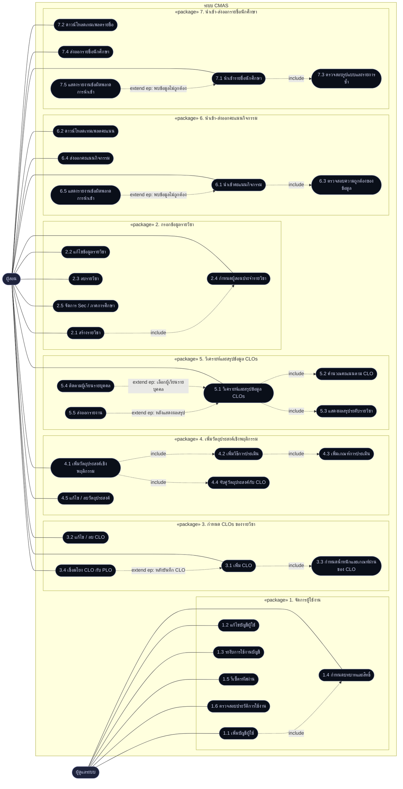

# UML — CMAS

**Layer 0 · ภาพรวมทั้งระบบ** · ปรับล่าสุด 2569-09-13

<!-- STATUS:AUTHORITATIVE
     บรรทัดที่ขึ้นต้นด้วย STATUS: ถูกอ่านโดย scripts/check-diagrams.py
     ห้ามลบ ถ้าจะเปลี่ยนสถานะของไฟล์ให้แก้ที่นี่ที่เดียว
STATUS:SUPERSEDED UML-Layer2.drawio เลข use case เป็นฉบับร่างแรก ใช้ index-q แทน
-->

## ไฟล์ไหนเป็นฉบับจริงของอะไร

อ่านตารางนี้ก่อนหยิบไฟล์ไปขึ้นจอ · ทุกไฟล์ในโฟลเดอร์นี้ไม่ได้มีสถานะเท่ากัน

| ไฟล์ | สถานะ | ใช้ตอนไหน |
|---|---|---|
| **UML.md** (ไฟล์นี้) | ✅ ฉบับจริงของ **เลข use case** | อ้างเลข 1.1–7.5 ทุกครั้ง |
| `index-q/index-q-usecase.drawio` | ✅ ฉบับจริงของ **รายละเอียดและสิทธิ์** · สร้างจากโค้ด 6 หน้า | เจาะรายแพ็กเกจ · UML 2.5 เต็มรูป |
| `index-q/UML-INDEX-Q.drawio` | ✅ ข้อมูลชุดเดียวกัน หน้าเดียว สัญกรณ์เดียวกับ Layer2 | ภาพรวมบนสไลด์เดียว |
| `Struture.drawio` | ✅ โครงสร้างสิทธิ์ 3 หน้า | อธิบายบทบาทและ capability |
| `UML-Layer1.drawio` | ⚠ ร่างแรก | ประกอบเท่านั้น |
| `UML-Layer2.drawio` | ⛔ **ร่างแรก · เลขไม่ตรงกับไฟล์นี้** | **อย่าฉายคู่กับไฟล์อื่น** |

> **ทำไม Layer2 ถึงห้ามฉายคู่** — `scripts/check-diagrams.py` วัดแล้ว: เลข 10 ตัว
> ในนั้นหมายถึงคนละ use case กับไฟล์นี้ (เช่น 1.4 ในไฟล์นี้คือ *กำหนดบทบาทและสิทธิ์*
> แต่ใน Layer2 คือ *reset รหัสผ่าน*) · มีเลขซ้ำ 1 จุด และ use case ที่ไม่มีเลข 13 ข้อ
> ถ้าขึ้นจอเรียงกัน คนดูจะเห็นเลขเดียวกันหมายถึงสองเรื่องภายในสไลด์ติดกัน
>
> **ไม่ได้แก้ Layer2 เพราะมันแยกย่อยคนละแบบ** — Layer2 แยก *แก้ไข CLO* กับ *ลบ CLO*
> เป็นสองข้อ ส่วนไฟล์นี้รวมเป็น *3.2 แก้ไข / ลบ CLO* · การไล่เปลี่ยนเลขให้ตรงคือ
> การรื้อการแยกย่อยของคนอื่น ไม่ใช่การแก้เลข

## ข้อควรรู้ก่อนนำเสนอ

* **actor ในภาพนี้มี 2 ตัว แต่ระบบจริงมี 4** — `CourseRole` ถูกบังคับใช้จริงแล้ว
  (ASM-03a) เป็น ผู้ช่วยสอน ◁ ผู้สอนร่วม ◁ ผู้ประสานงานรายวิชา และ ผู้ดูแลระบบ
  ภาพสามบทบาทอยู่ใน `Struture.drawio` หน้า 2 และ `index-q/UML-INDEX-Q.drawio`
* **ผู้ดูแลระบบไม่ทำงานในรายวิชา** (ASM-03b) — สร้าง ลบ และผูกผู้สอนเข้ากับรายวิชาเท่านั้น
* **1.3 คือ *ระงับ* ไม่ใช่ *ลบ*** — FR-06 และ `onDelete: Restrict` ห้ามลบบัญชีที่ผูกรายวิชา
  เดิมไฟล์นี้เขียนว่า "ระงับ / ลบ" ซึ่งสัญญาสิ่งที่สคีมาปฏิเสธ · แก้แล้ว 2569-09-13

---

