# ER & UML ของต้นแบบ `docs/pages/index-q.html`

See also: [[UML]] · [[srs]] · [[user-flow]] · [[features-pages]] · `database/schema.prisma`

> **สร้าง:** 2026-09-10 · **สกัดจากโค้ดที่รันจริง** ไม่ได้เขียนจากเอกสาร
> ทุกตัวเลขในหน้านี้อ่านออกมาจากต้นแบบขณะทำงาน (`Object.keys(db)`, `ROUTES`, `FORMS`, `derive()`)
>
> **ต่างจาก [[UML]]:** ไฟล์นั้นเป็นแบบจำลองของ*ระบบที่จะสร้าง* · ไฟล์นี้เป็นภาพของ*ต้นแบบที่สร้างแล้ว*

**ต้นแบบโดยย่อ** — ไฟล์ HTML เดียว 3,861 บรรทัด (264 KB) · พึ่งภายนอกแค่ 2 อย่าง (Tailwind CDN, Google Fonts) · เปิดจาก `file://` ได้ ไม่ต้องมีเซิร์ฟเวอร์ · 9 หน้า · 7 entity ที่ CRUD ได้ · ข้อมูลตัวอย่าง 4 รายวิชา / 30 การลงทะเบียน / 120 แถวคะแนน

---

## 1 · ER — สิ่งที่ต้นแบบเก็บจริง

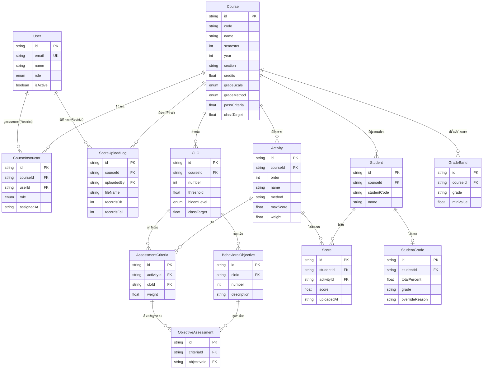

### 1.1 ความตรงกับ `schema.prisma`

| Model | ตรงระดับฟิลด์ | ฟิลด์ที่ schema มีแต่ต้นแบบไม่มี |
|---|:--:|---|
| CourseInstructor · CLO · BehavioralObjective · Activity · AssessmentCriteria · ObjectiveAssessment · Student · Score · ScoreUploadLog · GradeBand · StudentGrade | ✓ (11 model) | — |
| `User` | ✕ | `passwordHash`, `createdAt`, `updatedAt` |
| `Course` | ✕ | `createdAt`, `updatedAt` |

ที่ขาดคือ **รหัสผ่านกับ timestamp เท่านั้น** ซึ่งเป็นการตัดที่ถูกต้องสำหรับต้นแบบที่ไม่มีระบบล็อกอินและไม่มีฐานข้อมูลจริง — **ไม่มีฟิลด์เชิงธุรกิจข้อใดหายไป**

### 1.2 สามสิ่งที่ต้นแบบมีแต่ ER ไม่มี

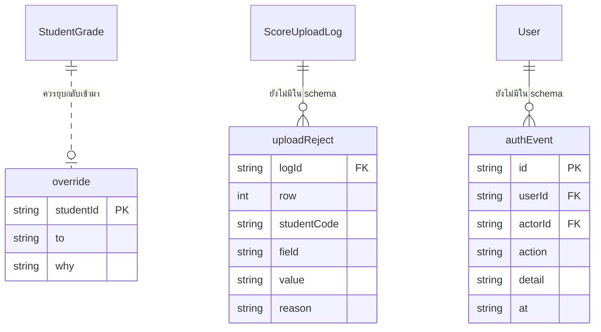

| สิ่งที่เพิ่มมา | รูปแบบ | ควรจะเป็น |
|---|---|---|
| **`db.override`** | object map `studentId → {to, why}` **ไม่ใช่ array** | นี่คือ `StudentGrade.grade` + `overrideReason` ที่ ER มีอยู่แล้ว — ต้นแบบแยกออกมาเพราะ `StudentGrade` ยังว่างจนกว่าจะกด "ประมวลผลเกรด" **ตอนต่อฐานข้อมูลจริงต้องยุบกลับเข้า `StudentGrade`** |
| **`db.uploadReject`** | array แถวที่ถูกปฏิเสธตอนนำเข้า | **ไม่มีใน schema เลย** — ปัจจุบัน `ScoreUploadLog` เก็บแค่จำนวน `recordsFail` ไม่ได้เก็บว่าแถวไหนผิดเพราะอะไร ถ้าต้องการรายงานข้อผิดพลาดจริง (FR-65) ต้องเพิ่มตารางนี้ · ตอนนี้ตัวตรวจไฟล์เขียนลงตารางนี้จริงทุกครั้งที่ปฏิเสธแถว |
| **`db.authEvent`** | array เหตุการณ์กับบัญชี (`SUSPEND` `ACTIVATE` `PW_RESET` `ROLE_SET`) | **ไม่มีใน schema เลย** — UC 1.6 (ตรวจสอบประวัติการใช้งาน) เป็นไปไม่ได้ถ้าไม่มี ต้นแบบจึงจำลองไว้ให้เห็นว่าหน้าจอรองรับได้ · รูปทรงตั้งใจให้ตรงกับ `AuditLog` ที่เสนอไว้ในหัวข้อ 6 เพื่อให้การรับมาเป็น migration ไม่ใช่การออกแบบใหม่ |

> **ข้อสรุปของหัวข้อ 1:** ต้นแบบสะท้อน ER ได้ 13/13 model และตรงระดับฟิลด์ 11/13
> ส่วนที่เกินมา 3 อย่างไม่ใช่ความผิดพลาด แต่เป็น **คำถามที่ ER ยังไม่ได้ตอบ** และควรตัดสินก่อนลงมือต่อระบบจริง

---

## 2 · UML — สถาปัตยกรรมของต้นแบบ

ไฟล์เดียวแต่แบ่งชั้นชัด ข้อมูลไหลทางเดียวจากบนลงล่าง และวนกลับผ่าน `render()` เท่านั้น

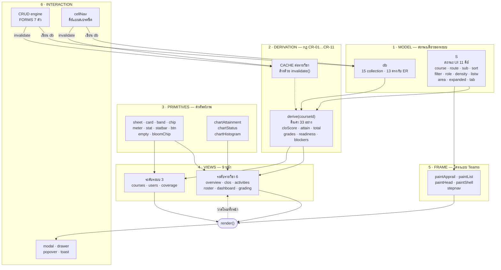

**กฎที่ถือไว้ตลอด:** ไม่มี view ไหนเก็บสถานะของตัวเอง · ไม่มีตัวเลขไหนถูกพิมพ์ลงหน้าจอโดยตรง ทุกตัวมาจาก `derive()` · การเขียนข้อมูลทุกครั้งจบด้วย `invalidate() → render()`

### 2.1 CRUD engine — สัญญาเดียว 7 entity

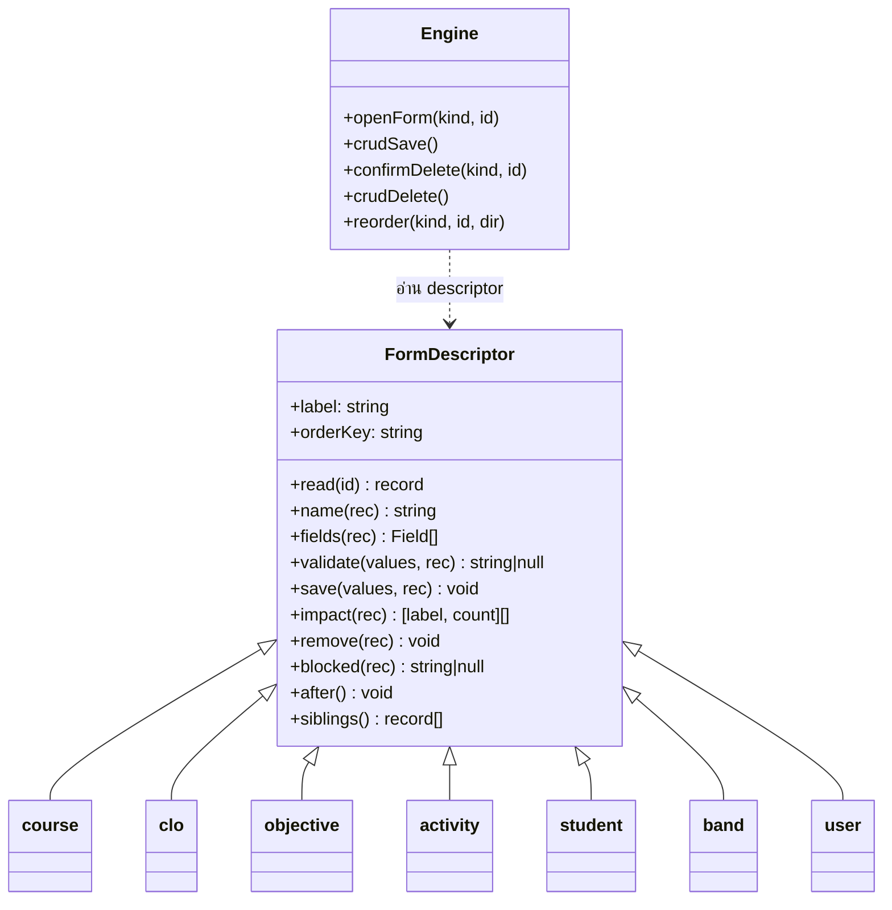

| Entity | fields | validate | save | impact | remove | blocked | จัดลำดับ |
|---|:--:|:--:|:--:|:--:|:--:|:--:|:--:|
| `clo` | ✓ | ✓ | ✓ | ✓ | ✓ | — | ✓ |
| `objective` | ✓ | ✓ | ✓ | ✓ | ✓ | — | ✓ |
| `activity` | ✓ | ✓ | ✓ | ✓ | ✓ | — | ✓ |
| `student` | ✓ | ✓ | ✓ | ✓ | ✓ | — | — |
| `band` | ✓ | ✓ | ✓ | ✓ | ✓ | ✓ | — |
| `user` | ✓ | ✓ | ✓ | ✓ | ✓ | ✓ | — |
| `course` | — | — | — | ✓ | ✓ | — | — |

`course` ใช้ฟอร์มของตัวเอง (`modalCourse`) เพราะมีตัวแก้ผู้สอนซ้อนอยู่ แต่**การลบเดินผ่าน engine เดียวกัน** จึงมี cascade อยู่ที่เดียวในระบบ

`ObjectiveAssessment` **ไม่มี descriptor** — อ่านได้ ลบตามได้ แต่ผูกจาก UI ไม่ได้ (FR-34 ระดับ SHOULD)

---

## 3 · UML — Activity diagram ของเส้นทางหลัก

โครงเดียวกับแถบ 6 ขั้นบนหน้าจอ และเป็นตัวที่ตัดสินว่าหน้าผลการประเมินเปิดหรือล็อก

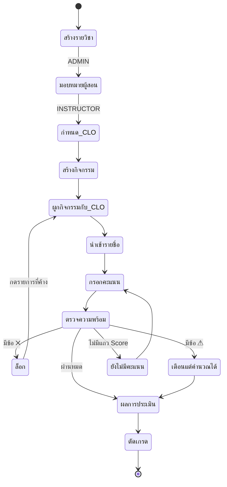

**เงื่อนไขล็อก มีข้อเดียว** — น้ำหนักเกณฑ์ของกิจกรรมใดกิจกรรมหนึ่งไม่ครบ 100% (FR-45)
CLO ที่ยังไม่มีกิจกรรมวัด เป็น **⚠ ไม่ใช่ ✕** เพราะ CLO ข้ออื่นยังคำนวณได้ตามปกติ (user-flow §7.1)

| ขั้น | คีย์ | ปลายทางเมื่อกด |
|---|---|---|
| 1 มอบหมายผู้สอน | `staff` | เปิดฟอร์มตั้งค่ารายวิชา |
| 2 กำหนด CLO | `clo` | หน้า CLO |
| 3 สร้างกิจกรรม | `act` | กิจกรรม → แท็บกิจกรรม |
| 4 ผูกกิจกรรมกับ CLO | `crit` | กิจกรรม → แท็บเกณฑ์ |
| 5 นำเข้ารายชื่อ | `roster` | นักศึกษา → แท็บคะแนน |
| 6 กรอกคะแนน | `score` | นักศึกษา → แท็บคะแนน |

---

## 4 · UML — Sequence ของลูปที่ทุกอย่างวิ่งผ่าน

การแก้ค่าหนึ่งช่องในตาราง คือเส้นทางเดียวกับที่ทุกการเปลี่ยนแปลงใช้ และเป็นที่มาของบั๊ก focus ที่แก้ไปแล้ว

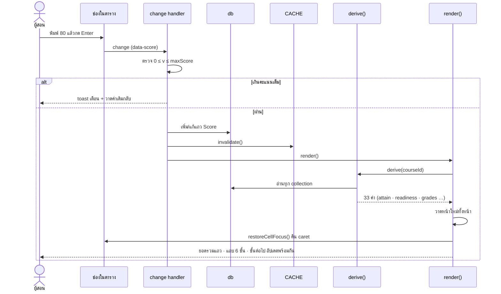

**จุดที่เคยพัง:** `render()` สร้าง DOM ใหม่ทั้งหมด ทำให้ `<input>` ที่ถืออยู่หายไปและ focus ตกไปที่ `<body>`
แก้โดยจำ **คีย์ของช่อง** (`studentId|activityId`) ไม่ใช่ตัว node แล้วคืน focus หลังวาดเสร็จ — เป็นราคาที่ต้องจ่ายของสถาปัตยกรรม "วาดใหม่ทั้งหน้า" ซึ่งแลกมากับการที่ **ไม่มีทางที่หน้าจอกับข้อมูลจะไม่ตรงกัน**

---

## 5 · แผนที่หน้าจอ

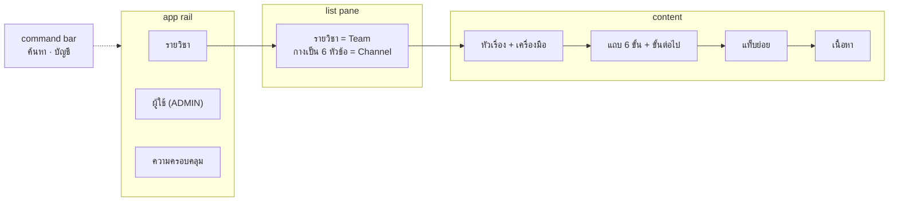

| ระดับ | หน้า | แท็บย่อย |
|---|---|---|
| รายวิชา | ภาพรวม · CLO · กิจกรรมและเกณฑ์ · นักศึกษาและคะแนน · ผลการประเมิน · การตัดเกรด | `กิจกรรม│เกณฑ์` · `คะแนน│ประวัตินำเข้า` · `สรุปผล│รายบุคคล` |
| ระบบ | รายวิชา · จัดการผู้ใช้งาน · ความครอบคลุมของแบบจำลอง | — |

---

## 6 · สิ่งที่ต้นแบบยัง**ไม่ได้**เป็นตัวแทน

รายการนี้สำคัญพอ ๆ กับที่มี เพราะเป็นสิ่งที่จะเซอร์ไพรส์ตอนต่อของจริง

| ไม่มี | ผลตอนขึ้นระบบจริง |
|---|---|
| **การยืนยันตัวตน** — ไม่มี `passwordHash` ไม่มีหน้าล็อกอิน สลับบทบาทด้วยปุ่ม | ต้องทำ auth + guard ที่ API ใหม่ทั้งหมด · การซ่อนเมนูในต้นแบบเป็นแค่การลดความสับสน (P9) · `me()` เป็นตัวแทนของ "ผู้ใช้ที่ล็อกอินอยู่" ทั้งระบบ ตอนต่อของจริงให้แทนที่ฟังก์ชันนี้จุดเดียว |
| **ความคงทนของข้อมูล** — ทุกอย่างอยู่ในหน่วยความจำ รีเฟรชแล้วกลับค่าเดิม | ทุก mutation ต้องกลายเป็น API call + optimistic update หรือ refetch |
| **`createdAt` / `updatedAt`** | ต้องเพิ่มกลับตาม schema ตอนต่อ Prisma |
| **การถอนรายวิชา** | CR-10 บอกว่าไม่นับคนถอนใน mean/SD แต่ `Student` ไม่มีคอลัมน์สถานะ — ช่องว่างของ ER ไม่ใช่ของต้นแบบ |
| **`ObjectiveAssessment` ผูกจาก UI** | FR-34 ระดับ SHOULD · ยืนยันด้วยการทดลองแล้วว่าลบทิ้งทั้งหมดก็ไม่มีตัวเลขใดเปลี่ยน |
| **การส่งไฟล์ขึ้นเซิร์ฟเวอร์** | ต้นแบบอ่าน/เขียน `.xlsx` จริงด้วย SheetJS แต่ทำในเบราว์เซอร์ล้วน ๆ · ของจริงต้อง POST ไฟล์แล้วตรวจซ้ำฝั่งเซิร์ฟเวอร์ เพราะการตรวจฝั่ง client เป็นเรื่องความสะดวก ไม่ใช่ความปลอดภัย |
| **การรีเซ็ตรหัสผ่านจริง** | ไม่มี `passwordHash` และไม่มีการส่งอีเมล · ปุ่มนี้จำลองขั้นตอน UC 1.5 และเขียน `authEvent` เท่านั้น รหัสชั่วคราวที่แสดงไม่ยืนยันตัวตนอะไรทั้งสิ้น |
| **การเปลี่ยนรหัสผ่านของเจ้าของบัญชี** | ฟอร์ม "บัญชีของฉัน › เปลี่ยนรหัสผ่าน" ตรวจกติกา (ยาว ≥ 8 · มีตัวอักษรและตัวเลข · ไม่ซ้ำของเดิม · ยืนยันตรงกัน) แล้ว**ทิ้งค่าที่พิมพ์ทันที** ไม่มีการเก็บหรือเปรียบเทียบรหัสจริง กติกาคือสิ่งที่ต้องตกลงก่อนสร้างของจริง |

### 6.1 กติกาที่บังคับไว้แล้วรอบบัญชีผู้ใช้

| กติกา | บังคับที่ไหน |
|---|---|
| **ลบบัญชี ADMIN ไม่ได้** ต้องเปลี่ยนบทบาทเป็นผู้สอนก่อน | `FORMS.user.blocked()` · ปุ่ม "ลบบัญชี" ในแถวเปลี่ยนเป็น "ระงับการใช้งาน" เอง |
| **ลบบัญชีที่กำลังใช้งานอยู่ไม่ได้** | `FORMS.user.blocked()` เทียบกับ `me()` |
| **ผู้ดูแลที่ใช้งานอยู่คนสุดท้ายถูกลดบทบาทหรือระงับไม่ได้** | `lastAdmin()` — ตรวจทั้งในฟอร์ม (`validate`) และที่ปุ่ม `toggle-user` เพราะทั้งสองประตูนำไปสู่การล็อกเอาต์แบบเดียวกัน |
| บัญชีที่ผูกรายวิชาหรือเคยอัปโหลดคะแนนลบไม่ได้ | `onDelete: Restrict` (FR-06, DC-08) |
| **ผู้สอนแก้ชื่อและอีเมลของตัวเองได้ แต่แก้บทบาทและสถานะไม่ได้** | `modalProfile()` ไม่มีคอนโทรลสองอันนั้นเลย (FR-04) — ฟอร์มที่โชว์ปุ่มที่กดไม่ได้แย่กว่าฟอร์มที่ไม่โชว์ |

### 6.1a สิทธิ์ตามบทบาทในรายวิชา (ASM-03a · ASM-03b · FR-22a · FR-22c)

`CourseInstructor.role` เคยเป็นป้ายแสดงผลล้วน ๆ ตอนนี้บังคับใช้จริง
เมทริกซ์เต็มและผลการตรวจอยู่ที่ [course-role-permissions.md](../markdown/dev/course-role-permissions.md)

สามประโยคที่เมทริกซ์ย่อลงได้ (แก้ 2569-09-12):
**ผู้ดูแลระบบผูกคนเข้ากับรายวิชาแล้วออกไป · ผู้ประสานงานทำได้ทุกอย่างในรายวิชา ·
ผู้สอนร่วมและผู้ช่วยสอนทำงานประจำ คือคะแนน ไฟล์ Excel และกิจกรรม โดยผู้ช่วยสอนลบไม่ได้**

```mermaid
flowchart TB
    CLICK["คลิกปุ่มใด ๆ"] --> DISP["dispatcher"]
    DISP --> CAPOF["capOf(act, el)"]
    CAPOF -->|"อยู่ใน READ_ACTS"| RUN["ทำงานได้เลย"]
    CAPOF -->|"มี capability"| CAN{"can(cap, courseId)"}
    CAPOF -->|"ไม่รู้จัก"| HIGH["course.settings<br/>(deny by default)"] --> CAN
    CAN -->|ผ่าน| RUN
    CAN -->|ไม่ผ่าน| DENY["deny() — toast + AuthEvent"]
    ROLE["courseRoleOf(courseId)<br/>LEAD / CO / ASSISTANT / null"] --> CAN
    PERM[("PERM · 18 capability")] --> CAN
    RENDER["render()"] --> AP["applyPermissions()<br/>ซ่อนสิ่งที่ can() ตอบว่าไม่ได้"]
    CAN -.อ่านตัวเดียวกัน.-> AP
    MUT["ทางที่ไม่ผ่าน data-act<br/>ช่องคะแนน · เมทริกซ์เกณฑ์<br/>openForm · confirmDelete · modalCourse"] --> CAN
```

| หลัก | ทำไม |
|---|---|
| **ประตูเดียวใน dispatcher (SEC-1)** | การซ่อนปุ่มเป็น UX · ประตูจริงต้องอยู่ก่อน handler ทำงาน ไม่ใช่กระจายเป็นการ์ดต่อปุ่ม |
| **ประตูชั้นสองที่จุดที่ข้อมูลเปลี่ยน** | เจอตอนทดสอบว่าโค้ดหลายจุดเรียก `confirmDelete()` / `openForm()` ตรง ๆ ข้าม dispatcher ไปได้ |
| **ปฏิเสธเป็นค่าตั้งต้น (SEC-2)** | `READ_ACTS` เป็นรายการ *ปิด* ของสิ่งที่ไม่เปลี่ยนข้อมูล · action ใหม่ที่ยังไม่ได้จัดหมวดจะถูกกั้นไว้ ไม่ใช่ปล่อยผ่าน |
| **ซ่อน ไม่ลบ** | ครั้งแรกใช้ `el.remove()` แล้ว `paintList()` พังเพราะถือ reference ของ `#lpAdd` ไว้ |
| **`applyPermissions` กวาดทั้งหน้า** | รายการ container ที่ต้องจำให้ครบจะขาดเสมอ — พลาด `#ctTools` ไปในรอบแรก |

### 6.2 ขอบเขตรายวิชาของผู้สอน (FR-23)

ผู้ดูแลระบบเห็นทุกรายวิชา · **ผู้สอนเห็นเฉพาะรายวิชาที่ตนถูกมอบหมายผ่าน `CourseInstructor`**

นี่ไม่ใช่สิทธิ์ต่อ *การกระทำ* แต่เป็นคำถามว่า *แถวไหนมีอยู่* สำหรับคนคนนั้น จึงอยู่ที่ต้นทางของรายการ
ไม่ใช่การ์ดที่แปะทีละหน้าจอ — `myCourses()` เป็นตัวเดียวที่ตอบ และทุกทางเข้าต้องอ่านจากตัวเดียวกัน

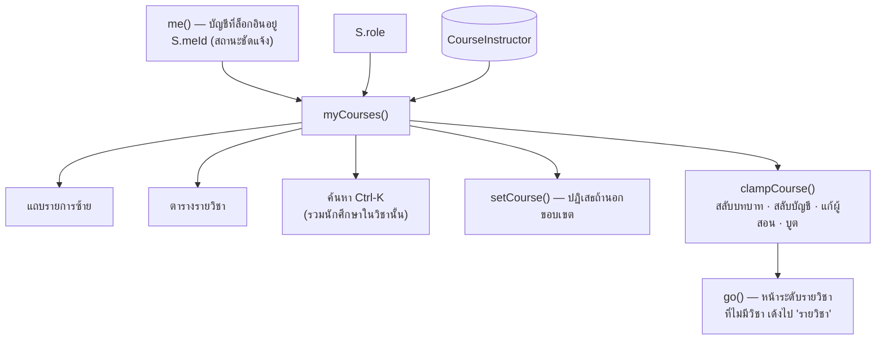

| จุดที่ต้องระวัง | เหตุผล |
|---|---|
| **`me()` ต้องเป็นสถานะชัดแจ้ง ไม่ใช่ค่าที่คำนวณจากวิชาที่เปิดอยู่** | เดิม `me()` คืน "ผู้ประสานงานของวิชาที่เปิดอยู่" ซึ่งกลายเป็นวงกลมทันทีที่เอามาใช้กรองรายวิชา — เปิดวิชาไหนก็เป็นเจ้าของวิชานั้น ขอบเขตจึงไม่เคยกัดจริง ตอนนี้เก็บใน `S.meId` และเป็นจุดเดียวที่ต้องแทนที่เมื่อมี auth จริง |
| **ผู้สอนที่สร้างรายวิชาต้องถูกใส่เป็น ผู้ประสานงาน ทันที** | ไม่งั้นวิชาที่เพิ่งสร้างหายไปจากสายตาตัวเองตอนกดบันทึก · `modalCourse('create')` จึงตั้ง `CSTAFF` เริ่มต้นเป็นตัวผู้สร้าง |
| **เอาชื่อตัวเองออกจากรายวิชา = ยกวิชาให้คนอื่น** | อนุญาต แต่ฟอร์มเตือนล่วงหน้า และหลังบันทึกระบบพาออกไปหน้ารายวิชาพร้อมบอกว่าเกิดอะไรขึ้น |
| **ผู้สอนที่ยังไม่ถูกมอบหมายเลย** | เป็นสถานะจริงของวันแรกของภาคเรียน จึงมีหน้าจอของตัวเอง ไม่ใช่แถบว่าง |
| **"เข้าใช้งานเป็น" ในเมนูบัญชี** | ของต้นแบบเท่านั้น — ระบบจริงได้ค่านี้จาก session · มีไว้เพื่อสาธิตว่าผู้สอนสองคนเห็นรายการคนละชุด ซึ่งพิสูจน์ด้วยวิธีอื่นไม่ได้ |

---

## 7 · ชั้น Excel

### 7.0 ชั้น XML — สิ่งที่ SheetJS เขียนให้ไม่ได้

วัดโดยแกะ zip ของไฟล์ที่ SheetJS 0.18.5 (community) สร้าง ไม่ใช่อ่านจากเอกสาร

| เขียนได้ | เขียนไม่ได้ |
|---|---|
| `mergeCell` · `cols` · `rows` · `numFmt` · `autoFilter` · `sheetProtection` · docProps | `pane` (ตรึงหัว) · `dataValidation` · `cellXfs` (สี ตัวหนา เส้นขอบ locked) |

สามอย่างที่ขาดคือส่วนที่ทำให้ไฟล์ใช้งานได้จริง จึงมีชั้นบาง ๆ ต่อท้าย

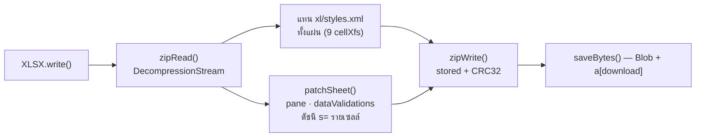

ลำดับ element ใน `worksheet` ถูกบังคับโดยสคีมา — `sheetData` → `sheetProtection` → `autoFilter` →
`mergeCells` → `dataValidations` · วางผิดลำดับ Excel จะฟ้องว่าไฟล์เสีย จึงต้องแทรกตามลำดับนั้นเสมอ

ตรวจผลด้วย **openpyxl** ไม่ใช่ SheetJS — ให้ไลบรารีเดิมอ่านงานตัวเองกลับมาไม่ใช่หลักฐานว่าโปรแกรมอื่นเปิดได้

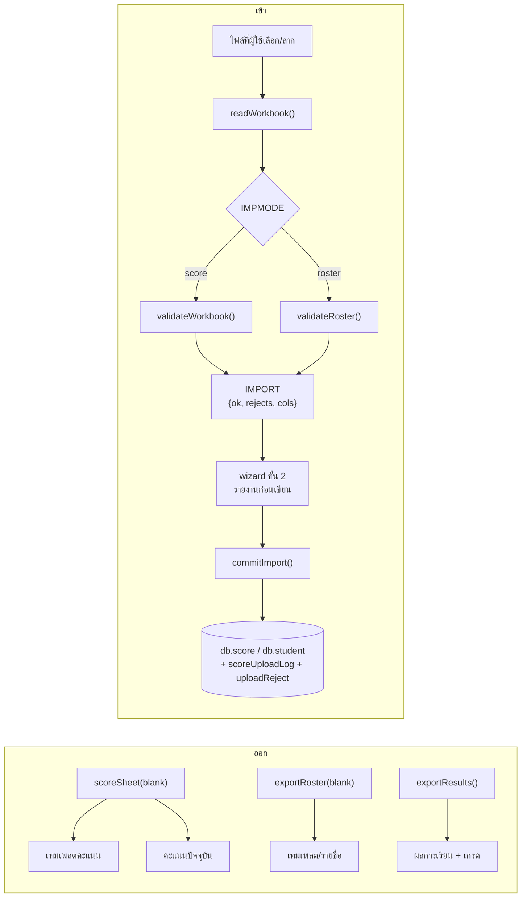

หัวคอลัมน์คะแนนลงท้ายด้วย `[activityId]` — นั่นคือสิ่งที่ผูกคอลัมน์กับกิจกรรม
ไม่ใช่ชื่อกิจกรรม เปลี่ยนชื่อกิจกรรมในระบบแล้วไฟล์เก่ายังนำเข้าได้ และกิจกรรมสองอันชื่อซ้ำกันก็ไม่สับสน

**กติกาการปฏิเสธ (คะแนน)** — ไม่มีรหัสนี้ในหมู่เรียน · รหัสซ้ำในไฟล์ · ไม่ใช่ตัวเลข · ติดลบ · เกินคะแนนเต็มของกิจกรรมนั้น
ช่องว่าง **ไม่ใช่** ข้อผิดพลาดและ **ไม่ใช่** 0 — แปลว่า "ไม่มีข้อมูลมาด้วย" ระบบจึงไม่แตะช่องนั้น (CR-03.1)

ตัวนำเข้า **หาแถวหัวตารางจากเนื้อหา** (แถวที่คอลัมน์แรกเป็น "รหัสนักศึกษา") ไม่ใช่จากตำแหน่ง
เพราะไฟล์รุ่นใหม่มีหัวเอกสารคั่น 12 แถว และไฟล์รุ่นเก่าที่ไม่มีหัวเอกสารต้องยังนำเข้าได้เหมือนเดิม
เลขแถวที่รายงานคำนวณจาก `!ref` + ดัชนีจริง (`blankrows:true`) — ถ้าตัดแถวว่างทิ้งก่อนนับ รายงานจะชี้ผิดแถว

ไฟล์ทดสอบอยู่ที่ `docs/excel/import-test/` สร้างใหม่ด้วย `python scripts/build-import-test-workbooks.py`

---

_เอกสารนี้สกัดจาก `docs/pages/index-q.html` ณ 2026-09-10 — ถ้าต้นแบบเปลี่ยนโครง ให้สกัดใหม่ อย่าแก้ด้วยมือ_
